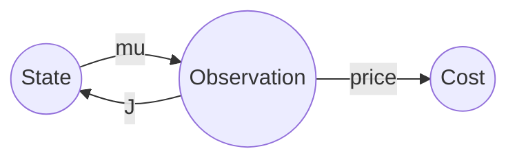

# The Thiele Machine Thesis

This repository contains the executable thesis for the Thiele Machine, a new universal model of computation, cognition, and emergence. The project demonstrates, verifies, and audits the foundational claims of the Thiele Machine using code, formal proofs, and reproducible artifacts.

## Background
Readers new to theoretical computer science may find the following quick references helpful:

- **Turing Machine**: an abstract device that reads and writes symbols on an infinite tape, one cell at a time.
- **Lens (`mu`)**: the observation function that extracts information from the current state.
- **Judgment (`J`)**: the action taken after observation.
- **No Unpaid Sight Debt (NUSD)**: every observation has an information price measured in bits.

## What is the Thiele Machine?
The Thiele Machine (ThM) is a generalization of the Turing Machine that explicitly accounts for the information cost of observation and action. Unlike the Turing Machine, which operates with local tape access, the Thiele Machine models computation as a cycle of global observation and judgment, with every act of observation incurring a physical cost (the No Unpaid Sight Debt, or NUSD law).

**Thiele Machine tuple:**
- `S`: Global state (the entire configuration of the system)
- `mu`: Observation function (Lens) — extracts information from the state
- `J`: Judgment function (Action) — transforms the state based on observation
- `price`: Information cost function — quantifies the cost of each observation/action

| Component | Role |
|-----------|------|
| `S` | Complete system state |
| `mu` | Observation Lens |
| `J` | Judgment/action |
| `price` | Information cost in bits |



The thesis proves that the Thiele Machine strictly generalizes the Turing Machine, and exposes the physical cost of computation via the NUSD law. This law ties information processing directly to energy expenditure, making the Thiele Machine a bridge between computation and physics.

## Why is this important?
- **Universality**: The Thiele Machine can simulate any Turing Machine, but also models cognitive and emergent processes beyond classical computation.
- **Physical Cost**: Every computation pays its information cost, grounded in thermodynamics (Landauer's principle).
- **Executable Proofs**: All claims are demonstrated and verified in code, not just theory.
- **Auditable Artifacts**: Outputs (plots, CSVs, logs, proofs) are saved in the `artifacts/` directory for reproducibility and peer review.

## Repository Structure
- `newthesis.py`: Main executable thesis and treatise. Run this file to generate all results and artifacts.
- `artifacts/`: Contains all generated outputs:
  - `plots/`: PNG images and visualizations
  - `csv/`: Benchmark results
  - `proof/`: SMT-LIB proof files (machine-verifiable)
  - `logs/`: Markdown reports, metadata, and logs
- `requirements.txt`: Python dependencies for reproducibility
- `README.md`: This document

## Dependencies
The project currently depends on:
| Package | Version (requirements.txt) |
|---------|---------------------------|
| numpy | 2.3.2 |
| matplotlib | 3.10.5 |
| sympy | 1.14.0 |
| z3-solver | 4.15.1.0 |
| networkx | added |
Additional standard-library modules such as `hashlib` and `argparse` require no installation.

## How to Run
1. Install Python 3.13+ and create a virtual environment.
2. Install dependencies:
   ```sh
   pip install -r requirements.txt
   ```
3. Run the thesis:
   ```sh
   python newthesis.py
   ```
4. All outputs will be generated in the `artifacts/` directory.

## Main Results
- Demonstrates the Thiele Machine's universality and information cost law.
- Benchmarks reversal algorithms and proves formal lower/upper bounds.
- Generates auditable receipts and machine-verifiable proofs.
- Connects computation, cognition, and emergence in a single executable framework.
## Physical Realizability and Future Directions
The Thiele Machine obeys Landauer's limit: each observed bit costs energy.
Future work includes exploring hardware implementations and quantifying practical constraints in real devices.

## Meta-proof Artifacts
Running `newthesis.py` produces auditable files in `artifacts/`, including SMT proofs and `meta_proof_trace.json`. These artifacts allow reviewers to reproduce every verification step.

## Known Issues
- Saving large PNGs on some systems triggers a Pillow `_idat` error. Updating Pillow or reducing figure size resolves the issue.

## Citation
If you use this work, please cite:
> Devon Thiele, "The Thiele Machine: Executable Treatise on Universal Computation and Cognition", August 2025.

## License
This repository is private and unpublished. For collaboration or review, contact the author.

## Submission
This work is being prepared for a theoretical computer science or mathematical foundations venue.

---
For questions, issues, or peer review requests, open an issue or contact the repository owner.
