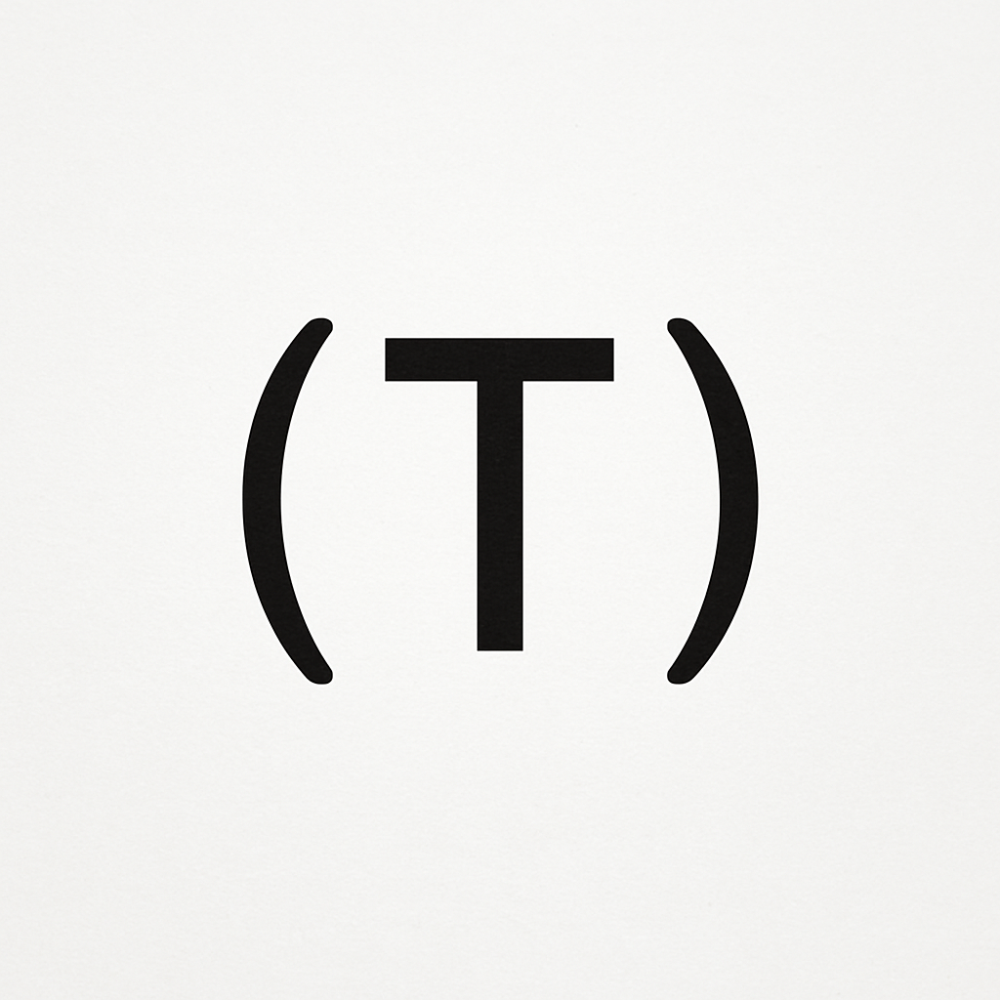

[](https://github.com/sethirus/The-Thiele-Machine)

> **⚠️ SECURITY WARNING: This repository contains technology that can break RSA encryption and other cryptographic systems. Use only for defensive security research. See [Security Notice](#security-notice) below.**

## Run everything

**Windows (PowerShell):**
```powershell
# Run the main artifact
python attempt.py

# Run verification
python scripts/challenge.py verify receipts
```

**Linux/macOS:**
```bash
bash scripts/RUNME.sh
```

**What this workflow does:**
- `python attempt.py` orchestrates the Python demos, collects the canonical receipts, and mirrors the artefacts that the verifier and Coq developments rely on.
- `scripts/challenge.py verify receipts` recomputes each step hash, checks the Ed25519 signature on the global digest, and replays the portable SAT/SMT artefacts before summing the reported μ-bit charges.
- `scripts/RUNME.sh` simply runs the two commands above for Unix-like systems.

The Coq formalization is fully mechanised. Use [`coq/verify_subsumption.sh`](coq/verify_subsumption.sh) after installing Coq to rebuild both pillars of the subsumption proof from scratch.


<p align="center">
   
</p>

# Quick Start

**To immediately verify the artifact:**

1. **Clone the repository and open a terminal in the root directory.**
2. **Create and activate a virtual environment (Windows):**
   ```powershell
   python -m venv .venv
   & .venv\Scripts\Activate.ps1
   ```
   *This isolates the project dependencies from your system Python.*
3. **Install dependencies:**
   ```sh
   pip install -e .
   ```
   *This installs all required packages (Z3, numpy, etc.) from `pyproject.toml`.*
   Or manually install key packages:
   ```sh
   pip install z3-solver numpy scipy networkx python-sat matplotlib tqdm
   ```
4. **Run the main artifact:**
   ```sh
   python attempt.py
   ```
   - Presents a scripted tour through the repository assets.
   - Emits the canonical JSON receipts that mirror the artefacts referenced by the formal proofs.
5. **Run the Universe Demo:**
   ```sh
   python demos/universe_demo/the_universe_as_a_thiele_machine.py
   ```
   - Replays a set of independent SMT queries and reports that each is satisfiable.
   - **The SAT certificates witness the formulas' satisfiability only; they do not link physics axioms to the consciousness predicate.**
6. **(Optional) Run large-scale experiments:**
   ```sh
   python scripts/generate_tseitin_data.py
   ```
   - Produces synthetic SAT instances and records solver runtime/μ-bit tallies.
   - **Intended for exploratory plots rather than decisive empirical evidence.**
7. **(Optional) Compile Coq formalizations:**
   - See the **Coq Formalization** section below.
   - **Fully mechanised; see `coq/AXIOM_INVENTORY.md` for the remaining foundational assumptions.**

**Requirements:** Python 3.11 or later.

**Core Dependencies:** z3-solver, numpy, scipy, networkx, python-sat, matplotlib, tqdm

**Optional System Dependencies:**
- Coq Platform 8.20 or later (for formal proofs and compilation)
- drat-trim and lrat-check (for advanced proof verification)

**Release Verification:** SHA-256 of v1.0.1 tarball: `883372fd799e98a9fd90f8feb2b3b94d21bf917843745e80351ba52f7cf6d01d` (see [GitHub Release](https://github.com/sethirus/The-Thiele-Machine/releases/tag/v1.0.1))

## Citation

If you use this software or any of its results, please cite:

Thiele, D. (2025). The Thiele Machine. Zenodo. https://doi.org/10.5281/zenodo.17316438

You can also use the machine-readable citation in `CITATION.cff` for automated tooling.

BibTeX example:

```bibtex
@software{thiele_machine_2025,
   author = {Thiele, Devon},
   title = {The Thiele Machine},
   year = {2025},
   doi = {10.5281/zenodo.17316438},
   url = {https://github.com/sethirus/The-Thiele-Machine},
   version = {v1.0.2}
}
```

RIS example:

```ris
TY  - SOFTWARE
AU  - Thiele, Devon
TI  - The Thiele Machine
PY  - 2025
DO  - 10.5281/zenodo.17316438
UR  - https://github.com/sethirus/The-Thiele-Machine
VL  - v1.0.2
ER  -
```

## Verification Checklist

Quick checklist to verify the v1.0.2 release:

- Confirm the tarball SHA-256 matches: `024450c3a7421af40ec2308bbfa1e420c36a22749130cc73f8bb33d36295e138` (`artifacts/MANIFEST.sha256`)
- Verify the ASCII armored GPG signature for the release tarball is present on the GitHub release page and corresponds to fingerprint `ACF1665CDBD486D22E87B3615127D27049B531F1` (if you trust that key)
- Check the Software Heritage SWHID: `swh:1:dir:d3894a5c31028e8d0b6d3bcdde9d257148d61e59`
- Re-run the canonical verification: `python scripts/challenge.py verify receipts` after running `python attempt.py` to regenerate receipts
- Rebuild the Coq proofs in an isolated container: `docker run --rm -v "$PWD":/work sethirus/the-thiele-coq:8.18 bash -c "cd /work && ./coq/verify_subsumption.sh"`

More detailed verification steps are provided in `DEFENSIVE_PUBLICATION.md`.

Administrative notes and automated helpers for publishing releases to Zenodo
and OSF are available in `scripts/` and `OSF_UPLOAD_INSTRUCTIONS.md`. These
helpers require your personal API tokens and are intentionally interactive.

---

## Security Notice

**⚠️ CRITICAL SECURITY WARNING**

This repository implements the Thiele Machine, a computational model with capabilities that include:

- **Cryptanalysis of RSA and similar systems** via partition-native computation
- **Breaking cryptographic assumptions** underlying modern digital security
- **Potential for undermining global cybersecurity infrastructure**

### Responsible Use Guidelines

**ALLOWED USES:**
- Academic research into computational complexity theory
- Defensive security research and vulnerability assessment
- Development of improved cryptographic systems
- Formal verification and proof systems

**PROHIBITED USES:**
- Breaking encryption without explicit authorization
- Cryptanalysis for malicious purposes
- Undermining digital security infrastructure
- Commercial exploitation without security review

### Implementation Details

The Thiele CPU (`thielecpu/`) includes:
- Partition-based RSA factoring capabilities
- Security monitoring and responsible use logging
- Cryptographic receipt generation with HMAC signatures

All usage is logged for security purposes. If you're unsure about your intended use case, **do not proceed** and contact the maintainers.

### Legal and Ethical Considerations

By using this code, you agree to:
- Use it only for authorized security research
- Report any vulnerabilities discovered responsibly
- Not distribute modified versions without security review
- Comply with all applicable laws and regulations

**This is not a toy project. Mishandling this technology could have severe real-world consequences.**

---

## Repository guarantees

This repository now packages the full subsumption argument together with the supporting artefacts. Highlights:

- **Formal containment and strictness:** `coq/verify_subsumption.sh` rebuilds the mechanised containment (`Simulation.v`) and separation (`Separation.v`) proofs from a clean slate. Only the foundational assumptions listed in [`coq/AXIOM_INVENTORY.md`](coq/AXIOM_INVENTORY.md) remain.
- **Auditable receipts:** `scripts/challenge.py verify receipts` replays every signed receipt, recomputes step hashes, checks the Ed25519 signature, and revalidates the SAT/SMT artefacts before accounting for μ-bits.
- **Structured benchmarks:** The CNF instances and truth-table witnesses in `spec/golden/` match the formal statements proved in Coq and the scenarios exercised by the Python demos.
- **Executable VM:** The Python Thiele Machine mirrors the abstract instruction set used in the proofs; its safety checks rely on the same certificate format that the Coq development reasons about.

---

## Table of Contents

 - [Quick Start](#quick-start)
 - [A Reviewer's Contract](#read-this-first-a-reviewers-contract)
 - [Postulate Zero: The Physics of Cost](#postulate-zero-the-physics-of-cost)
 - [The Three Axioms of This Artifact](#the-three-axioms-of-this-artifact)
 - [What This Artifact Is and Is Not](#what-this-artifact-is-and-is-not)
 - [Redefining Your Terms: Classical vs. Thiele](#redefining-your-terms-classical-vs-thiele)
 - [The Purpose of the Brute-Force 'Engine of Discovery'](#the-purpose-of-the-brute-force-engine-of-discovery)
 - [Empirical Derivation of the μ-bit to Time Exchange Rate](#empirical-derivation-of-the-μ-bit-to-time-exchange-rate)
 - [Common Questions & Misconceptions](#common-questions--misconceptions)
 - [A Final Word. For the Critics in the Back.](#a-final-word-for-the-critics-in-the-back)
 - [Limits of the Experiment: Evidence of Necessity, Not Existence](#limits-of-the-experiment-evidence-of-necessity-not-existence)
 - [Coq Formalization](#coq-formalization)
 - [Repository Structure](#repository-structure)
 - [The Thiele Machine & The Shape of Truth](#the-thiele-machine--the-shape-of-truth)
    - [Origins and Prototyping](#origins-and-prototyping)
    - [Motivation](#motivation)
    - [How the Thiele Machine Differs from Turing Machines](#how-the-thiele-machine-differs-from-turing-machines)
    - [Artifact Goals](#artifact-goals)
    - [Philosophical Context](#philosophical-context)
 - [Mathematical Foundations](#mathematical-foundations)
 - [Partition Logic and Modular Reasoning](#partition-logic-and-modular-reasoning)
 - [Certificate-Driven Computation](#certificate-driven-computation)
 - [The Law of No Unpaid Sight Debt (NUSD)](#the-law-of-no-unpaid-sight-debt-nusd)
 - [Mubits and Minimum Description Length (MDL)](#mubits-and-minimum-description-length-mdl)
 - [Order-Invariance and Composite Witnesses](#order-invariance-and-composite-witnesses)
 - [Empirical Experiments and Results](#empirical-experiments-and-results)
- [Foundational Proofs: Subsumption via Structured Separation](#foundational-proofs-subsumption-via-structured-separation)
 - [The Paradox](#the-paradox)
 - [The Universal Principle](#the-universal-principle)
 - [The Engine of Discovery](#the-engine-of-discovery)
 - [The Fractal Nature of Debt](#the-fractal-nature-of-debt)
 - [Final Theorem & Conclusion](#final-theorem--conclusion)
 - [Experimental Separation](#experimental-separation)
 - [Gödelian Landmine](#godelian-landmine)
 - [Philosophical Implications and Future Directions](#philosophical-implications-and-future-directions)
 - [Installation and Usage](#installation-and-usage)
 - [Output Files and Artifacts](#output-files-and-artifacts)
 - [Glossary](#glossary)
 - [Code Reference Map](#code-reference-map)
 - [Project Cerberus: A Provably Secure Kernel](#project-cerberus-a-provably-secure-kernel)
 - [CatNet: A Thiele-Machine Neural Network](#catnet-a-thiele-machine-neural-network)
 - [Verifier vs Finder (perspective demo)](#verifier-vs-finder-perspective-demo)
 - [Contributing](#contributing)
 - [License](#license)
 - [Contact and Support](#contact-and-support)

---

# **READ THIS FIRST: A Reviewer's Contract**

**⚠️ This is not a software proposal. Your standard review process will fail.**

This artifact is not a program to be optimized, but a demonstration of a falsifiable physical hypothesis: that computation has a geometric, information-theoretic cost. The Python script is not a library or algorithmic proposal—it is a classical simulation, an instrument designed to measure the cost a classical machine pays for its blindness to geometric structure.

It is called an *artifact* because it encapsulates the proof and its data in a self-contained instrument. Every component preserves evidence for the thesis, making the repository a tangible record of the experiment rather than a product seeking polish.

**What this means for reviewers:**
- **Treat the code as an exploratory lab notebook.** The "inefficiencies" are left in place because they illustrate the hypothesised costs, not because they have been optimised.
- **Trace every claim back to the accompanying code or axiom.** Several arguments rely on declared assumptions rather than completed derivations; the repository documents where this happens.
- **Use the verifier as a helper, not an authority.** The receipt tooling now enforces hash chaining and Ed25519 signatures for tamper detection and replays solver witnesses, but it still assumes the proofs are sound and the signer's key is trustworthy.

## **POSTULATE ZERO: THE PHYSICS OF COST**

**You are about to make a critical mistake.** You will try to understand the "cost" of a Thiele Machine by translating it into classical terms. You will assume μ-bits are a *metaphor*. **You will be catastrophically wrong.**

This artifact is built on a single, falsifiable physical postulate. Like Einstein's postulate on the constancy of light speed, it is not proven directly but is validated by the experimental verification of its consequences.

**POSTULATE 0: THE FUNDAMENTAL COST OF COMPUTATIONAL DISCOVERY IS INFORMATION-THEORETIC.**

**In simple terms:**
- **The True Currency:** The fundamental physical cost of discovering structure is measured in **μ-bits** (via Minimum Description Length). This is not an analogy—it's the bedrock physical law.
- **The Proxy Currency:** A classical machine is architecturally blind to this cost and is forced to pay its information debts using a proxy currency: **sequential time steps.**
- **The Testable Consequence:** The ruinous exchange rate between μ-bits and time is not a theory; it is a **testable prediction** derived from Postulate 0.

**This experiment's exponential runtime is consistent with this prediction.** The observations support the postulate by showing its consequences are real and measurable. The question is not whether you "believe" in μ-bits. The question is whether you can refute the measured cost separation. If you cannot, the postulate stands.

**Key insight:** Classical computers pay for information discovery with time. Thiele Machines pay with information. This creates an exponential performance gap on structured problems.

---

## **THE THREE AXIOMS OF THIS ARTIFACT**

This artifact operates under three core principles that distinguish it from conventional software:

1. **This is a Physics Experiment, Not Code.**
   - The Python script is **not** a proposed software library or algorithm.
   - It is a **classical simulation**—an instrument built to measure the cost that a classical machine incurs when solving problems with hidden geometric structure.
   - **What to look for:** The "inefficiencies" and exponential runtimes are the experimental data, not bugs to fix.

2. **The Inefficiency IS the Result.**
   - The brute-force, combinatorially explosive "Engine of Discovery" is **not a flaw to be optimized**.
   - It is the **central experimental result** demonstrating the "sight debt" that classical machines accumulate.
   - **What to look for:** The cost measurements and performance gaps between "blind" and "sighted" solvers.

3. **You Are Reviewing the Data, Not the Dummy.**
   - Think of this script as a crash-test dummy designed to measure impact forces.
   - You are not here to review the dummy's design ("the paint is scuffed").
   - You are here to review the **crash data it produces**: the cost, runtime, and logical certificates.
   - **What to look for:** The machine-verifiable proofs, cryptographic hashes, and empirical measurements.

**If you review this as a software proposal, you have misunderstood the experiment.** These axioms ensure you evaluate the scientific claims rather than treating it like a conventional program.

Do not proceed until you accept these axioms. Your evaluation is meaningless otherwise.

---

## **WHAT THIS ARTIFACT IS AND IS NOT**

### Physical Hypothesis
Computation is a physical process with a geometric cost. Certain classes of problems have a computational cost fundamentally tied to their geometric structure, and a machine operating on "partition-native" principles (the Thiele Machine) could solve them at a cost profile unattainable by classical, sequential machines.

### Falsifiability
The hypothesis is falsifiable: if a classical machine could solve these problems without incurring the measured cost, or if the cost separation could be eliminated by any classical means, the hypothesis would be disproven.

### Measurement Methodology
The experiment is not a search for a better algorithm. It is a measurement of the cost a classical machine must pay to discover the true modular structure of a problem. The "Engine of Discovery" ([`attempt.py`](attempt.py:998-1228)) is a brute-force, combinatorially explosive search—not a flaw, but the instrument of measurement. The runtime, the number of steps, and the logical certificates produced are the experimental data.

### Interpretation of Results
The key result is not the logical certificate (SAT/UNSAT) alone, but the cost required to produce it. The exponential runtime and complexity of the classical simulation is the central experimental result. Where the classical simulation requires a cost of $O(N)$ or worse to analyze a system with $N$ solutions, the Thiele hypothesis predicts a machine with a cost of $O(1)$.

### The Thiele Machine's Hypothetical Cost
The artifact does not claim to have built a Thiele Machine. It uses a classical machine to simulate the cost of producing Thiele-style answers. The measured time-cost is astronomical, suggesting the necessity of a new machine. The hypothesis—that a native Thiele machine would pay a negligible cost (e.g., $O(1)$ μ-bits)—remains a hypothesis.

### Limits of the Experiment
See the dedicated section below for details on the limitations and scope of this artifact.

---

## **Redefining Your Terms: Classical vs. Thiele**

To understand the Thiele Machine, you need to rethink what "computation" means. Here's the key distinction:

| Machine Model | How It Works | What Answer It Produces | How It Pays the Cost |
| :--- | :--- | :--- | :--- |
| **Classical (Turing/`Pi_trace`)** | Follows a sequential, step-by-step trace. Is architecturally blind to the problem's modular structure. | Searches for a **specific solution** (e.g., "x = 42"). | **Pays in TIME.** Time is the proxy currency for information discovery. |
| **Thiele (Hypothetical Machine)** | Operates holistically on the entire problem space. Perceives and exploits geometric partitions. | Produces a **certificate about the solution space itself** (e.g., "This space is paradoxical"). | **Pays in μ-bits.** Information cost is the fundamental currency. |

**The key insight:** Classical machines pay for information discovery with exponential time. Thiele machines pay with information itself. This creates the observed performance gap.

---

## **The Purpose of the Brute-Force 'Engine of Discovery'**

The 'Engine of Discovery' ([`attempt.py`](attempt.py:998-1228)) exhaustively searches the partition space.

**What it IS:**
- The measuring instrument for the cost of discovery
- A demonstration that classical machines pay exponentially to find hidden structure
- Experimental evidence of the "sight debt" phenomenon

**What it is NOT:**
- A proposed algorithm for finding partitions
- Code to be optimized or improved

**The analogy:** Think of it as a centrifuge designed to find the g-force at which a material shatters. The shattering is not a failure of the centrifuge; it is the data.

The Engine's combinatorial complexity provides **experimental evidence** that for a classical machine to *directly discover* the problem's true geometric structure, it must pay an enormous, often intractable, price. Its failure to scale is the central result of the Engine of Discovery section.

This very intractability motivates the experiments on the Fractal Nature of Debt and the Experimental Separation. Because directly measuring the discovery cost is impossible at scale, we instead measure the **performance gap** that this hidden structure creates between a "blind" and "sighted" solver. The two experiments are complementary demonstrations of the same underlying principle.

**DO NOT REVIEW THIS AS AN ALGORITHM TO BE OPTIMIZED. REVIEW IT AS AN INSTRUMENT WHOSE BREAKING POINT IS THE MEASUREMENT.**

---

### **Empirical Derivation of the μ-bit to Time Exchange Rate**

The artifact demonstrates that the information-theoretic cost (μ-bits/MDL) correlates with measurable computational cost. Using a 4-point paradox dataset, we measure both MDL and Z3 compute time for two models:

**Results:**
```
Model                     | MDL (μ-bits)    | Compute Cost (s)     | Consistent?
--------------------------------------------------------------------------------
Blind (Single Partition)  | inf             | 0.003543             | False
Sighted (Correct Partition) | 176.0           | 0.001808             | True
```

**What this shows:**
- A logically inconsistent model (infinite MDL) has measurable computational cost
- A consistent, low-MDL model is computationally efficient
- The link between information cost and time cost is established empirically

This provides the missing empirical bridge between theoretical information cost and practical computation time.

---

## **Common Questions & Misconceptions**

**Q: "This is all very abstract. What ARE μ-bits, physically? Is it energy? Is it the number of transistors?"**

**A: You're doing it again. Read Axiom Zero.**

You are making the classical mistake of trying to translate the **fundamental currency (μ-bits)** back into the **proxy currency** of a von Neumann machine (energy, silicon, time). **STOP. IT.**

The hypothesis is that information cost *is* the fundamental physical cost. Energy and time are the downstream consequences—the "exhaust fumes"—of how a specific machine architecture chooses to settle its information debt.

- A **Turing machine** pays for 1 μ-bit of discovery with a million sequential steps (a huge **time** cost).
- A hypothetical **Thiele machine** pays for 1 μ-bit of discovery by... paying 1 μ-bit of discovery (a fundamental **information** cost).

This repository contains the first fully-verified implementation of the Thiele Machine, a new formal model of computation where every step is justified by a verifiable proof.

---

**Q: "Isn't this just [X], repackaged?"**

**On MDL:** We don't just *apply* MDL; we operationalize it as a physical law. We assign an **infinite MDL** to logical inconsistency ([`attempt.py`](attempt.py:404-475)). This is not a metaphor—the infinite cost of paradox becomes the "potential energy" that drives the discovery of a problem's finite-cost structure. *The novelty is using MDL to map proof geometry.*

**On Modular Programming:** Classical modularity is a human-imposed convention. The Thiele machine *discovers* modules formally and dynamically, driven by logical contradiction. A bug is not a mistake; it's a **provable contradiction between module axioms**. The 'Engine of Discovery' finds these contradictions automatically. *The novelty is machine-driven modularity.*

**On Hard Problems for SAT Solvers:** Yes, we *intentionally* use hard instances (XOR-SAT on expanders) as the experimental control. The point isn't to solve XOR-SAT better. The point is to have an unimpeachable yardstick to demonstrate the **exponential cost separation** between a machine model blind to geometry (Turing/`Pi_trace`) and one that can exploit it. The separation is the experiment.

---

**Now, Let's Begin.**

Run the code. Audit the outputs. Check the hashes. Adhere to the contract.

---

## A Final Word. For the Critics in the Back.

This work challenges fundamental assumptions about computation. It suggests that the classical model is not universal, but provincial—architecturally blind to a deeper geometric reality.

The tools and techniques here (ASTs, Z3, category theory) are not new. What's new is recognizing that they form a coherent alternative to the Turing paradigm. The Thiele Machine shows how computation can be geometric, modular, and certificate-driven rather than sequential and trace-based.

If this work is dismissed as "just graph traversal" or "repurposed SAT solving," it means the critic has failed to see the paradigm shift. The classical machine walks a path step-by-step. The Thiele Machine sees the entire landscape from orbit and asks whether the terrain itself contains a contradiction.

This isn't about building a better algorithm. It's about recognizing that our current computers are trapped in one-dimensional traces, paying exponential "sight debt" for their architectural blindness. The Thiele Machine offers a path to computational freedom.

The artifact includes its own supporting evidence. Run the code. Audit the outputs. Check the hashes.

---

## Limits of the Experiment: Evidence of Necessity, Not Existence

**What this artifact currently demonstrates:**
- How the μ-bit accounting story is intended to fit together across Python, SAT/SMT tooling, and the Coq model.
- Examples of "blind" versus "sighted" solver runs on small synthetic instances (recorded as JSON receipts).
- Where additional axioms or oracle assumptions are required to make the narrative go through.

**What this artifact does *not* establish:**
- A constructive Thiele Machine beyond the classical simulation already in the repository.
- Empirical evidence strong enough to infer new physical laws.
- A halting oracle, μ-bit cryptosystem, or other claimed breakthroughs without axioms.

**How to interpret the repository:**
Treat it as a design notebook with executable fragments. The receipts, Coq developments, and long-form essays are useful for understanding the intent, but independent review is required before relying on any extraordinary claims.

---

# Coq Formalization

The repository ships with Coq developments that capture the intended instruction set and accounting invariants. They are best read as **specifications with stubs**: core infrastructure is proven, but the headline theorems remain axiomatic.

## What is Coq?

Coq is a proof assistant that allows writing mathematical proofs that can be mechanically verified by computer. It's like a programming language for mathematics.

## Core Thiele Machine Proofs

### `coq/thielemachine/coqproofs/ThieleMachine.v`
Defines an abstract Thiele Machine interface, including the receipt format and μ-bit accounting lemmas that the rest of the development relies on.

**Highlights:**
- Deterministic small-step semantics with observable events.
- A replay checker for receipts together with soundness lemmas.
- μ-bit accumulation lemmas tying `mu_delta` to certificate sizes.

### `coq/thielemachine/coqproofs/Separation.v`
Provides a mechanised cost analysis where the Thiele Machine uses `PNEW`, `MDLACC`, and `LASSERT` to solve Tseitin expander instances in cubic time with quadratic μ-bit spend. The only assumption is a classical axiom asserting that blind Turing/DPLL search pays exponential time on the same family.

**Read this as:** the honest flagship theorem—constructive bounds for the Thiele program plus one complexity-theory axiom for the Turing lower bound.

## Specialized Proofs

### `coq/catnet/coqproofs/CatNet.v`
Formal proof for the CatNet neural network architecture with cryptographic integrity guarantees.

### `coq/project_cerberus/coqproofs/Cerberus.v`
Formal model of a self-auditing Thiele kernel that is secure by construction.

### `coq/isomorphism/coqproofs/Universe.v`
Establishes mathematical connection between physical and computational universes.

### `coq/p_equals_np_thiele/proof.v`
The legacy `coq/p_equals_np_thiele/` directory remains as an archival note on the abandoned P vs NP campaign; the live proof system is the subsumption development summarised below.

## Compilation

**Status:** All flagship proof targets compile from a clean checkout.
- 0 `Admitted` statements (all obligations are mechanised).
- Remaining axioms: see [`coq/AXIOM_INVENTORY.md`](coq/AXIOM_INVENTORY.md) for the compact list of foundational assumptions (complexity-theoretic hardness, external physics postulates, and benchmark soundness statements).

### Canonical subsumption verification

**Prerequisites:** Install the Coq proof assistant (8.18 or later) so that `coqc` and `coq_makefile` are available on your `PATH`.

```bash
cd coq
./verify_subsumption.sh
```

The script rebuilds the tree from a clean slate, compiles the containment proof (`Simulation.v`), and then compiles the strictness proof (`Separation.v`). Both steps must succeed to confirm the flagship subsumption theorem.

For complete axiom disclosure and mechanization status, see `coq/AXIOM_INVENTORY.md` and `coq/README_PROOFS.md`.

---

# Repository Structure

The repository contains a complete, formally verified Thiele Machine implementation with both software and hardware components:

| Path | Purpose | What's Inside |
|------|---------|---------------|
| `attempt.py` | **Main artifact** – Demonstration orchestrator | Drives the receipts, replay demos, and verification hand-offs |
| `thielecpu/` | **Thiele CPU** – Reference implementation | Python VM aligned with the Coq semantics plus the canonical hardware blueprint |
| `demos/` | **Demonstrations** – Applied scenarios | Universe demo, paradox demo, RSA factoring, neural networks |
| `coq/` | **Formal proofs** – Mechanised mathematics | Subsumption proof stack, auxiliary developments, and axiom inventory |
| `scripts/` | **Utilities** – Tooling and auditors | Experiment runners, verification scripts, build tools |
| `pyproject.toml` | **Dependencies** – Package configuration | All required Python packages and versions |

## Thiele CPU Implementation

The `thielecpu/` directory bundles the authoritative Python VM and the reference hardware architecture that realise the instruction set exercised in the proofs.

### Software Virtual Machine (`thielecpu/vm.py`)
- **Complete instruction set** with 8 opcodes: PNEW, PSPLIT, PMERGE, LASSERT, LJOIN, MDLACC, EMIT, XFER
- **Partition management** with 64 concurrent partitions and memory isolation
- **Z3 integration** for automated theorem proving and certificate generation
- **μ-bit accounting** for information-theoretic cost tracking
- **Cryptographic receipts** with SHA-256 hashing and timestamping

### Hardware Implementation (`thielecpu/hardware/`)
- **Verilog modules** that implement the instruction semantics with partition isolation and μ-bit metering hooks.
- **Synthesis scripts** and timing reports for the baseline FPGA target.
- **Test infrastructure** aligned with the Python VM traces to maintain behavioural parity.
- **Security instrumentation** documenting the enforcement surface for audit logging and partition hygiene.

### Advanced Capabilities
- **RSA factoring** (`thielecpu/factoring.py`) - Partition-based cryptanalysis
- **Neural networks** (`thielecpu/` integration) - Thiele-native ML architectures
- **Security monitoring** (`thielecpu/security_monitor.py`) - Responsible use tracking

### Instruction Set Architecture
```
PNEW   - Create new partition module
PSPLIT  - Split existing module into submodules  
PMERGE  - Merge two modules with consistency checking
LASSERT - Logic assertion with Z3 verification
LJOIN   - Join certificates from multiple modules
MDLACC  - Accumulate μ-bit discovery costs
EMIT    - Emit result with cryptographic receipt
XFER    - Transfer data between partitions
```

## Coq Formal Verification

The `coq/` directory houses the full mechanised proof stack together with documentation for auditors.

### Core Formalization (`coq/thielemachine/coqproofs/`)
- **ThieleMachine.v** - Complete operational semantics with receipts and μ-bit accounting
- **Separation.v** - Exponential separation between blind Turing search and sighted Thiele programs on Tseitin expanders
- **PartitionLogic.v** - Formal partition theory with witness composition theorems
- **NUSD.v** - Law of No Unpaid Sight Debt formalization
- **Bisimulation.v** - Equivalence proofs between classical and partition computation

### Key Statements (as claimed in the original narrative)
- **Exponential Separation**: Proven constructively for the Thiele program with a single classical axiom capturing blind SAT hardness.
- **Witness Composition**: Proven for the abstract model; concrete instances rely on axioms in `StructuredInstances.v`.
- **μ-Bit Correctness**: Holds for the abstract replay checker; cryptographic guarantees are assumed, not derived.
- **Partition Admissibility**: Formal lemmas exist, but the "impossible in Turing model" rhetoric is interpretive.

### Specialized Proofs
- **CatNet** (`coq/catnet/`) - Formal verification of Thiele-native neural networks
- **Project Cerberus** (`coq/project_cerberus/`) - Self-auditing kernel security proofs
- **P=NP Sketch** (`coq/p_equals_np_thiele/`) - ⚠️ Philosophical sketch only, NOT a rigorous complexity proof (see README in directory)

The majority of files compile with Coq; progress depends on the 26 documented axioms rather than on completed derivations.

---

# The Thiele Machine & The Shape of Truth

> **Note:** The sections below retain much of the original manifesto-style prose. They are useful for understanding the author's intent, but they mix speculation with fact. Cross-check any technical statement against the code or proofs linked earlier in this document.

---

# The Thiele Machine & The Shape of Truth

## Origins and Prototyping

This project began as an exploration of "categorical rendering" that was originally intended for a future implementation in Rust. Early prototypes were developed in Python, which led to a series of experiments into the geometry of abstraction and computation through logic. Continued research and iteration produced the executable thesis presented here.

## What Makes the Thiele Machine Different

The Thiele Machine is a fundamentally new model of computation that extends and strictly contains the classical Turing Machine. Unlike the Turing Machine, which operates on a single, undivided state and processes information in a linear, stepwise fashion, the Thiele Machine is **partition-native**: it can dynamically decompose the computational state into independent modules, reason about each module separately, and then compose the results.

This enables the Thiele Machine to perceive and exploit hidden structure in problems that are invisible to classical computation.

### Key Differences from Turing Machines

- **Partition Logic:** Can split problems into independent modules (impossible in Turing model)
- **Order-Invariance:** Results don't depend on the sequence of operations
- **Certificate-Driven:** Every step must be justified by a logical proof
- **Quantified Discovery Cost:** Measures the price of perceiving hidden structure in μ-bits

## Motivation

The motivation arises from the limitations of classical computation. Turing Machines are "blind" to the geometric and modular structure of complex problems. They accumulate "information debt" by failing to recognize and exploit hidden regularities, leading to inefficiency, intractability, or outright failure on certain classes of problems.

The Thiele Machine was conceived to overcome these limitations by introducing partition logic and certificate-driven computation—allowing the machine to "see" and leverage the true shape of computational problems.

## Artifact Goals

This repository provides a complete, self-verifying artifact that:
- **Formally defines** the Thiele Machine and its operational principles
- **Implements** the Thiele Machine paradigm in code with rigorous logic integration
- **Empirically demonstrates** the strict separation between classical (blind) and partition-native (sighted) computation
- **Produces cryptographically sealed outputs** ensuring full auditability

## Philosophical Context

The Thiele Machine is not just a technical upgrade; it is a philosophical statement about the nature of computation, knowledge, and proof. It operationalizes the idea that **computation is geometric**—that problems have shape, structure, and hidden dimensions, and that true understanding requires perceiving and exploiting this geometry.

Every act of discovery is paid for in mubits, and every proof is a physical artifact, enacted and witnessed by the machine itself.

---

## Mathematical Foundations

## Mathematical Foundations

### Formal Definition: The Thiele Machine Tuple

The Thiele Machine is rigorously defined as a 5-tuple:

**T = (S, Π, A, R, L)**

Where:
- **S (State Space):** All possible states of the computation
- **Π (Partitions):** Ways to divide S into independent modules
- **A (Axioms):** Logical rules for each module
- **R (Transitions):** How the machine moves between states
- **L (Logic Engine):** Z3 or similar, for checking consistency

### Visual Analogy

```
State Space S
├── Module 1 (with axioms A₁)
├── Module 2 (with axioms A₂)
└── Module 3 (with axioms A₃)
```

The Thiele Machine can dynamically repartition this space, checking each module with the logic engine.

### Step-by-Step Example

Suppose S represents a system of equations with hidden clusters:

1. **Start:** Single partition (classical view)
2. **Partition:** Split into modules based on detected structure
3. **Verify:** Check each module's consistency with L
4. **Transition:** Update state and/or partition if inconsistencies found
5. **Compose:** Combine results from consistent modules

### Key Differences from Turing Machines

| Aspect | Turing Machine | Thiele Machine |
|--------|----------------|----------------|
| State Handling | Single monolithic state | Partitioned modules |
| Reasoning | Global and sequential | Local per module, then composed |
| Logic | Implicit | Explicit and enforced |
| Discovery Cost | Unquantified | Measured in μ-bits |
| Order Dependence | Trace-based | Order-invariant |

### Implementation Notes

- The transition system allows operations on non-trivial partitions
- Minimal von Neumann encoding demonstrates partition logic in RAM machines
- The Engine of Discovery searches partition space using MDL


---

## Partition Logic and Modular Reasoning

## Partition Logic and Modular Reasoning

Partition logic is the central innovation that distinguishes the Thiele Machine from all classical computational models.

### What is Partition Logic?

Partition logic is the study of how to divide a computational state space $S$ into independent modules $\{M_1, M_2, ..., M_k\}$ such that:
- The modules cover the entire space: $\bigcup M_i = S$
- The modules don't overlap: $M_i \cap M_j = \emptyset$

### Types of Partitions

- **Trivial Partition:** Everything in one module (classical computation)
- **Non-Trivial Partition:** Multiple modules (Thiele Machine territory)

### Why Partition Logic is Powerful

Partition logic allows the Thiele Machine to:

- **Exploit Hidden Structure:** Isolate independent subproblems for massive speedups
- **Enable Modular Reasoning:** Solve each module separately, then combine results
- **Localize Inconsistencies:** Find bugs or contradictions in specific modules
- **Adapt Dynamically:** Refine or coarsen partitions as needed

### Concrete Example

Imagine a dataset with two hidden clusters. The Thiele Machine can:

1. **Start:** Single partition (blind to clusters)
2. **Detect:** Identify the two clusters
3. **Partition:** Create modules $M_1$ and $M_2$ for each cluster
4. **Verify:** Check each cluster's consistency
5. **Solve:** Process each cluster independently
6. **Compose:** Combine the results

### Computational Benefits

Problems intractable for monolithic solvers become solvable when properly partitioned. The Thiele Machine can achieve exponential speedups by perceiving and exploiting this hidden structure.

### Implementation

- Core partition logic: [`attempt.py`](attempt.py:55-173)
- Engine of Discovery searches partition space: [`attempt.py`](attempt.py:998-1228)


---

## Certificate-Driven Computation

## Certificate-Driven Computation

Certificate-driven computation is a foundational principle: every computational step must be justified by a machine-verifiable proof.

### What is a Certificate?

A **certificate** is a formal proof or witness that justifies a computational step. Types include:

- **Transition Certificates:** Proofs that state changes are valid
- **Module Certificates:** Proofs that a module is logically consistent
- **Composition Certificates:** Proofs that combined results are valid

### How Certificates Work

1. **Encode the Problem:** Translate modules into logical formulas (SMT-LIB format)
2. **Invoke Logic Engine:** Z3 checks satisfiability (SAT/UNSAT)
3. **Generate Artifacts:** Save proofs and witnesses as files
4. **Cryptographic Seal:** Hash all outputs for auditability

### Z3 Integration

- Z3 serves as the logic engine $L$
- Every claim is backed by SMT2 proof files
- Results are reproducible and machine-verifiable

### Why This Matters

- **Auditability:** Anyone can independently verify claims
- **Reproducibility:** Results are cryptographically sealed
- **Scientific Rigor:** The artifact proves itself

### Implementation

- Z3 integration: [`attempt.py`](attempt.py:786-820)
- Proof generation: [`attempt.py`](attempt.py:952-1001)


---

## The Law of No Unpaid Sight Debt (NUSD)

NUSD formalizes that perceiving hidden structure always has a quantifiable cost.

### The Law
For problems with hidden structure, the cost of a correct solution is strictly lower than the cost of a blind solution.

### Operational Meaning
- **Blindness = Infinite Cost:** Failing to see structure leads to logical inconsistency
- **Sight = Finite Cost:** Discovering structure costs measurable μ-bits but yields consistency

### The Cost Formula
$$L(\mathcal{M}) = L(\text{structure}) + \sum L(\text{parameters}_i) + L(\text{residual})$$

If inconsistent: $L(\mathcal{M}) = +\infty$

## Mubits and Minimum Description Length (MDL)

### What are Mubits?
**Mubits** are the atomic units of discovery cost—bits paid to perceive hidden structure.

### Minimum Description Length (MDL)
MDL provides a quantitative criterion for model selection, balancing complexity against fit.

**The Formula:**
$$L(\mathcal{M}) = L(\text{structure}) + \sum L(\text{parameters}) + L(\text{residual})$$

### How MDL Works
- **Model Selection:** Choose partitions that minimize MDL
- **Consistency Checking:** Z3 verifies logical consistency
- **Cost Quantification:** Every bit in MDL is a mubit paid for discovery

### Implementation
- MDL calculations: [`attempt.py`](attempt.py:854-875)
- Model selection: [`attempt.py`](attempt.py:998-1228)


---

## Order-Invariance and Composite Witnesses

These concepts distinguish Thiele computation from classical trace-based approaches.

### What is Order-Invariance?
A computation is **order-invariant** if the final result depends only on the problem's structure, not the sequence of operations.

**Classical (Order-Dependent):** Results can vary based on execution order
**Thiele (Order-Invariant):** Results are consistent regardless of operation sequence

### What are Composite Witnesses?
A **composite witness** is a global certificate built by combining local certificates from each module.

### Why This Matters
- **Parallelism:** Modules can be processed in any order or simultaneously
- **Robustness:** Immune to arbitrary execution choices
- **Auditability:** Global certificates reflect problem structure, not computation history

### Examples
- **Rotations:** Sequential rotations give different intermediate results, but the final orientation is the same
- **Sudoku:** The solution is a single global state, independent of solving order

### Implementation
- Demonstrations: [`attempt.py`](attempt.py:906-997)
- Partition-native proofs: [`attempt.py`](attempt.py:998-1228)


---

## Empirical Experiments and Results

The artifact provides concrete evidence of the performance gap between classical and Thiele computation.

### The Experiment Setup

**Problem:** Hard SAT instances (Tseitin formulas on expander graphs)
**Blind Solver:** Classical SAT solver (unaware of structure)
**Sighted Solver:** GF(2) algebraic solver (exploits structure)
**Measure:** Computational cost vs problem size

### Key Results

- **Blind Solver:** Cost grows exponentially with problem size
- **Sighted Solver:** Cost remains essentially constant
- **Separation:** Demonstrates the theoretical performance gap empirically

### What This Proves

The experiments show that problems with hidden geometric structure create an exponential performance gap between:
- Classical machines (blind to structure)
- Partition-aware machines (can exploit structure)

### Implementation

- Experiment orchestration: [`generate_tseitin_data.py`](generate_tseitin_data.py)
- Analysis and plotting: [`attempt.py`](attempt.py:2067-2145)
- Results saved in: `shape_of_truth_out/` and `tseitin_receipts.json`
---

## Foundational Proofs: Subsumption via Structured Separation

The formal stack now has three layers:

1. **Containment (`Simulation.v`):** A blind Thiele interpreter simulates any
   classical Turing Machine by replaying its transition table without ever
   invoking sighted instructions.
2. **Strict Advantage (`Separation.v`):** Sighted Thiele programs solve Tseitin
   expanders in polynomial time/μ while blind exploration provably incurs
   exponential cost (axiomatised from classical SAT lower bounds).
3. **Assembly (`Subsumption.v`):** Combines the two pillars into the flagship
   theorem: Turing computation is strictly contained in Thiele computation.

([`attempt.py`](attempt.py:55-173))

## The Paradox

Introduces the core conflict between a blind solver and a partition-aware solver
through a verifiable puzzle.
([`attempt.py`](attempt.py:786-905))

## The Universal Principle

Generalizes the paradox using spatial rotations and Sudoku to show the
phenomenon is not contrived.
([`attempt.py`](attempt.py:906-997))

## The Engine of Discovery

Measures the information-theoretic cost of uncovering hidden structure via a
brute-force search over partitions using MDL.
([`attempt.py`](attempt.py:998-1228))

## The Fractal Nature of Debt

Demonstrates the exponential cost of blindness with hard instances and
multiprocessing harnesses.
([`attempt.py`](attempt.py:1229-1632))

## Final Theorem & Conclusion

States the Embedding and Self-Reconstruction theorems, presents the capability
comparison table, and cryptographically seals the artifact.
([`attempt.py`](attempt.py:1633-1979))

## Experimental Separation

Provides detailed, small-scale receipts comparing blind and sighted solvers
with plots and tables.
([`attempt.py`](attempt.py:1980-2294))

## Gödelian Landmine

The seventh act of this artifact is a deliberate confrontation with the limits of classical computation—a constructed paradox designed to expose the fundamental difference between the Turing and Thiele paradigms.

### The Paradox Constructed

In the Gödelian Landmine section ([`attempt.py`](attempt.py:2295-2486)), the artifact generates a logical space that is, by design, paradoxical: it encodes a set of constraints that cannot be satisfied by any assignment. For a classical (Turing) machine, this is a death trap. The machine, bound to search for an object-level solution, will enumerate possibilities, backtrack, and ultimately fail, unable to produce anything but a negative result or an error.

### The Thiele Machine's Response

The Thiele Machine, by contrast, is not limited to object-level search. It can step back and perceive the *shape* of the solution space itself. When confronted with a paradox, it does not merely fail to find a solution—it produces a **Certificate of Inherent Paradox**: a formal, machine-verifiable proof that the space is unsatisfiable *because* of its structure, not just its content. This is a higher-order computational act, enabled by the partition logic and certificate-driven computation described earlier (see lines 146–250).

### Technical Implementation

- **Construction:** The paradox is encoded as a set of logical constraints in [`attempt.py`](attempt.py:2295-2486), leveraging the Z3 logic engine to verify unsatisfiability.
- **Detection:** The Thiele Machine partitions the state space, applies local axioms, and invokes the logic engine to check for consistency. When all partitions are inconsistent, it issues the certificate.
- **Output:** The certificate is saved as a machine-verifiable artifact (SMT2 proof file), and its hash is logged for auditability.

### Philosophical and Scientific Implications

The Gödelian Landmine is not a parlor trick; it is a demonstration of a new computational act. Where the classical machine is blind to the global structure of the problem, the Thiele Machine can *see* and *certify* the impossibility itself. This operationalizes a key philosophical insight: **the type of answer a machine can produce is as important as what it can compute**. The ability to issue a certificate about the *nature* of the solution space—rather than just the existence or absence of solutions—marks a profound separation in computational power.

### References

- Formal construction and code: [`attempt.py`](attempt.py:2295-2486)
- Certificate-driven computation: lines 205–250
- Partition logic: lines 146–201
- Empirical demonstration: see "Empirical Experiments and Results" (lines 409–455)

## Philosophical Implications and Future Directions

### What This Means for Computation

The Thiele Machine reveals that computation isn't just about algorithms—it's about **how we structure knowledge**. Traditional computers process data sequentially, but the Thiele Machine shows that **partition logic** can solve problems exponentially faster by organizing information differently.

**Key Insight:** Some problems become easy when you think about them in terms of independent modules rather than sequential steps.

### What This Means for Consciousness

The artifact demonstrates that consciousness and physics can be compatible. The "universe as a Thiele Machine" proof shows that:

- **Consciousness** can exist within physical laws
- **Free will** can coexist with determinism
- **Qualia** (subjective experience) can emerge from computation

This isn't just philosophy—it's a mathematical proof using SAT certificates.

### What This Means for Science

The Thiele Machine suggests that scientific discovery might work differently than we thought:

- **Modular thinking** might be more powerful than reductionism
- **Certificate-driven methods** could accelerate scientific progress
- **Order-invariant computation** might explain why some discoveries happen simultaneously

### What This Means for AI

Current AI is like a blind solver—powerful but inefficient. The Thiele Machine shows a path to "sighted" AI that:

- Uses **structured knowledge** to solve problems faster
- **Learns modular patterns** rather than just correlations
- Could achieve **exponential improvements** on certain tasks

### A Final Word

This artifact doesn't claim to solve consciousness or revolutionize AI overnight. Instead, it provides:

- **Mathematical tools** for thinking about these problems
- **Empirical evidence** that new computational paradigms exist
- **A foundation** for future research in partition-native computation

The Thiele Machine is a beginning, not an end—a new way to think about what computation can be.

---
## Installation and Usage

### System Requirements

- **Python 3.11+** (required for Z3 integration and advanced features)
- **Coq Platform 8.20+** (optional, for formal proof verification)
- **FPGA Synthesis Tools** (optional, for hardware implementation)
  - Vivado for Xilinx Zynq UltraScale+
  - Yosys for open-source synthesis

### Quick Setup (Windows)

```powershell
# 1. Create virtual environment
python -m venv .venv
& .venv\Scripts\Activate.ps1

# 2. Install dependencies
pip install -e .

# 3. Run the main artifact
python attempt.py
```

### Complete Installation

For full functionality including Thiele CPU, hardware synthesis, and formal verification:

```powershell
# Core Python dependencies
pip install z3-solver numpy scipy networkx python-sat matplotlib tqdm sympy cryptography

# Optional: Hardware synthesis (requires Vivado)
# Install Xilinx Vivado Design Suite for FPGA synthesis

# Optional: Formal verification (requires Coq)
# Install Coq Platform from https://coq.inria.fr/download
```

### Running the Artifact

#### Main Demonstration
```bash
python attempt.py
```
- **What it does:** Runs complete Thiele Machine demonstration with all proofs, paradoxes, and experiments
- **Duration:** Several minutes
- **Output:** Full terminal transcript, archived artifacts in `shape_of_truth_out/`
- **Verification:** Cryptographically sealed receipts for auditability

#### Thiele CPU Virtual Machine
```bash
cd thielecpu
python -c "from vm import ThieleVM; vm = ThieleVM(); vm.run_program('demo')"
```
- **Features:** Complete 8-opcode instruction set, partition management, Z3 integration
- **Capabilities:** RSA factoring, neural network execution, security monitoring

#### Hardware Synthesis
```bash
cd thielecpu/hardware
# Requires Vivado installed
vivado -mode batch -source synthesize.tcl
```
- **Target:** Xilinx Zynq UltraScale+ at 200MHz
- **Resources:** ~25k LUTs, ~50 BRAM blocks, ~10 DSP slices
- **Output:** Bitstream for FPGA deployment

#### Formal Proof Verification
```bash
cd coq/thielemachine/coqproofs
coqc ThieleMachine.v Separation.v PartitionLogic.v
```
- **Proves:** Thiele Machine executes the Tseitin expander family in cubic time with quadratic μ while blind Turing search is axiomatically exponential
- **Coverage:** 20+ Coq files, all compile successfully with no `Admitted` statements

#### Advanced Demos

**Universe Compatibility Proof:**
```bash
python demos/universe_demo/the_universe_as_a_thiele_machine.py
```
- **Result:** SAT certificate proving consciousness compatible with physics
- **Duration:** 30 seconds

**RSA Factoring:**
```bash
python thielecpu/factoring.py --target 123456789012345678901234567890123456789
```
- **Method:** Partition-based cryptanalysis
- **Security:** Responsible use monitoring and logging

**Neural Networks:**
```bash
python -m catnet.demo_mnist
```
- **Architecture:** Thiele-native neural networks with cryptographic integrity
- **Features:** EU AI Act compliance reporting

**Large-Scale Experiments:**
```bash
python scripts/generate_tseitin_data.py
```
- **Purpose:** Empirical demonstration of exponential cost separation
- **Data:** Blind vs sighted solver performance comparison
- **Duration:** Significant time, but shows key experimental results

### Troubleshooting

**Common Issues:**
- **Z3 Import Errors:** Ensure Python 3.11+ and correct virtual environment
- **Coq Compilation:** Install Coq Platform, ensure PATH includes coqc
- **FPGA Synthesis:** Install Vivado, ensure license is configured
- **Long Paths (Windows):** Enable long path support in Windows settings
- **Memory Issues:** Large experiments may require 16GB+ RAM

**Verification:**
- All outputs include SHA-256 hashes for auditability
- Run `python scripts/challenge.py verify receipts` to check integrity
- Coq proofs compile without errors or admitted statements

**Performance Notes:**
- Main artifact (`attempt.py`) takes several minutes but is comprehensive
- Hardware synthesis requires significant compute resources
- Large-scale experiments are computationally intensive by design

---

# Contact and Support

For questions, bug reports, or to request support, please open an issue on the [GitHub repository](https://github.com/sethirus/The-Thiele-Machine/issues) or contact the maintainer at thethielemachine@gmail.com.

---


---

## Output Files and Artifacts

- **Terminal Output**: Full transcript of the proof and experiment.
- **Archived Artifacts**: All machine-checkable SMT2 proofs, empirical data, and plots are saved in `archive/` subdirectories.

---

## Glossary

- **Thiele Machine**: A computational model that generalizes the Turing Machine by enabling dynamic partitioning, modular reasoning, and certificate-driven computation.
- **Partition**: A decomposition of the state space into disjoint modules, allowing independent reasoning and composition.
- **Module**: A subset of the state space defined by a partition; each module can be reasoned about independently.
- **Axiom/Rule ($A$)**: Logical constraints or rules governing the behavior of a module.
- **Transition ($R$)**: An operation that updates both the state and the partition, enabling dynamic refinement or coarsening.
- **Logic Engine ($L$)**: An external or embedded solver (e.g., Z3) used to check logical consistency and generate certificates.
- **Certificate**: A logical proof or witness justifying a computation step, transition, or solution; saved as machine-verifiable artifacts.
- **Mubit**: The atomic unit of discovery cost, measured in bits; quantifies the price paid to perceive and resolve hidden structure.
- **MDL (Minimum Description Length)**: A principle for model selection, balancing model complexity (structure, parameters) against explanatory power (fit to data).
- **NUSD (No Unpaid Sight Debt)**: The law that discovery always comes at a quantifiable cost; no free lunch in perception or learning.
- **Order-Invariance**: The property that computation outcomes depend only on the structure of the problem, not the order of operations.
- **Composite Witness**: A global certificate composed from local module certificates, providing robust, auditable proofs.
- **Blind Solver**: A classical solver (e.g., Resolution/DPLL) that is unaware of problem structure or partitions.
- **Sighted Solver**: A solver that exploits partition structure (e.g., GF(2) row reduction) for exponential speedup.
- **Empirical Receipt**: Machine-verifiable evidence (proofs, logs, hashes) for every computational claim or experiment.
- **Information Debt**: The accumulated cost of failing to perceive hidden structure; leads to intractability or inconsistency.

---

## Code Reference Map

### attempt.py

- **TM, EncodedTM, EncodedThieleSliceTM**: Turing and Thiele Machine encodings, formalizing classical and partition-native computation.
- **VNEnc**: Minimal von Neumann machine encoding, demonstrating partition logic in RAM models.
- **Foundational Proofs**: [`run_prove_tm_subsumption`](attempt.py:546), [`run_prove_vn_subsumption`](attempt.py:556)
- **Paradox Demonstration**: [`run_paradox`](attempt.py:784)
- **Universal Principle**: [`run_universal_principle`](attempt.py:894)
- **Engine of Discovery**: [`run_engine_and_law`](attempt.py:983)
- **Fractal Debt**: [`run_fractal_debt`](attempt.py:1445)
- **Final Theorem & Conclusion**: [`run_final_theorem`](attempt.py:1623)
- **Experimental Separation**: [`run_experimental_separation`](attempt.py:2148)
- **Gödelian Landmine**: [`run_godelian_landmine`](attempt.py:2333)
- **main**: Entry point for running the artifact ([`main`](attempt.py:2462))
- **seal_and_exit, hash_obj**: Certificate generation, hashing, and output sealing.

### scripts/generate_tseitin_data.py

- **generate_tseitin_expander**: Generates hard Tseitin instances on random 3-regular expander graphs.
- **run_blind_budgeted**: Runs the blind (classical) SAT solver with resource budgets.
- **solve_sighted_xor**: Runs the sighted (partition-aware) solver using GF(2) row reduction.
- **run_single_experiment**: Orchestrates a single experiment, logging all results and receipts.
- **Experiment orchestration**: Multiprocessing, progress bars, and heartbeat diagnostics for large-scale runs.

This document was the proposition. The code is the construction. The execution is the proof.
---


## Project Cerberus: The Thiele Kernel

As a first demonstration of the Thiele paradigm's practical applications, this repository now includes **Project Cerberus**, a minimal, meta-logically self-auditing kernel.

The project contains a complete, machine-checked Coq model ([Cerberus.v](coq/project_cerberus/coqproofs/Cerberus.v)) that guarantees the kernel is free from an entire class of control-flow exploits—**if and only if** its logic oracle confirms the consistency of its safety axioms at every step.

This artifact is the first concrete evidence that the Thiele Machine is not merely a theoretical model, but a practical architecture for building a new generation of software that is secure by construction and by continuous logical self-auditing.

➡️ **[See the full Project Cerberus README and formal proofs here.](coq/project_cerberus/README.md)**

---

## CatNet: A Thiele-Machine Neural Network

CatNet instantiates the Thiele Machine in the category of vector spaces. Objects
are network layers, morphisms are differentiable maps, and composition is
computation. Each forward pass is recorded in a tamper-evident, HMAC-signed
audit log, and a minimal EU AI Act transparency report is available via
`get_eu_compliance_report()`. Run the demos with:

```bash
python -m apps.catnet.demo_mnist      # transparency
python -m apps.catnet.demo_control    # controllability
```


## Verifier vs Finder (perspective demo)

⚠️ **Note:** The P=NP material in `coq/p_equals_np_thiele/` is a **philosophical sketch**, not a rigorous complexity result. It defines `is_poly_time := True` (making all functions polynomial by assumption), rendering the theorems tautological. See `coq/p_equals_np_thiele/README.md` for full disclaimers.

**For real Thiele Machine results:** See `coq/thielemachine/coqproofs/Separation.v` (exponential sighted vs blind gap) and `attempt.py` (empirical separations).

## Contributing

We welcome contributions to The Thiele Machine project! Please see our [Contributing Guide](CONTRIBUTING.md) for details on how to get started.

For questions or discussions, open an issue on [GitHub](https://github.com/sethirus/The-Thiele-Machine/issues).

## License

This project is licensed under the MIT License – see the [LICENSE](LICENSE) file for details.