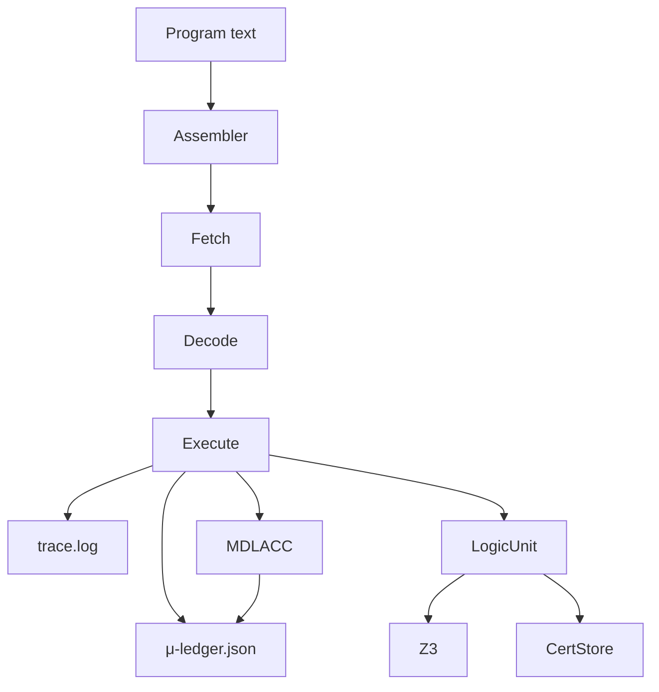

# Coq Formalization: Thiele CPU Empirically Subsumes Turing

## Formalization Directory
All Coq files for the formalization are in `thielecpu/coq/`:

- `TuringMachine.v`: Classical Turing machine definition
- `ThieleCPU.v`: Thiele CPU model (mirroring Python implementation)
- `Subsumption.v`: Theorem statement and simulation relation
- `EmpiricalEvidence.v`: Placeholder for linking empirical results from Python

## Status
- [x] Project scaffolded
- [x] Theorem stated
- [x] Simulation relation stubbed
- [ ] Step semantics and encodings to be completed
- [ ] Full proof in progress

## Build Instructions
Install Coq (8.16+ recommended):

```sh
sudo apt update && sudo apt install coq
```

To check the formalization:

```sh
cd thielecpu/coq
coqc Subsumption.v
```

## Notes
- The formalization is a work in progress.
- The Thiele CPU model is being refined to match the Python implementation in `thielecpu/`.
- The simulation relation and proof will be developed incrementally.
# Thiele CPU Simulator

The Thiele Machine project provides a compact reference
implementation of the Thiele CPU instruction set.  The simulator models the
entire ISA at the fetch→decode→execute level and records every decision the
machine makes.  Each run emits an instruction trace, a μ‑bit ledger tracking
structural information growth, Z3 certificates for logical steps, and a
summary of wall‑clock runtime statistics.  The goal is to make experiments in
minimal description length easy to reproduce and audit.

## Why Thiele?

Conventional processors hide the cost of reasoning behind complex pipelines and
opaque hardware state.  The Thiele CPU exposes that state explicitly: every
logical assertion is routed through a single solver, every proof or witness is
hashed and stored, and every increase in description length is accounted for in
μ.  Researchers can trace how information moves through the machine and verify
that the accounting matches the specification.

## What Makes It a Thiele Machine

The design follows the Thiele Machine philosophy that computation must account
for the structure it introduces.  Each instruction manipulates regions and
modules, not raw registers, and the machine tracks how those manipulations
change the program's description length.

- **Logical core** – `LASSERT` and `LJOIN` are first-class opcodes that send
  formulas to a solver and capture the resulting proof or witness.
- **Information ledger** – the μ counter grows deterministically with every
  structural operation, exposing the information cost of a computation.
- **Deterministic artifacts** – traces, certificates, and ledger entries are
  hashed so experiments can be reproduced and audited byte-for-byte.

### From First Principles

A Thiele Machine begins with only observable structure and logic.  Rather than
manipulating arithmetic registers, the machine operates on *regions* and
*modules*—abstract partitions of state.  Each instruction either refines these
partitions, composes their proofs, or accounts for the information introduced.

1. **State is structural.**  The sole mutable quantity is the arrangement of
   regions into modules.  No hidden state exists outside this graph.
2. **Reasoning is explicit.**  Logical claims are sent to an external solver and
   the resulting proof or model becomes part of the machine's record.
3. **Cost is measurable.**  The μ‑bit ledger grows with every structural change,
   giving a first‑principles measure of description length.

These rules reduce computation to the minimum ingredients necessary for
repeatable reasoning.

## How It Differs from a Standard CPU

Traditional CPUs prioritise arithmetic throughput and hide reasoning steps.
The Thiele CPU deliberately omits that complexity and elevates logic and
accounting:

- No arithmetic or general-purpose memory instructions; programs operate on
  regions and modules instead of registers and RAM.
- All logical reasoning is serialized through a single solver, producing
  certificates as mandatory outputs.
- A built-in μ-bit ledger accounts for structural growth, something mainstream
  architectures never expose.
- Deterministic execution ensures identical traces and hashes across runs,
  whereas commodity CPUs permit timing and concurrency variance.

## Features

- **Deterministic execution** – seeding of the solver ensures identical traces
  and certificate hashes across runs.
- **First‑class certificates** – proofs and witnesses are written to disk with
  SHA‑256 hashes so downstream tools can audit solver results.
- **μ‑bit ledger** – every structural action updates a running MDL counter,
  enabling quantitative comparisons between different algorithms or encodings.
- **Tiny ISA surface** – only the operations necessary to manipulate modules,
  make logical assertions, and seal certificates.

## Repository Layout

```
thielecpu/         core simulator package
examples/          tiny programs and SMT files
scripts/           helper utilities and demo launcher
out/               artifacts created by demos (ignored by git)
```

All documentation—ISA, programmer’s model, receipts, and architecture—is
consolidated in this file to keep the repository trim.

## Quickstart

All dependencies are listed in `requirements.txt`.  Once installed, run the
demo program and generate receipts with:

```bash
./scripts/run_demo_tseitin.sh      # writes outputs to ./out/demo
python scripts/gen_receipts.py     # converts JSON artifacts into CSV tables
```

The `./out/demo` directory then contains:

- `trace.log` – decoded instructions with cycle numbers
- `mu_ledger.json` – sequence of μ‑bit deltas and totals
- `certs/` – proofs, witnesses, and SHA‑256 hashes
- `summary.json` – runtime metadata (cycles, wall clock, CSR flags)

Each file is deterministic; rerunning the demo will reproduce identical
contents and hashes.  Detailed formats and workflow are described in the
sections below.

## Design Philosophy

The simulator favors legibility over raw speed.  All components are written in
plain Python so researchers can audit behaviour down to each instruction.  State
mutations are explicit, file formats are textual, and the pipeline can be
inspected with standard command‑line tools.

## Scope and Limitations

This project is a reference implementation.  It is intentionally single‑threaded
and omits caches, branch predictors, and speculative execution.  Arithmetic and
general purpose memory operations are absent; programs interact with the outside
world solely through regions, modules, and logic calls.  These constraints keep
the code surface tiny and the specification unambiguous while leaving room for
future extensions.

## Contributing

For questions or bug reports please open an issue.  Contributions that enhance
the clarity or auditability of the simulator are welcome.


## Architecture Overview

The Thiele CPU simulator is composed of a small set of cooperating components
arranged in a straight‑line pipeline.  The emphasis is on transparency: every
state transition is visible in the trace, every logical claim is certified, and
every increase in description length is accounted for.

### Pipeline



```
text → assemble → [fetch → decode → execute] → trace/μ-ledger/certs
                                    │
                                    ├─ LogicUnit ──► Z3
                                    └─ MDLACC ────► μ
```

1. **Assembler** – converts human‑readable opcodes into 32‑bit words.  The
   assembler performs minimal validation and leaves semantic checks to the VM.
2. **Fetch/Decode** – sequentially reads instruction words and translates them
   into `(opcode, a, b, c)` tuples.
3. **Execute** – dispatches on the opcode, mutating the `State` object and
   emitting trace entries.  Execution is single‑threaded and deterministic.
4. **LogicUnit** – handles `LASSERT` and `LJOIN`.  Inputs are normalised to
   SMT‑LIB2 and passed to Z3.  Proofs or models are written to disk and hashed.
5. **MDLACC** – applies the minimum description length rules to update the μ
   counter whenever modules or regions change structure.
6. **CertStore** – organises certificate files and maintains the CSR mapping for
   the latest hash.

### State Objects

- **State** – central container holding Π (partition map), μ counter, and CSR
  values.  It exposes small helper methods for module allocation and μ
  increments but deliberately avoids hidden side effects.
- **RegionGraph** – maintains the mapping from regions to module ids while
  enforcing disjointness.  All partition operations (`pnew`, `psplit`,
  `pmerge`) delegate to this structure.
- **VM** – orchestrates the fetch/decode/execute cycle and coordinates the
  LogicUnit and MDLACC.  It is responsible for emitting the trace and ledger
  entries in deterministic order.
- **CertStore** – assigns monotonically increasing certificate ids and writes
  assertion/proof/model/hash files to disk.

### Data Flow

During execution the VM performs the following high‑level steps for each
instruction:

1. Fetch word from program memory.
2. Decode opcode and operands.
3. Execute: update state, interact with LogicUnit or MDLACC as required.
4. Append a human readable entry to `trace.log`.
5. Record μ delta in `mu_ledger.json` if applicable.
6. When logic is invoked, store artifacts under `certs/` and update CSRs.

The deterministic ordering of these steps ensures reproducible traces and
ledger entries.

#### Certificate Workflow

1. `LASSERT` normalises the supplied SMT2 formula and writes it to
   `certs/<id>.assert.smt2`.
2. Z3 produces either a proof (`.proof`) or model (`.witness`), which is stored
   alongside the assertion file.
3. The byte stream from step 2 is hashed with SHA‑256 and the hex digest is
   written to `certs/<id>.sha256`.
4. The path to the hash file is reflected in `CSR_CERT_ADDR` so callers can
   validate the result without parsing the full log directory.

### Design Goals

- **Auditability** – every artifact is small, textual, and easy to inspect.
- **Determinism** – seeding of the solver and avoidance of concurrency yield
  repeatable results.
- **Minimalism** – only the primitives necessary for reasoning and accounting
  are implemented.

### Future Extensions

Potential areas for expansion include:

- Adding arithmetic and memory operations to broaden the class of programs that
  can be expressed.
- Introducing alternative SMT solvers via an abstraction layer in `logic.py`.
- Persisting the μ‑ledger in a structured database for large experiments.

Despite its simplicity, the current architecture is sufficient to explore
quantitative reasoning about proofs and information growth.


## Relation to Prior Work

The simulator sits on a foundation built by several research communities.  SAT
and SMT solvers have long supported proof logging and model extraction; this
project treats those artifacts as first‑class ISA outputs.  Solver‑aided
languages such as Rosette and SKETCH push computation into Z3 in a similar
spirit, and proof‑carrying code systems show how certificates can enforce
correctness.  The Thiele CPU differs in that these ideas live at the instruction
level: opcodes like `LASSERT` and `LJOIN` encode solver interaction directly,
deterministic receipts are mandatory, and a built‑in μ‑ledger quantifies the
information growth of a run.

## Caveats

- **μ semantics** – `MDLACC` is the sole authority for updating the μ counter.
  Region cell size and accounting rules must be applied consistently to avoid
  double counting.
- **Solver realities** – Z3 can return `unknown` or time out.  Each run records
  solver version and command‑line flags in `summary.json` so results can be
  reproduced exactly.
- **LJOIN specification** – joins only succeed when the composed certificates
  are logically compatible.  On paradox the CSR error flag is set and μ becomes
  infinite.
- **CSR model** – the CSR holds an opaque certificate id.  Actual file paths are
  listed in `summary.json` to keep the execution model agnostic to storage
  layout.


## ISA Specification

This document defines the instruction set architecture implemented by the
Thiele CPU simulator.  It serves as the canonical contract between software
running on the VM and the underlying execution engine.

The ISA is intentionally minimal.  It contains only the operations required to
manipulate modules, reason about their logical properties, and account for
information growth.  Arithmetic and general purpose memory operations are
absent; they can be layered on later once the correctness of the core
reasoning pipeline is established.

### State

The machine state is composed of three visible components.  Each component is
observable through the programmer's model and participates in the μ‑bit
accounting rules described in `docs/PROGRAMMERS_MODEL.md`.

#### μ Counter

`μ` is a 64‑bit unsigned integer representing the cumulative minimum description
length of the program so far.  Every structural change to the system increases
`μ`.  The counter starts at zero and monotonically increases unless a paradox is
encountered, in which case it is set to ∞ and further execution is undefined.

#### Partition Π

Π is a partition of memory regions into disjoint modules.  Each module owns one
or more regions.  Regions are abstract; they can represent bytes, clauses, or
arbitrary resources supplied by the host environment.  Modules are identified by
small integers.  Many instructions take modules as arguments to scope their
actions.

#### CSR Map

Control and status registers provide side channels for communicating results to
and from the logic unit.  The current implementation exposes three CSRs:

| Name       | Address | Width | Description                                                  |
|------------|---------|-------|--------------------------------------------------------------|
| CERT_ADDR  | 0x00    | ptr   | Path to the latest certificate hash file.                    |
| STATUS     | 0x01    | u8    | Result of the last logic operation (1 = SAT, 0 = UNSAT).     |
| ERR        | 0x02    | u8    | Non‑zero when a paradox or runtime error is detected.        |

Future revisions may introduce additional CSRs for performance counters or
extended solver information.  Software must treat unknown addresses as
reserved.

The three visible CSRs have well‑defined reset values:

| CSR        | Reset | Notes                                              |
|------------|------:|----------------------------------------------------|
| CERT_ADDR  | 0     | No certificate has been produced yet.              |
| STATUS     | 0     | Last logic result is UNSAT until proven otherwise. |
| ERR        | 0     | Execution starts in a non‑error state.             |

Writes to unknown CSR addresses are ignored.  Programs may read CSRs at any
time to make decisions based on solver outcomes or error conditions.

### Instruction Semantics

Each instruction is encoded as a single 32‑bit word.  Operands are encoded in
8‑bit slots; modules and regions are therefore limited to 256 unique ids in this
revision.  The simulator rejects encodings that do not conform to the layouts
below.

#### PNEW r → m

Create a new module `m` from region id `r`.

Pseudo‑code:

```
if Π.contains_region(r):
    m = fresh_module()
    Π.assign(r, m)
    return m
else:
    raise ERR
```

Effects:

- The region `r` must not already be assigned.
- `μ` increases by 16 bits to account for the new module cell.
- Returns the new module id in the destination slot of the instruction word.

#### PSPLIT r, pred → m₁, m₂

Split the module owning region `r` into two modules according to predicate
`pred`.  The predicate is a host function encoded as a resource id; it decides
for each element of `r` whether it belongs to `m₁` or `m₂`.

Pseudo‑code:

```
parent = Π.owner(r)
if parent is None:
    raise ERR
m1, m2 = fresh_module(), fresh_module()
for cell in region(r):
    if pred(cell):
        Π.assign(cell, m1)
    else:
        Π.assign(cell, m2)
return m1, m2
```

Effects:

- Both resulting modules inherit the CSR view of the parent.
- `μ` increases by 16 bits per newly created region cell.
- On inconsistent predicates (overlap), `CSR_ERR` is set and `μ` becomes ∞.

#### PMERGE m₁, m₂ → m

Merge two disjoint modules into a single module `m`.

Pseudo‑code:

```
if not Π.disjoint(m1, m2):
    raise ERR
m = fresh_module()
Π.move_regions(m1, m)
Π.move_regions(m2, m)
return m
```

Effects:

- Precondition: modules must be disjoint; otherwise `CSR_ERR` is set.
- All regions from `m₁` and `m₂` are reassigned to `m`.
- `μ` increases by 16 bits for the consolidated cell.

#### LASSERT m, φ → cert

Invoke the logic unit on formula `φ` scoped to module `m`.

Pseudo‑code:

```
cid = cert_store.next()
write_smt2(cid, φ)
result = z3_check(φ)
if result == SAT:
    write_model(cid)
    CSR_STATUS = 1
else:
    write_proof(cid)
    CSR_STATUS = 0
hash_cert(cid)
CSR_CERT_ADDR = path(cid)
return cid
```

Effects:

- The SMT2 representation of `φ` is normalised and written to
  `certs/<id>.assert.smt2` inside the run directory.
- Z3 is invoked; a proof (UNSAT) or model (SAT) is written alongside the SMT2.
- `CSR_STATUS` is updated: `1` for SAT, `0` for UNSAT.
- A SHA‑256 hash of the proof or model is written to `certs/<id>.sha256` and the
  path recorded in `CSR_CERT_ADDR`.

#### LJOIN m₁, m₂ → cert

Combine two existing certificates.

Pseudo‑code:

```
cid = cert_store.next()
if certificates_compatible(m1, m2):
    write_join(cid, m1, m2)
    hash_cert(cid)
    CSR_CERT_ADDR = path(cid)
else:
    write_join(cid, m1, m2)
    CSR_ERR = 1
    μ = ∞
return cid
```

Effects:

- If the certificates are compatible the resulting hash is written as in
  `LASSERT`.
- If a paradox is detected the proof is still written but `CSR_ERR` is set to
  `1` and `μ` becomes ∞.

#### MDLACC m → μ

Update the μ counter based on the structural complexity of module `m`.

Pseudo‑code:

```
if CSR_ERR:
    μ = ∞
else:
    μ += 16 * module_size(m)
return μ
```

Effects:

- For each region cell in `m`, `μ` increases by 16 bits.
- If `CSR_ERR` is set, `μ` is forced to ∞.

#### EMIT cert → hash

Seal a certificate and expose its hash through `CSR_CERT_ADDR`.

Pseudo‑code:

```
hash = sha256(cert)
save_hash(cert, hash)
CSR_CERT_ADDR = path(hash)
return hash
```

Effects:

- The certificate file is flushed to disk and a SHA‑256 hash is computed.
- The hash path is written to `CSR_CERT_ADDR`.
- `μ` is unchanged.

#### XFER m, r

Rebind region `r` to module `m`.

Pseudo‑code:

```
if not Π.contains_region(r):
    raise ERR
Π.assign(r, m)
```

Effects:

- Region `r` must already exist in Π.
- Ownership is moved without altering `μ`.
- Used by higher level code to shuffle resources between modules.

### Encoding

All instructions share a common 32‑bit little‑endian layout:

```
[ opcode:8 ][ a:8 ][ b:8 ][ c:8 ]
```

The meaning of the operand slots depends on the instruction.  The table below
summarises the mapping:

| Mnemonic | Opcode | a field       | b field       | c field / notes                  |
|----------|-------:|--------------|--------------|----------------------------------|
| PNEW     | 0x00   | region id    | dest module  | unused                           |
| PSPLIT   | 0x01   | region id    | predicate id | dest module id (implicit +1)     |
| PMERGE   | 0x02   | module id 1  | module id 2  | dest module id                   |
| LASSERT  | 0x03   | module id    | formula id   | certificate id                   |
| LJOIN    | 0x04   | cert id 1    | cert id 2    | result certificate id            |
| MDLACC   | 0x05   | module id    | unused       | unused                           |
| EMIT     | 0x06   | cert id      | unused       | unused                           |
| XFER     | 0x07   | module id    | region id    | unused                           |

Unused fields must be zero; the decoder rejects non‑zero values to avoid forward
compatibility ambiguities.

### Exceptions

An instruction triggers an exception when:

- The opcode value is not recognised.
- Any reserved field is non‑zero.
- A precondition listed in the semantic descriptions is violated (e.g. merging
  overlapping modules).

When an exception occurs the VM sets `CSR_ERR` to a non‑zero value, halts
execution, and records the offending instruction in the runtime summary.

### Example Program

The following snippet creates a module from region `0`, asserts a simple formula
about it, and seals the resulting certificate:

```
PNEW   r0       -> m0
LASSERT m0, φ0  -> c0
EMIT   c0       -> h0
```

This program will produce an SMT2 file for `φ0`, a proof or model from Z3, and a
SHA‑256 hash written to disk.  The μ‑ledger will contain entries for the module
allocation and the logic assertion.

### Rationale and Future Work

The Thiele ISA focuses on the intersection of program structure and logical
reasoning.  By keeping the instruction surface tiny the simulator encourages a
style of programming where most behaviour is expressed in the surrounding host
language while critical logical steps go through the certified pipeline.  Future
extensions may add arithmetic operations, richer region predicates, or
multi‑solver backends.


## Programmer's Model

This document describes how programmers interact with the Thiele CPU simulator
and how to interpret the artifacts produced by a run.

### Python API

Programs are written in the tiny Thiele assembly syntax and executed through
the Python API.  The snippet below mirrors `scripts/run_demo_tseitin.sh`:

```python
from pathlib import Path
from thielecpu.assemble import parse
from thielecpu.state import State
from thielecpu.vm import VM

prog_path = Path("examples/demo.thl")
with prog_path.open() as fh:
    program = parse(fh, prog_path.parent)

vm = VM(State())
vm.run(program, Path("out/demo"))
```

`out/demo` will contain the trace, μ‑ledger, certificates, and summary files
described below.

### Assembly Syntax

Program files (`*.thl`) are plain text with one instruction per line.  Operands
are comma‑separated and comments start with `#`:

```
PNEW   r0      -> m0     # create module 0 from region 0
LASSERT m0, f0 -> c0     # assert formula f0 in module 0
EMIT   c0      -> h0     # seal certificate
```

Tokens beginning with `r` denote region identifiers while tokens beginning with
`m`, `f`, or `c` denote modules, formulas, and certificates respectively.  The
assembler resolves these aliases to numeric ids during assembly.

### Output Directory Layout

After a successful run, `outdir/` contains:

- `trace.log` – human readable trace of every executed instruction with cycle
  numbers and operand values.
- `mu_ledger.json` – JSON array documenting the evolution of the μ counter.
- `certs/` – directory containing solver inputs and outputs.
- `summary.json` – final statistics and CSR values.

#### trace.log

Each line of the trace has the form:

```
<cycle>: <mnemonic> <op_a> <op_b> <op_c>
```

The trace is deterministic and can be replayed to reconstruct machine state.

#### mu_ledger.json

The μ‑ledger captures how much structural information the program has
accumulated.  Each entry is a JSON object with the following schema:

```json
{
  "step": 1,
  "delta_mu": 0,
  "total_mu": 0,
  "reason": "start"
}
```

- `step` – sequential instruction number starting at 1.
- `delta_mu` – increase in μ caused by the instruction.
- `total_mu` – cumulative μ after the instruction.
- `reason` – mnemonic or short explanation of the event.

The first entry records the initial state with zero μ.

#### certs/

Each logic instruction produces a triplet of files:

| File extension | Description                                       |
|----------------|---------------------------------------------------|
| `.assert.smt2` | Normalised SMT2 fed to Z3.                         |
| `.proof`       | Z3 proof object when the formula is UNSAT.         |
| `.witness`     | Z3 model when the formula is SAT.                  |
| `.sha256`      | Hash of the proof or witness bytes (hex encoded).  |

Files are numbered sequentially starting at `0001`.  The hash file is
referenced by `CSR_CERT_ADDR` so external tools can verify the proof without
parsing the entire log directory.

#### summary.json

The summary collects final run metadata:

```json
{
  "mu": 32,
  "cert": "out/demo/certs/0001.sha256"
}
```

`mu` is the cumulative description length after the last instruction.  `cert`
holds the path to the final certificate hash.  Future versions may extend this
schema with cycle counts or wall‑clock timings.

### Determinism

The simulator seeds its solver with a fixed value so re‑running the same program
produces identical traces, ledgers, and certificate hashes.  The demo script
uses seed `1`, which is recorded in `RECEIPTS.md`.

### File Formats

#### Ledger CSV

The `scripts/gen_receipts.py` utility converts `mu_ledger.json` into a CSV with
columns `step,delta_mu,total_mu,reason`.  The CSV is stable across runs and can
be imported into plotting tools or spreadsheets.

#### Certificates

Certificate files are written exactly as produced by Z3.  Proof and witness
files can be large; for automated checks it is often sufficient to verify the
SHA‑256 hash.

### Exit Status and CSR Interaction

Programs interact with CSRs implicitly through instructions like `LASSERT` and
`LJOIN`.  After each logic operation `CSR_STATUS` and `CSR_ERR` are updated.
Calling programs should inspect `summary.json` to determine success.  A
non‑zero `ERR` indicates that μ has become infinite and any further reasoning is
unsound.

### Debugging Tips

- Alter the seed in the source to explore alternative solver models while still
  maintaining reproducibility.
- Inspect `trace.log` to step through execution; each line corresponds to a
  cycle and can be cross‑referenced with `mu_ledger.json`.
- The `certs/` directory is numbered; comparing hashes across runs quickly
  reveals nondeterministic behaviour.


## Receipts

Receipts are reproducible records of a simulator run.  They allow external
auditors to verify μ‑bit accounting, solver results, and runtime characteristics
without executing the original program.  This document explains how receipts are
generated and what information they contain.

### Generating Receipts

Receipts are derived from the JSON artifacts produced by a run directory.

```bash
./scripts/run_demo_tseitin.sh   # writes outputs to ./out/demo using seed=1
python scripts/gen_receipts.py  # populates ./out/demo/mu_ledger.csv and summary.csv
```

The demo uses the files under `examples/` and a fixed solver seed of `1`.
Re‑running the above commands on a clean clone yields identical CSV files and
certificate hashes.

#### Step‑by‑Step

1. `scripts/run_demo_tseitin.sh` executes `examples/demo.thl` through the Python API.
2. The run directory `out/demo/` contains `trace.log`, `mu_ledger.json`,
   `summary.json`, and the `certs/` subdirectory.
3. `scripts/gen_receipts.py` reads the JSON files and writes `mu_ledger.csv`
   and `summary.csv`.
4. The CSV files are checked for determinism by hashing their contents.  Any
   deviation indicates a non‑deterministic component in the simulator.

### File Contents

#### mu_ledger.csv

Columns: `step,delta_mu,total_mu,reason`.

Example:

```csv
step,delta_mu,total_mu,reason
1,0,0,start
2,16,16,pnew
3,16,32,lassert
```

#### summary.csv

Columns: `cert,mu`.

Example:

```csv
cert,mu
out/demo/certs/0001.sha256,32
```

The summary consolidates the final μ count and the path to the last certificate
hash.

If multiple certificates are emitted the CSV contains one row per hash in the
order they were sealed.  The last row therefore mirrors the state reported in
`summary.json`.

### Reproducibility Guidelines

- Always record the seed used for the run.  The demo defaults to `1`.
- Ensure the output directory does not exist before running the demo script.
- Commit the resulting CSV files alongside any publication or experiment so
  others can verify your results.
- Receipts are small; they can be embedded into reports or uploaded as build
  artifacts in CI pipelines.

### Verifying Receipts

To verify a published receipt, download the CSV files and run:

```bash
sha256sum -c receipt.sha256  # optional hash check if provided
python scripts/verify_receipt.py receipt_directory
```

The verification script (future work) will recompute μ and certificate hashes to
ensure the receipt corresponds to a valid run.

For quick manual checks you can diff the CSV files from two runs:

```bash
diff -u run1/mu_ledger.csv run2/mu_ledger.csv
diff -u run1/summary.csv   run2/summary.csv
```

If both commands produce no output the runs are considered identical.
