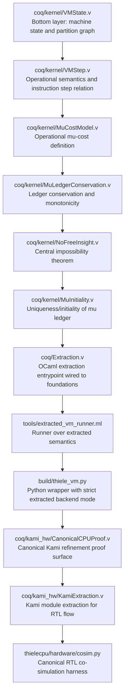
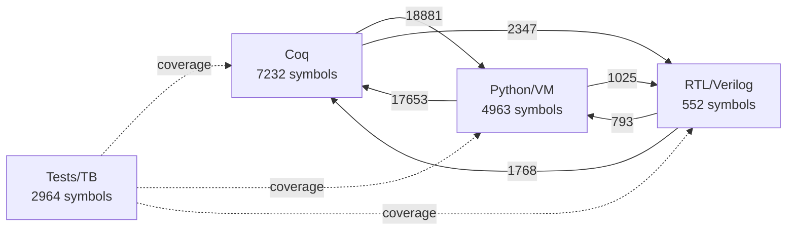
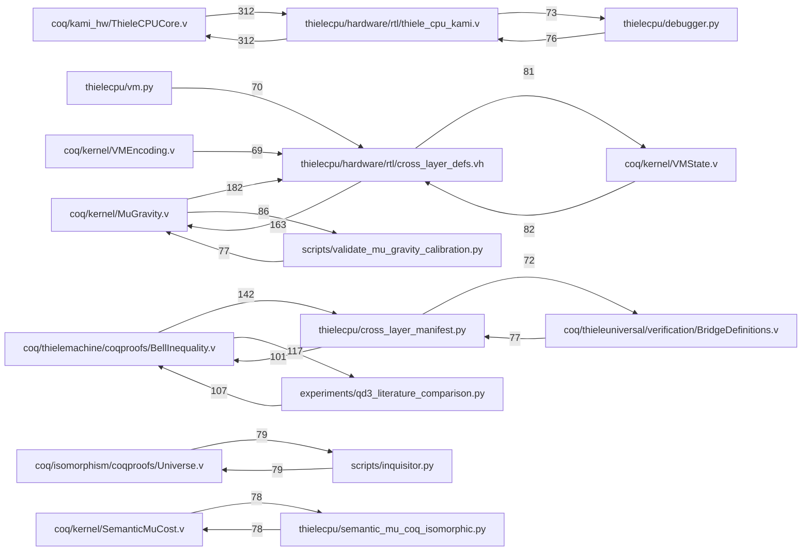

# Thiele Integration Atlas

Generated: 2026-03-01T18:29:38.957673+00:00

Single canonical atlas tracking progress toward the Thiele Machine thesis goal.

## Thesis Goal Tracker

Goal: A complete Thiele Machine formalized in Coq, extracted to a Python VM and a
Verilog CPU, all compiling/synthesizing and bit-for-bit isomorphic across all layers.

| Gate | Status |
|---|---|
| Coq kernel compiles | ✓ PASS |
| OCaml extraction build | ✓ PASS |
| Extraction freshness | ✓ PASS |
| RTL synthesis | ✓ PASS |
| Kernel triads (3-layer coverage) | 43.0%  (92 complete / 122 partial) |
| Cross-layer connectivity | 95.55% of symbols (8746/9153) |
| Deep value isomorphism violations | ✓ none |
| Definition of Done | **NOT_COMPLETED** |

## Executive Summary

- Total symbols: **15711**
- Total edges: **100672**
- 3-layer triads: **92**
- Partial triads (2/3 layers): **122**
- Integrate candidates: **0**
- Archive candidates: **2**
- Inquisitor gate: **PASS**
- Proof accuracy: **100.00%**
- Test verification gate: **FAIL**
- Definition of Done: **NOT_COMPLETED**
- Deep isomorphism value mismatches: **0**

Policy: Coq proofs are never archived — they are the mathematical foundation.
Important: Proof accuracy is Inquisitor proof-hygiene quality, not project completion percentage.

## Inquisitor Proof Gate

| Metric | Value |
|---|---:|
| Gate rating | PASS |
| Strict pass | True |
| Proof accuracy | 100.00% |
| Proof grade | A+ |
| Scanned Coq files | 319 |
| HIGH findings | 0 |
| MEDIUM findings | 0 |
| LOW findings | 0 |
| Proof connectivity gaps | 0 |
| Cross-layer foundation disconnects | 0 |
| Inquisitor return code | 0 |

Top failing rule families from Inquisitor:

| Rule | Count |
|---|---:|
| *(none parsed)* | 0 |

## Kernel Organization Guidance

- Kernel Coq files: **126**, average connectivity **68%**
- Non-kernel Coq files: **191**, average connectivity **65%**
- Guidance: Kernel should remain the minimal canonical semantics layer; keep physics and domain files outside kernel and prove bridges into kernel invariants.

## Canonical Foundation Chain

Bottom-most layer is `coq/kernel/VMState.v` (state, partition graph, canonical normalization).
Every higher theorem/runtime surface must be constructively connected through this chain:

| Order | Stage | Role |
|---|---|---|
| 1 | coq/kernel/VMState.v | Bottom layer: machine state and partition graph |
| 2 | coq/kernel/VMStep.v | Operational semantics and instruction step relation |
| 3 | coq/kernel/MuCostModel.v | Operational mu-cost definition |
| 4 | coq/kernel/MuLedgerConservation.v | Ledger conservation and monotonicity |
| 5 | coq/kernel/NoFreeInsight.v | Central impossibility theorem |
| 6 | coq/kernel/MuInitiality.v | Uniqueness/initiality of mu ledger |
| 7 | coq/Extraction.v | OCaml extraction entrypoint wired to foundations |
| 8 | tools/extracted_vm_runner.ml | Runner over extracted semantics |
| 9 | build/thiele_vm.py | Python wrapper with strict extracted backend mode |
| 10 | coq/kami_hw/CanonicalCPUProof.v | Canonical Kami refinement proof surface |
| 11 | coq/kami_hw/KamiExtraction.v | Kami module extraction for RTL flow |
| 12 | thielecpu/hardware/cosim.py | Canonical RTL co-simulation harness |



## Isomorphism Guidance Scorecard

| Metric | Value |
|---|---:|
| Isomorphism score (0-100) | 78.49 |
| Core+Bridge production ratio | 96% |
| Triad completion ratio | 43% |
| Directional coverage | 6/6 |
| Integrate-file pressure | 0% |
| Completion readiness (heuristic) | 56.95 |

## Test Verification Gate

| Metric | Value |
|---|---:|
| Gate rating | FAIL |
| Production symbol coverage | 7% |
| Production file coverage | 46% |
| Isolated test files | 0 |
| Covered prod symbols | 853/12747 |
| Covered prod files | 237/517 |

## Definition of Done (Unambiguous Completion Gate)

Overall status: **NOT_COMPLETED**

| Check | Actual | Target | Pass |
|---|---:|---:|---|
| isomorphism_score | 78.49 | >= 95.0 | False |
| triad_completion_ratio | 0.4299 | >= 0.85 | False |
| core_bridge_ratio | 0.9555 | >= 0.99 | False |
| test_prod_symbol_coverage_ratio | 0.0669 | >= 0.15 | False |
| test_prod_file_coverage_ratio | 0.4584 | >= 0.5 | False |
| isolated_test_files | 0.0 | <= 0.0 | True |
| per_proof_doc_ratio | 0.9921 | >= 0.99 | True |
| proof_files_with_readme_ratio | 0.9716 | >= 1.0 | False |
| kernel_proof_latex_coverage_ratio | 0.9701 | >= 0.99 | False |
| proof_connectivity_gaps | 0.0 | <= 0.0 | True |
| cross_layer_foundation_disconnects | 0.0 | <= 0.0 | True |
| coq_compile_pass | 1.0 | >= 1.0 | True |
| ocaml_extraction_build_pass | 1.0 | >= 1.0 | True |
| extraction_freshness_pass | 1.0 | >= 1.0 | True |
| rtl_synthesis_pass | 1.0 | >= 1.0 | True |
| inquisitor_strict_pass | 1.0 | == 1.0 | True |
| isomorphism_proof_chain_gaps | 0.0 | <= 0.0 | True |
| opcode_parity_violations | 0.0 | <= 0.0 | True |
| test_proof_lockstep_violations | 0.0 | <= 0.0 | True |
| extraction_semantic_violations | 0.0 | <= 0.0 | True |
| foundation_utilization_gaps | 0.0 | <= 0.0 | True |

Unmet checks:

- isomorphism_score: actual=78.49 target >= 95.0
- triad_completion_ratio: actual=0.4299 target >= 0.85
- core_bridge_ratio: actual=0.9555 target >= 0.99
- test_prod_symbol_coverage_ratio: actual=0.0669 target >= 0.15
- test_prod_file_coverage_ratio: actual=0.4584 target >= 0.5
- proof_files_with_readme_ratio: actual=0.9716 target >= 1.0
- kernel_proof_latex_coverage_ratio: actual=0.9701 target >= 0.99

### Why NOT_COMPLETED (Counterexamples)

Each failing gate has a specific, actionable root cause:

1. isomorphism_score=78.5 < 95.0: Symbols exist in some layers but not all three. Find partial triads and add the missing layer implementation.
2. triad_completion_ratio=0.4299 < 0.85: Too many symbols appear in only 1-2 layers. Each proven concept must appear in Coq, Python, AND RTL.


## Toolchain Reality Gates

These gates verify **actual compilation, extraction, and synthesis** — not just
static graph analysis. All five must PASS for the isomorphism to be mechanically
checkable end-to-end.

| Gate | Ran | Pass | Detail |
|---|---|---|---|

## Deep Isomorphism Value Mismatches

These are value-level disagreements for triads where constants were parseable across layers.

| Norm | Coq | Python | RTL | Delta | Severity |
|---|---:|---:|---:|---:|---|
| *(none)* | | | | | |
| Coq compile (make -C coq, zero Admitted) | ✓ | **PASS** | 321/322 .vo, admits=0 |
| OCaml extraction build (Extraction.vo + MinimalExtraction.vo) | ✓ | **PASS** | rc=0 |
| Extraction freshness (thiele_core.ml ≥ Extraction.v) | ✓ | **PASS** | — |
| RTL synthesis (Yosys lite, top=thiele_cpu, cells>0) | ✓ | **PASS** | cells=8409 top=True |
| Co-simulation (iverilog/vvp testbench) | ✓ | **PASS** | rc=0 fatal=False |

## Thesis/Math LaTeX Coverage

| Metric | Value |
|---|---:|
| TeX files scanned | 20 |
| Kernel proof symbols mentioned in TeX | 1039/1071 |
| Kernel proof LaTeX coverage ratio | 97% |
| Triad norms mentioned in TeX | 54/92 |
| Triad norm LaTeX coverage ratio | 59% |

Top missing kernel proof symbols in TeX (first 20):

| Symbol |
|---|
| alpha_fundamental |
| bianchi_identity_vacuum |
| both_preserve_mu_monotonicity |
| complete_three_layer_isomorphism |
| cpu_bisimulation |
| discrete_divergence_uniform |
| discrete_divergence_vacuum |
| fold_left_add_zero |
| general_bianchi_identity |
| implementation_equivalence |
| jump_state_graph |
| jump_state_rm_graph |
| optimized_cpu_correct |
| p_13_equals_101 |
| p_14_equals_135 |
| p_15_equals_176 |
| pair_sum_cancel |
| performance_correctness_tradeoff |
| receipt_equivalence |
| rtl_coq_single_step_bisimulation |

## Coq Proof Documentation Coverage (Low Priority)

| Metric | Value |
|---|---:|
| Proof files | 282 |
| Proof files with local README | 274/282 |
| Proof files with comment blocks | 282/282 |
| Proof files documented (README + comments) | 272/282 |

| Proof file | Proof count | Has comments | Has README | Status |
|---|---:|---|---|---|
| coq/kami_hw/CanonicalCPUProof.v | 1 | True | False | needs_docs |
| coq/kernel/CPURefinement.v | 8 | True | True | needs_docs |
| coq/kernel/AlphaDerivation.v | 4 | True | True | needs_docs |
| coq/kami_hw/Abstraction.v | 30 | True | False | needs_docs |
| coq/kami_hw/VerilogRefinement.v | 5 | True | False | needs_docs |
| coq/kernel/ThreeLayerIsomorphism.v | 20 | True | True | documented |
| coq/bridge/BoxWorld_to_Kernel.v | 7 | True | True | documented |
| coq/bridge/Causal_to_Kernel.v | 1 | True | True | documented |
| coq/bridge/Entropy_to_Kernel.v | 1 | True | True | documented |
| coq/bridge/FiniteQuantum_to_Kernel.v | 9 | True | True | documented |
| coq/bridge/PythonMuLedgerBisimulation.v | 8 | True | True | documented |
| coq/bridge/Randomness_to_Kernel.v | 1 | True | True | documented |
| coq/bridge/Tomography_to_Kernel.v | 1 | True | True | documented |
| coq/catnet/coqproofs/CatNet.v | 3 | True | True | documented |
| coq/isomorphism/coqproofs/Universe.v | 3 | True | True | documented |
| coq/kernel/AlgebraicCoherence.v | 17 | True | True | documented |
| coq/kernel/ArrowOfTimeSynthesis.v | 15 | True | True | documented |
| coq/kernel/BornRule.v | 10 | True | True | documented |
| coq/kernel/BornRuleFromSymmetry.v | 4 | True | True | documented |
| coq/kernel/BoxCHSH.v | 7 | True | True | documented |
| coq/kernel/CHSH.v | 5 | True | True | documented |
| coq/kernel/CHSHExtraction.v | 6 | True | True | documented |
| coq/kernel/CausalSetAxioms.v | 11 | True | True | documented |
| coq/kernel/Certification.v | 10 | True | True | documented |
| coq/kernel/ClassicalBound.v | 2 | True | True | documented |
| coq/kernel/Closure.v | 1 | True | True | documented |
| coq/kernel/Composition.v | 5 | True | True | documented |
| coq/kernel/ConeAlgebra.v | 14 | True | True | documented |
| coq/kernel/ConeDerivation.v | 2 | True | True | documented |
| coq/kernel/ConstantDerivationStrength.v | 14 | True | True | documented |
| coq/kernel/ConstantUnification.v | 6 | True | True | documented |
| coq/kernel/ConstructivePSD.v | 23 | True | True | documented |
| coq/kernel/DerivedTime.v | 3 | True | True | documented |
| coq/kernel/DiscreteCalculus.v | 6 | True | True | documented |
| coq/kernel/DiscreteGaussBonnet.v | 11 | True | True | documented |
| coq/kernel/DiscreteTopology.v | 18 | True | True | documented |
| coq/kernel/EinsteinEmergence.v | 7 | True | True | documented |
| coq/kernel/EinsteinEquations4D.v | 43 | True | True | documented |
| coq/kernel/EntropyImpossibility.v | 4 | True | True | documented |
| coq/kernel/FalsifiablePrediction.v | 2 | True | True | documented |
| coq/kernel/FiniteInformation.v | 17 | True | True | documented |
| coq/kernel/FourDSimplicialComplex.v | 11 | True | True | documented |
| coq/kernel/GeodesicCompleteness.v | 8 | True | True | documented |
| coq/kernel/HardAssumptions.v | 2 | True | True | documented |
| coq/kernel/HardMathFactsProven.v | 7 | True | True | documented |
| coq/kernel/HardwareBisimulation.v | 11 | True | True | documented |
| coq/kernel/InformationCausality.v | 13 | True | True | documented |
| coq/kernel/InverseSquareLaw.v | 13 | True | True | documented |
| coq/kernel/KernelBenchmarks.v | 5 | True | True | documented |
| coq/kernel/KernelNoether.v | 12 | True | True | documented |
| coq/kernel/KernelPhysics.v | 23 | True | True | documented |
| coq/kernel/KernelTM.v | 1 | True | True | documented |
| coq/kernel/L2Derivation.v | 10 | True | True | documented |
| coq/kernel/LocalInfoLoss.v | 8 | True | True | documented |
| coq/kernel/Locality.v | 16 | True | True | documented |
| coq/kernel/LorentzNotForced.v | 3 | True | True | documented |
| coq/kernel/LorentzSignature.v | 17 | True | True | documented |
| coq/kernel/MasterSummary.v | 5 | True | True | documented |
| coq/kernel/MetricFromMuCosts.v | 13 | True | True | documented |
| coq/kernel/MinimalE.v | 2 | True | True | documented |
| coq/kernel/MinorConstraints.v | 13 | True | True | documented |
| coq/kernel/ModularObservation.v | 4 | True | True | documented |
| coq/kernel/MuChaitin.v | 3 | True | True | documented |
| coq/kernel/MuComplexity.v | 5 | True | True | documented |
| coq/kernel/MuCostDerivation.v | 10 | True | True | documented |
| coq/kernel/MuCostModel.v | 7 | True | True | documented |
| coq/kernel/MuGeometry.v | 5 | True | True | documented |
| coq/kernel/MuGravity.v | 108 | True | True | documented |
| coq/kernel/MuGravity_BridgeTheorems.v | 1 | True | True | documented |
| coq/kernel/MuGravity_Definitions.v | 1 | True | True | documented |
| coq/kernel/MuGravity_Emergence.v | 1 | True | True | documented |
| coq/kernel/MuInformation.v | 5 | True | True | documented |
| coq/kernel/MuInitiality.v | 18 | True | True | documented |
| coq/kernel/MuLedgerConservation.v | 24 | True | True | documented |
| coq/kernel/MuNecessity.v | 4 | True | True | documented |
| coq/kernel/MuNoFreeInsightQuantitative.v | 7 | True | True | documented |
| coq/kernel/NPAMomentMatrix.v | 7 | True | True | documented |
| coq/kernel/NPMuCostBound.v | 9 | True | True | documented |
| coq/kernel/NoArbitrage.v | 5 | True | True | documented |
| coq/kernel/NoCloning.v | 7 | True | True | documented |
| coq/kernel/NoCloningFromMuMonotonicity.v | 4 | True | True | documented |
| coq/kernel/NoFreeInsight.v | 3 | True | True | documented |
| coq/kernel/NoGo.v | 11 | True | True | documented |
| coq/kernel/NoGoSensitivity.v | 4 | True | True | documented |
| coq/kernel/NonCircularityAudit.v | 15 | True | True | documented |
| coq/kernel/ObserverDerivation.v | 7 | True | True | documented |
| coq/kernel/OracleImpossibility.v | 7 | True | True | documented |
| coq/kernel/PDISCOVERIntegration.v | 6 | True | True | documented |
| coq/kernel/PNEWTopologyChange.v | 7 | True | True | documented |
| coq/kernel/POVMBridge.v | 8 | True | True | documented |
| coq/kernel/PartitionSeparation.v | 5 | True | True | documented |
| coq/kernel/Persistence.v | 3 | True | True | documented |
| coq/kernel/PhysicsClosure.v | 1 | True | True | documented |
| coq/kernel/PoissonEquation.v | 9 | True | True | documented |
| coq/kernel/ProbabilityImpossibility.v | 3 | True | True | documented |
| coq/kernel/ProperSubsumption.v | 6 | True | True | documented |
| coq/kernel/Purification.v | 7 | True | True | documented |
| coq/kernel/PythonBisimulation.v | 5 | True | True | documented |
| coq/kernel/QuantumBound.v | 8 | True | True | documented |
| coq/kernel/QuantumEquivalence.v | 10 | True | True | documented |
| coq/kernel/ReceiptCore.v | 1 | True | True | documented |
| coq/kernel/ReceiptIntegrity.v | 17 | True | True | documented |
| coq/kernel/RevelationRequirement.v | 5 | True | True | documented |
| coq/kernel/SemanticComplexityIsomorphism.v | 12 | True | True | documented |
| coq/kernel/SemanticMuCost.v | 2 | True | True | documented |
| coq/kernel/SemidefiniteProgramming.v | 5 | True | True | documented |
| coq/kernel/SimulationProof.v | 29 | True | True | documented |
| coq/kernel/SpacetimeEmergence.v | 23 | True | True | documented |
| coq/kernel/StateSpaceCounting.v | 7 | True | True | documented |
| coq/kernel/StressEnergyDynamics.v | 5 | True | True | documented |
| coq/kernel/Subsumption.v | 3 | True | True | documented |
| coq/kernel/TOE.v | 1 | True | True | documented |
| coq/kernel/TOEDecision.v | 4 | True | True | documented |
| coq/kernel/Tier1Proofs.v | 6 | True | True | documented |
| coq/kernel/TopologyCurvatureBridge.v | 5 | True | True | documented |
| coq/kernel/TsirelsonComputation.v | 1 | True | True | documented |
| coq/kernel/TsirelsonDerivation.v | 5 | True | True | documented |
| coq/kernel/TsirelsonFromAlgebra.v | 11 | True | True | documented |
| coq/kernel/TsirelsonGeneral.v | 15 | True | True | documented |
| coq/kernel/TsirelsonLowerBound.v | 2 | True | True | documented |
| coq/kernel/TsirelsonUniqueness.v | 1 | True | True | documented |
| coq/kernel/TsirelsonUpperBound.v | 19 | True | True | documented |
| coq/kernel/Unitarity.v | 7 | True | True | documented |
| coq/kernel/VMEncoding.v | 15 | True | True | documented |
| coq/kernel/VMState.v | 32 | True | True | documented |
| coq/kernel/ValidCorrelation.v | 1 | True | True | documented |
| coq/kernel/VerilogRTLCorrespondence.v | 6 | True | True | documented |
| coq/kernel_toe/Closure.v | 1 | True | True | documented |
| coq/kernel_toe/NoGo.v | 11 | True | True | documented |
| coq/kernel_toe/NoGoSensitivity.v | 4 | True | True | documented |
| coq/kernel_toe/Persistence.v | 3 | True | True | documented |
| coq/kernel_toe/TOE.v | 1 | True | True | documented |
| coq/modular_proofs/CornerstoneThiele.v | 5 | True | True | documented |
| coq/modular_proofs/Encoding.v | 16 | True | True | documented |
| coq/modular_proofs/EncodingBounds.v | 18 | True | True | documented |
| coq/modular_proofs/Minsky.v | 2 | True | True | documented |
| coq/modular_proofs/Simulation.v | 2 | True | True | documented |
| coq/modular_proofs/TM_Basics.v | 10 | True | True | documented |
| coq/modular_proofs/TM_to_Minsky.v | 12 | True | True | documented |
| coq/modular_proofs/ThieleInstance.v | 12 | True | True | documented |
| coq/modular_proofs/Thiele_Basics.v | 2 | True | True | documented |
| coq/nofi/Instance_Kernel.v | 4 | True | True | documented |
| coq/nofi/MuChaitinTheory_Theorem.v | 3 | True | True | documented |
| coq/nofi/NoFreeInsight_Theorem.v | 1 | True | True | documented |
| coq/physics/DiscreteModel.v | 15 | True | True | documented |
| coq/physics/DissipativeModel.v | 5 | True | True | documented |
| coq/physics/LandauerBridge.v | 10 | True | True | documented |
| coq/physics/PreregSplit.v | 4 | True | True | documented |
| coq/physics/TriangularLattice.v | 27 | True | True | documented |
| coq/physics/WaveModel.v | 23 | True | True | documented |
| coq/physics_exploration/DissipativeEmbedding.v | 9 | True | True | documented |
| coq/physics_exploration/EmergentSchrodinger.v | 4 | True | True | documented |
| coq/physics_exploration/EmergentSpacetime.v | 3 | True | True | documented |
| coq/physics_exploration/HardwareVMHarness.v | 2 | True | True | documented |
| coq/physics_exploration/HolographicGravity.v | 2 | True | True | documented |
| coq/physics_exploration/ParticleMasses.v | 2 | True | True | documented |
| coq/physics_exploration/PhysicsEmbedding.v | 12 | True | True | documented |
| coq/physics_exploration/PlanckDerivation.v | 7 | True | True | documented |
| coq/physics_exploration/PlanckEmergenceClean.v | 14 | True | True | documented |
| coq/physics_exploration/WaveEmbedding.v | 10 | True | True | documented |
| coq/project_cerberus/coqproofs/Cerberus.v | 6 | True | True | documented |
| coq/quantum_derivation/BornRuleUnique.v | 2 | True | True | documented |
| coq/quantum_derivation/CollapseDetermination.v | 3 | True | True | documented |
| coq/quantum_derivation/ComplexNecessity.v | 13 | True | True | documented |
| coq/quantum_derivation/CompositePartitions.v | 5 | True | True | documented |
| coq/quantum_derivation/ObservationIrreversibility.v | 4 | True | True | documented |
| coq/quantum_derivation/ProjectionFromPartitions.v | 4 | True | True | documented |
| coq/quantum_derivation/SchrodingerFromPartitions.v | 3 | True | True | documented |
| coq/quantum_derivation/TensorNecessity.v | 5 | True | True | documented |
| coq/quantum_derivation/TwoDimensionalNecessity.v | 8 | True | True | documented |
| coq/self_reference/SelfReference.v | 4 | True | True | documented |
| coq/shor_primitives/Euclidean.v | 3 | True | True | documented |
| coq/shor_primitives/Modular.v | 8 | True | True | documented |
| coq/shor_primitives/PeriodFinding.v | 1 | True | True | documented |
| coq/shor_primitives/PolylogConjecture.v | 1 | True | True | documented |
| coq/spacetime/Spacetime.v | 7 | True | True | documented |
| coq/spacetime_projection/SpacetimeProjection.v | 10 | True | True | documented |
| coq/test_vscoq/coqproofs/test_vscoq.v | 3 | True | True | documented |
| coq/theory/ArchTheorem.v | 11 | True | True | documented |
| coq/theory/Core.v | 2 | True | True | documented |
| coq/theory/CostIsComplexity.v | 6 | True | True | documented |
| coq/theory/EvolutionaryForge.v | 14 | True | True | documented |
| coq/theory/Genesis.v | 3 | True | True | documented |
| coq/theory/GeometricSignature.v | 11 | True | True | documented |
| coq/theory/LogicToPhysics.v | 1 | True | True | documented |
| coq/theory/NoFreeLunch.v | 2 | True | True | documented |
| coq/theory/PhysRel.v | 4 | True | True | documented |
| coq/theory/Representations.v | 7 | True | True | documented |
| coq/theory/Separation.v | 6 | True | True | documented |
| coq/theory/Universality.v | 13 | True | True | documented |
| coq/theory/WitnessIsGenesis.v | 4 | True | True | documented |
| coq/thermodynamic/LandauerDerived.v | 18 | True | True | documented |
| coq/thermodynamic/ThermodynamicBridge.v | 16 | True | True | documented |
| coq/thiele_manifold/PhysicsIsomorphism.v | 7 | True | True | documented |
| coq/thiele_manifold/ThieleManifold.v | 12 | True | True | documented |
| coq/thiele_manifold/ThieleManifoldBridge.v | 20 | True | True | documented |
| coq/thielemachine/coqproofs/AbstractLTS.v | 22 | True | True | documented |
| coq/thielemachine/coqproofs/AlgebraicLaws.v | 6 | True | True | documented |
| coq/thielemachine/coqproofs/AmortizedAnalysis.v | 5 | True | True | documented |
| coq/thielemachine/coqproofs/BellArtifacts.v | 8 | True | True | documented |
| coq/thielemachine/coqproofs/BellCheck.v | 8 | True | True | documented |
| coq/thielemachine/coqproofs/BellInequality.v | 210 | True | True | documented |
| coq/thielemachine/coqproofs/BellReceiptLocalBound.v | 1 | True | True | documented |
| coq/thielemachine/coqproofs/BellReceiptLocalGeneral.v | 14 | True | True | documented |
| coq/thielemachine/coqproofs/BellReceiptSoundness.v | 6 | True | True | documented |
| coq/thielemachine/coqproofs/Bisimulation.v | 1 | True | True | documented |
| coq/thielemachine/coqproofs/BlindSighted.v | 2 | True | True | documented |
| coq/thielemachine/coqproofs/CompositionPrimitive.v | 2 | True | True | documented |
| coq/thielemachine/coqproofs/ComputationIsomorphism.v | 3 | True | True | documented |
| coq/thielemachine/coqproofs/Confluence.v | 1 | True | True | documented |
| coq/thielemachine/coqproofs/CoreSemantics.v | 25 | True | True | documented |
| coq/thielemachine/coqproofs/DiscoveryProof.v | 26 | True | True | documented |
| coq/thielemachine/coqproofs/EfficientDiscovery.v | 9 | True | True | documented |
| coq/thielemachine/coqproofs/Embedding_TM.v | 4 | True | True | documented |
| coq/thielemachine/coqproofs/EncodingBridge.v | 1 | True | True | documented |
| coq/thielemachine/coqproofs/HardwareBridge.v | 2 | True | True | documented |
| coq/thielemachine/coqproofs/HyperThiele_Oracle.v | 1 | True | True | documented |
| coq/thielemachine/coqproofs/InfoTheory.v | 9 | True | True | documented |
| coq/thielemachine/coqproofs/LogicIsomorphism.v | 2 | True | True | documented |
| coq/thielemachine/coqproofs/MuAlignmentExample.v | 4 | True | True | documented |
| coq/thielemachine/coqproofs/MuAlu.v | 3 | True | True | documented |
| coq/thielemachine/coqproofs/NUSD.v | 2 | True | True | documented |
| coq/thielemachine/coqproofs/Oracle.v | 40 | True | True | documented |
| coq/thielemachine/coqproofs/OracleImpossibility.v | 1 | True | True | documented |
| coq/thielemachine/coqproofs/PartitionDiscoveryIsomorphism.v | 4 | True | True | documented |
| coq/thielemachine/coqproofs/PartitionLogic.v | 10 | True | True | documented |
| coq/thielemachine/coqproofs/PhaseThree.v | 3 | True | True | documented |
| coq/thielemachine/coqproofs/QHelpers.v | 4 | True | True | documented |
| coq/thielemachine/coqproofs/QuantumAdmissibilityDeliverableB.v | 4 | True | True | documented |
| coq/thielemachine/coqproofs/QuantumAdmissibilityTsirelson.v | 2 | True | True | documented |
| coq/thielemachine/coqproofs/QuantumTheorems.v | 5 | True | True | documented |
| coq/thielemachine/coqproofs/RepresentationTheorem.v | 4 | True | True | documented |
| coq/thielemachine/coqproofs/SemanticBridge.v | 6 | True | True | documented |
| coq/thielemachine/coqproofs/Separation.v | 5 | True | True | documented |
| coq/thielemachine/coqproofs/SpacelandComplete.v | 19 | True | True | documented |
| coq/thielemachine/coqproofs/SpacelandCore.v | 8 | True | True | documented |
| coq/thielemachine/coqproofs/SpacelandProved.v | 8 | True | True | documented |
| coq/thielemachine/coqproofs/SpecSound.v | 5 | True | True | documented |
| coq/thielemachine/coqproofs/SpectralApproximation.v | 22 | True | True | documented |
| coq/thielemachine/coqproofs/StructuredInstances.v | 5 | True | True | documented |
| coq/thielemachine/coqproofs/Subsumption.v | 1 | True | True | documented |
| coq/thielemachine/coqproofs/ThieleFoundations.v | 3 | True | True | documented |
| coq/thielemachine/coqproofs/ThieleKernelCausality.v | 9 | True | True | documented |
| coq/thielemachine/coqproofs/ThieleMachine.v | 15 | True | True | documented |
| coq/thielemachine/coqproofs/ThieleMachineConcrete.v | 20 | True | True | documented |
| coq/thielemachine/coqproofs/ThieleMachineSig.v | 4 | True | True | documented |
| coq/thielemachine/coqproofs/ThieleProc.v | 19 | True | True | documented |
| coq/thielemachine/coqproofs/ThieleProofCarryingReality.v | 2 | True | True | documented |
| coq/thielemachine/coqproofs/ThieleSpaceland.v | 37 | True | True | documented |
| coq/thielemachine/coqproofs/ThieleUnificationProtocol.v | 9 | True | True | documented |
| coq/thielemachine/coqproofs/ThieleUnificationTensor.v | 8 | True | True | documented |
| coq/thielemachine/coqproofs/ThieleVMOpcodes.v | 18 | True | True | documented |
| coq/thielemachine/coqproofs/TsirelsonBoundBridge.v | 1 | True | True | documented |
| coq/thielemachine/coqproofs/WaveCheck.v | 4 | True | True | documented |
| coq/thielemachine/verification/Admissibility.v | 5 | True | True | documented |
| coq/thielemachine/verification/Deliverable_CHSHSeparation.v | 5 | True | True | documented |
| coq/thielemachine/verification/Deliverable_MuEntropyNBits.v | 20 | True | True | documented |
| coq/thielemachine/verification/Deliverable_MuEntropyOneBit.v | 4 | True | True | documented |
| coq/thielemachine/verification/Deliverable_SignalingLowerBound.v | 1 | True | True | documented |
| coq/thielemachine/verification/FullIsomorphism.v | 10 | True | True | documented |
| ... 22 more proof-doc rows omitted | | | | |

Top uncovered production files (first 20):

| Production file |
|---|
| coq/Extraction.v |
| coq/MinimalExtraction.v |
| coq/bridge/Randomness_to_Kernel.v |
| coq/kami_hw/Abstraction.v |
| coq/kami_hw/Blink.v |
| coq/kami_hw/CanonicalCPUProof.v |
| coq/kami_hw/Compatibility.v |
| coq/kami_hw/KamiExtraction.v |
| coq/kami_hw/ThieleCPUCore.v |
| coq/kami_hw/VerilogRefinement.v |
| coq/kernel/AlgebraicCoherence.v |
| coq/kernel/ArrowOfTimeSynthesis.v |
| coq/kernel/AssumptionBundle.v |
| coq/kernel/BornRule.v |
| coq/kernel/BornRuleFromSymmetry.v |
| coq/kernel/CHSH.v |
| coq/kernel/CHSHExtraction.v |
| coq/kernel/CPURefinement.v |
| coq/kernel/CausalSetAxioms.v |
| coq/kernel/Certification.v |

## Fragmented Correctness Diagnostics

- Proof gate PASS but test gate FAIL: verified statements are not yet sufficiently exercised against runtime surfaces.
- Production symbol coverage by tests is below strict target; dynamic paths are under-verified.

## Top 10 Highest-Impact Closure Tasks

| Rank | Task | Type | Estimated score gain | Details |
|---:|---|---|---:|---|
| 1 | Complete triad 'energy' | close_partial_triad | 0.16 | missing=rtl present=coq,python |
| 2 | Complete triad 'hash' | close_partial_triad | 0.16 | missing=rtl present=coq,python |
| 3 | Complete triad 'instr' | close_partial_triad | 0.16 | missing=rtl present=coq,python |
| 4 | Complete triad 'instruction' | close_partial_triad | 0.16 | missing=rtl present=coq,python |
| 5 | Complete triad 'mu_cost' | close_partial_triad | 0.16 | missing=rtl present=coq,python |
| 6 | Complete triad 'mu_total' | close_partial_triad | 0.16 | missing=rtl present=coq,python |
| 7 | Complete triad 'muledger' | close_partial_triad | 0.16 | missing=rtl present=coq,python |
| 8 | Complete triad 'num_modules' | close_partial_triad | 0.16 | missing=rtl present=coq,python |
| 9 | Complete triad 'op_halt' | close_partial_triad | 0.16 | missing=rtl present=coq,python |
| 10 | Complete triad 'op_lassert' | close_partial_triad | 0.16 | missing=rtl present=coq,python |

## Test File Verification Detail

| Test file | Layer | Symbols | Coverage edges | Covered prod files | Covered prod symbols | Status |
|---|---|---:|---:|---:|---:|---|
| thielecpu/hardware/testbench/thiele_cpu_kami_batch_tb.v | rtl_tb | 21 | 1 | 1 | 1 | covered |
| thielecpu/hardware/testbench/thiele_cpu_kami_tb.v | rtl_tb | 39 | 1 | 1 | 1 | covered |
| coq/tests/verify_zero_admits.v | test | 5 | 6 | 4 | 6 | covered |
| tests/test_advantage_benchmarks.py | test | 39 | 6 | 2 | 2 | covered |
| tests/test_even_factor.py | test | 5 | 7 | 2 | 2 | covered |
| tests/test_emergent_geometry_proxies.py | test | 10 | 9 | 5 | 5 | covered |
| tests/test_kami_tuple_wiring.py | test | 7 | 9 | 2 | 3 | covered |
| tests/test_shor_demo.py | test | 8 | 9 | 3 | 4 | covered |
| coq/tests/TestNecessity.v | test | 21 | 10 | 2 | 8 | covered |
| tests/test_christoffel_flat_spacetime.py | test | 4 | 10 | 1 | 2 | covered |
| tests/test_chsh_verilator_hardware_bridge.py | test | 5 | 12 | 3 | 3 | covered |
| tests/test_coq_available.py | test | 4 | 12 | 9 | 9 | covered |
| tests/test_einstein_nonvacuum_empirical.py | test | 2 | 13 | 11 | 12 | covered |
| tests/test_logic_stall_liveness.py | test | 5 | 13 | 9 | 9 | covered |
| tests/test_einstein_equation_empirical.py | test | 5 | 14 | 1 | 3 | covered |
| tests/test_logic_z3_verilator_bridge.py | test | 4 | 14 | 9 | 10 | covered |
| tests/test_rsa_scaling.py | test | 5 | 14 | 3 | 3 | covered |
| tests/test_all_26_opcodes_comprehensive.py | test | 4 | 16 | 7 | 7 | covered |
| tests/test_foundry_generated_surface.py | test | 6 | 18 | 9 | 11 | covered |
| tests/test_mu_gravity_physics_analysis.py | test | 7 | 18 | 5 | 6 | covered |
| tests/test_transition_logic.py | test | 8 | 18 | 5 | 8 | covered |
| tests/test_structure_period_finding.py | test | 10 | 20 | 7 | 7 | covered |
| tests/test_vm_cli_input_prompt.py | test | 5 | 22 | 13 | 15 | covered |
| tests/test_axiom_geometric_calibration.py | test | 10 | 24 | 14 | 18 | covered |
| tests/trs_conformance/test_vectors.py | test | 19 | 25 | 8 | 8 | covered |
| tests/test_period_oracle.py | test | 10 | 26 | 11 | 11 | covered |
| tests/test_certcheck.py | test | 6 | 27 | 4 | 7 | covered |
| tests/test_gauss_bonnet_2d.py | test | 8 | 27 | 12 | 15 | covered |
| tests/test_kami_core_not_abstracted.py | test | 16 | 27 | 2 | 2 | covered |
| tests/test_real_angles_from_metric.py | test | 10 | 27 | 16 | 19 | covered |
| tests/test_mu_gravity_calibration_validator.py | test | 8 | 29 | 6 | 8 | covered |
| tests/test_utm_program_validation.py | test | 12 | 30 | 5 | 5 | covered |
| tests/test_mu_entropy_n_bits_certificate.py | test | 4 | 31 | 7 | 9 | covered |
| tests/test_partition_rsa_factorization.py | test | 8 | 31 | 13 | 13 | covered |
| tests/test_rtl_mu_charging.py | test | 12 | 31 | 7 | 7 | covered |
| tests/test_chsh_manifold.py | test | 22 | 32 | 11 | 12 | covered |
| tests/test_mu_entropy_one_bit_certificate.py | test | 6 | 34 | 6 | 9 | covered |
| tests/test_actual_truth_simplified.py | test | 15 | 36 | 13 | 20 | covered |
| tests/test_phase3_bad_graph.py | test | 22 | 37 | 6 | 6 | covered |
| tests/test_phase1_long_run.py | test | 20 | 38 | 9 | 13 | covered |
| tests/test_christoffel_corrected_metric.py | test | 5 | 39 | 19 | 21 | covered |
| tests/test_metric_position_dependent.py | test | 5 | 39 | 11 | 12 | covered |
| tests/test_phase4_null_hypothesis.py | test | 17 | 40 | 4 | 10 | covered |
| tests/test_einstein_vacuum_empirical.py | test | 10 | 41 | 18 | 21 | covered |
| tests/test_metric_diagnosis.py | test | 6 | 41 | 12 | 13 | covered |
| tests/test_vm_cli_c_and_stdin.py | test | 6 | 41 | 17 | 19 | covered |
| tests/test_discrete_topology.py | test | 12 | 42 | 12 | 17 | covered |
| tests/test_fine_structure.py | test | 12 | 42 | 11 | 14 | covered |
| tests/test_einstein_with_v3_metric.py | test | 5 | 46 | 20 | 28 | covered |
| tests/test_opcode_alignment.py | test | 11 | 50 | 16 | 16 | covered |
| tests/test_openfpga_flow.py | test | 14 | 50 | 21 | 25 | covered |
| tests/test_2d_mesh_creation.py | test | 9 | 51 | 13 | 21 | covered |
| tests/test_final_evidence.py | test | 14 | 51 | 20 | 22 | covered |
| tests/test_unified_cpu_semantic_contracts.py | test | 17 | 51 | 20 | 21 | covered |
| tests/test_christoffel_v3_metric.py | test | 5 | 55 | 19 | 21 | covered |
| tests/alignment/test_mu_alignment.py | test | 16 | 56 | 18 | 24 | covered |
| tests/test_c1_physics_divergence_verifier.py | test | 20 | 57 | 12 | 16 | covered |
| tests/test_c_rand_randomness_verifier.py | test | 13 | 59 | 5 | 10 | covered |
| tests/test_c_causal_causal_verifier.py | test | 13 | 60 | 6 | 10 | covered |
| tests/test_c_entropy_entropy2_verifier.py | test | 13 | 60 | 6 | 10 | covered |
| tests/test_geometric_factorization_claim.py | test | 13 | 60 | 18 | 21 | covered |
| scripts/test_16_instructions_tdd.py | test | 4 | 61 | 23 | 30 | covered |
| tests/test_nofi_pyexec_nonforgeability.py | test | 6 | 65 | 30 | 37 | covered |
| tests/test_c_tomo_tomography_verifier.py | test | 13 | 66 | 7 | 11 | covered |
| tests/test_strict_vm_backend_policy.py | test | 7 | 68 | 16 | 22 | covered |
| tests/test_bianchi_vm_runtime_halt.py | test | 8 | 69 | 28 | 36 | covered |
| tests/test_axiom_source_normalization.py | test | 13 | 72 | 20 | 30 | covered |
| tests/test_coq_bridge_coverage_links.py | test | 17 | 72 | 38 | 43 | covered |
| tests/test_nofi_semantic_structure_event.py | test | 8 | 74 | 31 | 41 | covered |
| tests/test_find_actual_truth.py | test | 17 | 80 | 21 | 28 | covered |
| tests/test_mu_signaling_lower_bound.py | test | 7 | 81 | 17 | 25 | covered |
| tests/test_unified_cpu_semantic_invariants.py | test | 13 | 81 | 44 | 44 | covered |
| tests/test_full_stack_geometric_factorization.py | test | 16 | 86 | 23 | 26 | covered |
| tests/test_axiom_horizon_cycle.py | test | 14 | 87 | 18 | 24 | covered |
| tests/test_chsh_vm_certificate_gate.py | test | 10 | 87 | 31 | 39 | covered |
| tests/test_mu.py | test | 5 | 87 | 29 | 38 | covered |
| tests/test_christoffel_empirical.py | test | 9 | 88 | 19 | 21 | covered |
| tests/test_topology_curvature_bridge.py | test | 15 | 89 | 20 | 27 | covered |
| tests/test_mu_gravity_axioms.py | test | 18 | 95 | 13 | 16 | covered |
| tests/test_pnew_topology_change.py | test | 16 | 98 | 15 | 19 | covered |
| tests/test_stress_energy_pnew.py | test | 21 | 98 | 31 | 37 | covered |
| tests/test_dialogue_of_the_one.py | test | 20 | 101 | 20 | 27 | covered |
| tests/test_equivalence_bundle.py | test | 20 | 102 | 42 | 44 | covered |
| tests/test_fuzz_random_programs.py | test | 41 | 105 | 14 | 18 | covered |
| tests/test_properties.py | test | 25 | 113 | 20 | 25 | covered |
| tests/test_observational_no_signaling.py | test | 8 | 117 | 17 | 26 | covered |
| tests/test_paradox_suite_verilator.py | test | 23 | 120 | 33 | 44 | covered |
| tests/test_three_layer_isomorphism_fuzz.py | test | 20 | 127 | 46 | 58 | covered |
| tests/test_security_monitor.py | test | 13 | 129 | 29 | 37 | covered |
| tests/test_quantitative_nofreeinsight.py | test | 25 | 135 | 6 | 12 | covered |
| tests/test_mu_profiler_universality.py | test | 46 | 136 | 12 | 16 | covered |
| tests/test_refinement.py | test | 23 | 139 | 23 | 32 | covered |
| tests/trs_conformance/test_trs10.py | test | 36 | 139 | 20 | 26 | covered |
| tests/test_no_shortcuts_proof_connectivity.py | test | 17 | 148 | 36 | 40 | covered |
| tests/test_connectivity_enforcement.py | test | 23 | 150 | 35 | 40 | covered |
| scripts/test_three_layer_isomorphism.py | test | 17 | 153 | 34 | 44 | covered |
| tests/test_canonical_hash_golden.py | test | 30 | 162 | 9 | 22 | covered |
| tests/test_cross_platform_isomorphism.py | test | 18 | 165 | 42 | 48 | covered |
| tests/test_accelerator_cosim.py | test | 18 | 173 | 37 | 38 | covered |
| tests/test_rtl_compute_isomorphism.py | test | 20 | 210 | 55 | 72 | covered |
| tests/test_predicate_parser.py | test | 31 | 212 | 12 | 16 | covered |
| tests/test_verification_fuzz.py | test | 60 | 215 | 4 | 11 | covered |
| tests/test_alpha_refinement.py | test | 16 | 227 | 37 | 64 | covered |
| tests/test_falsifiable_predictions.py | test | 39 | 237 | 24 | 35 | covered |
| tests/test_random_program_fuzz.py | test | 50 | 260 | 64 | 79 | covered |
| tests/test_cross_layer_comprehensive.py | test | 55 | 262 | 34 | 56 | covered |
| tests/test_opcode_isomorphism.py | test | 20 | 272 | 65 | 81 | covered |
| tests/test_receipt_chain.py | test | 30 | 281 | 17 | 31 | covered |
| tests/test_thesis_verify.py | test | 39 | 282 | 10 | 29 | covered |
| tests/test_mu_fixed.py | test | 42 | 283 | 8 | 33 | covered |
| tests/test_discovery_enhancements.py | test | 39 | 288 | 20 | 32 | covered |
| tests/test_extraction_freshness.py | test | 25 | 311 | 48 | 58 | covered |
| tests/test_partition_boundary.py | test | 18 | 315 | 20 | 31 | covered |
| tests/test_crypto_isomorphism.py | test | 28 | 335 | 64 | 96 | covered |
| tests/test_bisimulation.py | test | 47 | 348 | 64 | 99 | covered |
| tests/test_efficient_discovery.py | test | 39 | 363 | 35 | 59 | covered |
| tests/test_verilog_cosim.py | test | 75 | 363 | 49 | 59 | covered |
| tests/test_property_bisimulation.py | test | 39 | 364 | 57 | 78 | covered |
| tests/test_isomorphism_violation_detection.py | test | 49 | 370 | 39 | 69 | covered |
| tests/test_coq_compile_gate.py | test | 27 | 383 | 46 | 51 | covered |
| tests/test_partition_isomorphism_minimal.py | test | 38 | 390 | 63 | 95 | covered |
| tests/test_rtl_synthesis_gate.py | test | 29 | 415 | 41 | 49 | covered |
| tests/test_vm_encoding_validation.py | test | 16 | 457 | 22 | 34 | covered |
| tests/test_structural_verifier.py | test | 56 | 462 | 29 | 55 | covered |
| tests/test_extracted_vm_runner.py | test | 22 | 470 | 58 | 72 | covered |
| tests/test_three_layer_isomorphism_semantic.py | test | 53 | 526 | 63 | 99 | covered |
| tests/test_benchmark_suite.py | test | 56 | 599 | 37 | 64 | covered |
| tests/test_three_layer_isomorphism.py | test | 48 | 636 | 70 | 124 | covered |
| tests/test_bianchi_enforcement.py | test | 47 | 649 | 45 | 69 | covered |
| tests/alignment/test_comprehensive_alignment.py | test | 53 | 668 | 50 | 57 | covered |
| tests/test_isomorphism_vm_vs_verilog.py | test | 53 | 696 | 68 | 104 | covered |
| tests/test_mu_costs.py | test | 53 | 706 | 28 | 54 | covered |
| tests/test_fuzz_isomorphism.py | test | 42 | 803 | 95 | 147 | covered |
| tests/test_qm_divergent.py | test | 78 | 860 | 31 | 71 | covered |
| tests/test_isomorphism_vm_vs_coq.py | test | 46 | 923 | 62 | 87 | covered |
| tests/test_rigorous_isomorphism.py | test | 73 | 1275 | 71 | 108 | covered |
| tests/test_bisimulation_complete.py | test | 80 | 1325 | 72 | 110 | covered |

## Run-to-Run Progress Delta

- History snapshots tracked: **116**
- Score delta vs previous run: **-0.01**
- Triad delta vs previous run: **+0**
- Partial-triad delta vs previous run: **+0**
- Integrate-file delta vs previous run: **+0**

## Guided Next Actions (Priority Queue)

- Close partial triad 'step' by adding missing layer(s): rtl [present: coq,python]
- Close partial triad 'partition' by adding missing layer(s): rtl [present: coq,python]
- Close partial triad 'state' by adding missing layer(s): rtl [present: coq,python]
- Close partial triad 'receipt' by adding missing layer(s): rtl [present: coq,python]
- Close partial triad 'hash' by adding missing layer(s): rtl [present: coq,python]
- Close partial triad 'mu_cost' by adding missing layer(s): rtl [present: coq,python]
- Close partial triad 'tsirelson_bound' by adding missing layer(s): rtl [present: coq,python]
- Close partial triad 'instr' by adding missing layer(s): rtl [present: coq,python]

## Coverage by Layer

| Layer | Files | Symbols |
|---|---:|---:|
| coq | 317 | 7232 |
| python | 196 | 4963 |
| rtl | 4 | 552 |
| rtl_tb | 2 | 60 |
| test | 135 | 2904 |
| stale | 0 | 0 |

## Connectivity Legend

- **core**: connected to all three production layers
- **bridge**: connected to exactly two production layers
- **island**: connected only inside one layer
- **orphan**: no edges
- **duplicate**: same normalized symbol appears in multiple files of same layer
- **stale**: located under archive/disabled/exploratory/legacy markers
- **test_only**: symbol declared in test or testbench layer

## Symbol Classification

| Class | Count |
|---|---:|
| core | 2190 |
| bridge | 7032 |
| island | 184 |
| orphan | 402 |
| duplicate | 2939 |
| stale | 0 |
| test_only | 2964 |

## Edge Kinds

| Edge kind | Count |
|---|---:|
| cross_ref | 29568 |
| py_ref | 24587 |
| coq_ref | 17294 |
| test_covers | 16321 |
| cross_stem | 7826 |
| cross_transitive | 3451 |
| cross_name | 1156 |
| cross_norm | 432 |
| cross_opcode | 34 |
| rtl_ref | 3 |

## Layer Interaction Diagram



## File-Level Connection Diagram (Top Links)



## Triad Topology Diagram

```mermaid
flowchart TB
  C["Coq"]
  P["Python"]
  R["RTL"]
  T1["hash_state"]
  C --> T1
  T1 --> P
  T1 --> R
  T2["compile"]
  C --> T2
  T2 --> P
  T2 --> R
  T3["decode"]
  C --> T3
  T3 --> P
  T3 --> R
  T4["encode"]
  C --> T4
  T4 --> P
  T4 --> R
  T5["compute_geometric_signature"]
  C --> T5
  T5 --> P
  T5 --> R
  T6["entropy"]
  C --> T6
  T6 --> P
  T6 --> R
  T7["is_valid_partition"]
  C --> T7
  T7 --> P
  T7 --> R
  T8["isomorphism"]
  C --> T8
  T8 --> P
  T8 --> R
  T9["log2_nat"]
  C --> T9
  T9 --> P
  T9 --> R
  T10["neighbors"]
  C --> T10
  T10 --> P
  T10 --> R
  T11["trivial_partition"]
  C --> T11
  T11 --> P
  T11 --> R
  T12["vmstate"]
  C --> T12
  T12 --> P
  T12 --> R
  T13["charge_discovery"]
  C --> T13
  T13 --> P
  T13 --> R
  T14["check_model"]
  C --> T14
  T14 --> P
  T14 --> R
  T15["classical_bound"]
  C --> T15
  T15 --> P
  T15 --> R
  T16["clause_satisfied"]
  C --> T16
  T16 --> P
  T16 --> R
  T17["count_operators"]
  C --> T17
  T17 --> P
  T17 --> R
  T18["degree_partition"]
  C --> T18
  T18 --> P
  T18 --> R
```



## Cross-Layer Matrix

| From \ To | coq | python | rtl |
|---|---:|---:|---:|
| coq | 0 | 18881 | 2347 |
| python | 17653 | 0 | 1025 |
| rtl | 1768 | 793 | 0 |

## Confirmed 3-Layer Triads (Isomorphic Name Clusters)

| Normalized | Coq | Python/VM | RTL/Verilog | Multiplicity (C/P/R) |
|---|---|---|---|---|
| hash_state | hash_state | hash_state | hash_state | 3/3/1 |
| compile | compile | compile | compile | 3/2/1 |
| decode | decode | decode | decode | 4/1/1 |
| encode | encode | _encode | encode | 3/2/1 |
| compute_geometric_signature | compute_geometric_signature | compute_geometric_signature | compute_geometric_signature | 3/1/1 |
| entropy | Entropy | entropy | entropy | 3/1/1 |
| is_valid_partition | is_valid_partition | is_valid_partition | is_valid_partition | 3/1/1 |
| isomorphism | Isomorphism | ISOMORPHISM | isomorphism | 1/3/1 |
| log2_nat | log2_nat | log2_nat | log2_nat | 2/2/1 |
| neighbors | neighbors | neighbors | neighbors | 1/3/1 |
| trivial_partition | trivial_partition | trivial_partition | trivial_partition | 3/1/1 |
| vmstate | VMState | VMState | VMState | 1/3/1 |
| charge_discovery | charge_discovery | charge_discovery | charge_discovery | 1/2/1 |
| check_model | check_model | check_model | check_model | 2/1/1 |
| classical_bound | classical_bound | CLASSICAL_BOUND | classical_bound | 2/1/1 |
| clause_satisfied | clause_satisfied | _clause_satisfied | clause_satisfied | 2/1/1 |
| count_operators | count_operators | count_operators | count_operators | 1/2/1 |
| degree_partition | degree_partition | degree_partition | degree_partition | 2/1/1 |
| encode_instruction | encode_instruction | encode_instruction | encode_instruction | 1/2/1 |
| mask | mask | _mask | mask | 1/2/1 |
| partitioncandidate | PartitionCandidate | PartitionCandidate | PartitionCandidate | 2/1/1 |
| q16_min | Q16_MIN | Q16_MIN | q16_min | 1/2/1 |
| add_entry | add_entry | _add_entry | add_entry | 1/1/1 |
| arithexpr | ArithExpr | ArithExpr | ArithExpr | 1/1/1 |
| axiom_bitlength | axiom_bitlength | axiom_bitlength | axiom_bitlength | 1/1/1 |
| bounded_run | bounded_run | bounded_run | bounded_run | 1/1/1 |
| classify | classify | _classify | classify | 1/1/1 |
| constraint | Constraint | Constraint | Constraint | 1/1/1 |
| count_atoms | count_atoms | count_atoms | count_atoms | 1/1/1 |
| count_vars | count_vars | count_vars | count_vars | 1/1/1 |
| count_vars_arith | count_vars_arith | count_vars_arith | count_vars_arith | 1/1/1 |
| cryptoreceipt | CryptoReceipt | CryptoReceipt | CryptoReceipt | 1/1/1 |
| cryptostepwitness | CryptoStepWitness | CryptoStepWitness | CryptoStepWitness | 1/1/1 |
| degree | degree | degree | degree | 1/1/1 |
| discover_partition | discover_partition | discover_partition | discover_partition | 1/1/1 |
| edge | Edge | Edge | Edge | 1/1/1 |
| encode_modules | encode_modules | encode_modules | encode_modules | 1/1/1 |
| encode_partition | encode_partition | encode_partition | encode_partition | 1/1/1 |
| encode_program | encode_program | encode_program | encode_program | 1/1/1 |
| encode_region | encode_region | encode_region | encode_region | 1/1/1 |
| encode_state | encode_state | encode_state | encode_state | 1/1/1 |
| expectation | expectation | expectation | expectation | 1/1/1 |
| graph | Graph | Graph | Graph | 1/1/1 |
| graph_lookup | graph_lookup | graph_lookup | graph_lookup | 1/1/1 |
| horizon_area | horizon_area | horizon_area | horizon_area | 1/1/1 |
| info | info | info | info | 1/1/1 |
| instruction_cost | instruction_cost | instruction_cost | instruction_cost | 1/1/1 |
| l_planck | l_planck | l_planck | l_planck | 1/1/1 |
| module_neighbors | module_neighbors | _module_neighbors | module_neighbors | 1/1/1 |
| module_neighbors_adjacent | module_neighbors_adjacent | _module_neighbors_adjacent | module_neighbors_adjacent | 1/1/1 |
| mu_cost_density | mu_cost_density | _mu_cost_density | mu_cost_density | 1/1/1 |
| mu_laplacian | mu_laplacian | mu_laplacian | mu_laplacian | 1/1/1 |
| mu_module_distance | mu_module_distance | _mu_module_distance | mu_module_distance | 1/1/1 |
| normalize_region | normalize_region | normalize_region | normalize_region | 1/1/1 |
| opcode_chsh_trial | opcode_CHSH_TRIAL | OPCODE_CHSH_TRIAL | OPCODE_CHSH_TRIAL | 1/1/1 |
| opcode_emit | opcode_EMIT | OPCODE_EMIT | OPCODE_EMIT | 1/1/1 |
| opcode_halt | opcode_HALT | OPCODE_HALT | OPCODE_HALT | 1/1/1 |
| opcode_lassert | opcode_LASSERT | OPCODE_LASSERT | OPCODE_LASSERT | 1/1/1 |
| opcode_ljoin | opcode_LJOIN | OPCODE_LJOIN | OPCODE_LJOIN | 1/1/1 |
| opcode_mdlacc | opcode_MDLACC | OPCODE_MDLACC | OPCODE_MDLACC | 1/1/1 |
| opcode_oracle_halts | opcode_ORACLE_HALTS | OPCODE_ORACLE_HALTS | OPCODE_ORACLE_HALTS | 1/1/1 |
| opcode_pdiscover | opcode_PDISCOVER | OPCODE_PDISCOVER | OPCODE_PDISCOVER | 1/1/1 |
| opcode_pmerge | opcode_PMERGE | OPCODE_PMERGE | OPCODE_PMERGE | 1/1/1 |
| opcode_pnew | opcode_PNEW | OPCODE_PNEW | OPCODE_PNEW | 1/1/1 |
| opcode_psplit | opcode_PSPLIT | OPCODE_PSPLIT | OPCODE_PSPLIT | 1/1/1 |
| opcode_reveal | opcode_REVEAL | OPCODE_REVEAL | OPCODE_REVEAL | 1/1/1 |
| opcode_xfer | opcode_XFER | OPCODE_XFER | OPCODE_XFER | 1/1/1 |
| opcode_xor_add | opcode_XOR_ADD | OPCODE_XOR_ADD | OPCODE_XOR_ADD | 1/1/1 |
| opcode_xor_load | opcode_XOR_LOAD | OPCODE_XOR_LOAD | OPCODE_XOR_LOAD | 1/1/1 |
| opcode_xor_rank | opcode_XOR_RANK | OPCODE_XOR_RANK | OPCODE_XOR_RANK | 1/1/1 |
| opcode_xor_swap | opcode_XOR_SWAP | OPCODE_XOR_SWAP | OPCODE_XOR_SWAP | 1/1/1 |
| parse_assignment | parse_assignment | _parse_assignment | parse_assignment | 1/1/1 |
| partitiongraph | PartitionGraph | PartitionGraph | PartitionGraph | 1/1/1 |
| problemtype | ProblemType | ProblemType | ProblemType | 1/1/1 |
| run_program | run_program | _run_program | run_program | 1/1/1 |
| run_vm | run_vm | run_vm | run_vm | 1/1/1 |
| semantic_complexity_bits | semantic_complexity_bits | semantic_complexity_bits | semantic_complexity_bits | 1/1/1 |
| stepresult | StepResult | StepResult | StepResult | 1/1/1 |
| stress_energy | stress_energy | stress_energy | stress_energy | 1/1/1 |
| sum_angles | sum_angles | _sum_angles | sum_angles | 1/1/1 |
| triangle_angle | triangle_angle | _triangle_angle | triangle_angle | 1/1/1 |
| tsirelson_alice_outcome | tsirelson_alice_outcome | TSIRELSON_ALICE_OUTCOME | tsirelson_alice_outcome | 1/1/1 |
| tsirelson_alice_setting | tsirelson_alice_setting | TSIRELSON_ALICE_SETTING | tsirelson_alice_setting | 1/1/1 |
| tsirelson_bob_outcome | tsirelson_bob_outcome | TSIRELSON_BOB_OUTCOME | tsirelson_bob_outcome | 1/1/1 |
| tsirelson_bob_setting | tsirelson_bob_setting | TSIRELSON_BOB_SETTING | tsirelson_bob_setting | 1/1/1 |
| unit_conflict | unit_conflict | _unit_conflict | unit_conflict | 1/1/1 |
| variation_of_information | variation_of_information | _variation_of_information | variation_of_information | 1/1/1 |
| verify_crypto_receipt | verify_crypto_receipt | verify_crypto_receipt | verify_crypto_receipt | 1/1/1 |
| verify_hash_chain | verify_hash_chain | verify_hash_chain | verify_hash_chain | 1/1/1 |
| verify_rup_clause | verify_rup_clause | _verify_rup_clause | verify_rup_clause | 1/1/1 |
| vmaxiom | VMAxiom | VMAxiom | VMAxiom | 1/1/1 |
| witnessstate | WitnessState | WitnessState | WitnessState | 1/1/1 |

## Partial Triads (Missing One Layer)

| Normalized | Present layers | Missing layer(s) | Weight |
|---|---|---|---:|
| step | coq,python | rtl | 20 |
| partition | coq,python | rtl | 17 |
| state | coq,python | rtl | 16 |
| receipt | coq,python | rtl | 12 |
| hash | coq,python | rtl | 11 |
| mu_cost | coq,python | rtl | 9 |
| tsirelson_bound | coq,python | rtl | 8 |
| instr | coq,python | rtl | 7 |
| muledger | coq,python | rtl | 6 |
| tau_mu | coq,python | rtl | 6 |
| energy | coq,python | rtl | 5 |
| instruction | coq,python | rtl | 5 |
| mu_total | coq,python | rtl | 5 |
| op_lassert | coq,python | rtl | 5 |
| region_size | coq,python | rtl | 5 |
| num_modules | coq,python | rtl | 4 |
| op_halt | coq,python | rtl | 4 |
| op_ljoin | coq,python | rtl | 4 |
| op_pmerge | coq,python | rtl | 4 |
| op_pnew | coq,python | rtl | 4 |
| op_psplit | coq,python | rtl | 4 |
| op_xfer | coq,python | rtl | 4 |
| op_xor_add | coq,python | rtl | 4 |
| op_xor_load | coq,python | rtl | 4 |
| op_xor_rank | coq,python | rtl | 4 |
| op_xor_swap | coq,python | rtl | 4 |
| problem | coq,python | rtl | 4 |
| q16_max | coq,python | rtl | 4 |
| verify_receipt | coq,python | rtl | 4 |
| alpha_em | coq,python | rtl | 3 |
| base | coq,python | rtl | 3 |
| check_lrat | coq,python | rtl | 3 |
| chsh | coq,python | rtl | 3 |
| chsh_value | coq,python | rtl | 3 |
| config | coq,python | rtl | 3 |
| d_mu | coq,python | rtl | 3 |
| information_gain | coq,python | rtl | 3 |
| mu_information | coq,python | rtl | 3 |
| op_add | coq,python | rtl | 3 |
| op_chsh_trial | coq,python | rtl | 3 |
| op_emit | coq,python | rtl | 3 |
| op_load_imm | coq,python | rtl | 3 |
| op_mdlacc | coq,python | rtl | 3 |
| op_pdiscover | coq,python | rtl | 3 |
| op_reveal | coq,python | rtl | 3 |
| op_sub | coq,python | rtl | 3 |
| opcode | coq,python | rtl | 3 |
| q16_one | coq,python | rtl | 3 |
| q16_shift | coq,python | rtl | 3 |
| reg_q | coq,python | rtl | 3 |
| shift_big | coq,python | rtl | 3 |
| shift_small | coq,python | rtl | 3 |
| total_mu_cost | coq,python | rtl | 3 |
| trial | coq,python | rtl | 3 |
| angle_defect_curvature | coq,python | rtl | 2 |
| causal_query_op | coq,python | rtl | 2 |
| cert_addr | coq,python | rtl | 2 |
| chsh_x1_surcharge | coq,python | rtl | 2 |
| coarse_grain_op | coq,python | rtl | 2 |
| compute_chsh | coq,python | rtl | 2 |
| enc_base | coq,python | rtl | 2 |
| execute_instruction | coq,python | rtl | 2 |
| hash256 | coq,python | rtl | 2 |
| is_structured | coq,python | rtl | 2 |
| ledger_entries | coq,python | rtl | 2 |
| meas_trial_op | coq,python | rtl | 2 |
| mem_size | coq,python | rtl | 2 |
| module_exists | coq,python | rtl | 2 |
| module_neighbors_complete | coq,python | rtl | 2 |
| module_structural_mass | coq,python | rtl | 2 |
| modulus | coq,python | rtl | 2 |
| mu_bits | coq,python | rtl | 2 |
| mucost | coq,python | rtl | 2 |
| next_id | coq,python | rtl | 2 |
| op_call | coq,python | rtl | 2 |
| op_jnez | coq,python | rtl | 2 |
| op_jump | coq,python | rtl | 2 |
| op_load | coq,python | rtl | 2 |
| op_oracle | coq,python | rtl | 2 |
| op_ret | coq,python | rtl | 2 |
| op_store | coq,python | rtl | 2 |
| opcode_add | coq,rtl | python | 2 |
| opcode_call | coq,rtl | python | 2 |
| opcode_jnez | coq,rtl | python | 2 |
| opcode_jump | coq,rtl | python | 2 |
| opcode_load | coq,rtl | python | 2 |
| opcode_load_imm | coq,rtl | python | 2 |
| opcode_ret | coq,rtl | python | 2 |
| opcode_store | coq,rtl | python | 2 |
| opcode_sub | coq,rtl | python | 2 |
| partitions | coq,python | rtl | 2 |
| pr_box | coq,python | rtl | 2 |
| pr_e_b0_b0 | coq,python | rtl | 2 |
| pr_e_b0_b1 | coq,python | rtl | 2 |
| pr_e_b1_b0 | coq,python | rtl | 2 |
| pr_e_b1_b1 | coq,python | rtl | 2 |
| pr_s | coq,python | rtl | 2 |
| primitive | coq,python | rtl | 2 |
| problemclass | coq,python | rtl | 2 |
| psd5 | coq,python | rtl | 2 |
| psd_1 | coq,python | rtl | 2 |
| psd_2 | coq,python | rtl | 2 |
| psd_4 | coq,python | rtl | 2 |
| rand_trial_op | coq,python | rtl | 2 |
| refine_partition | coq,python | rtl | 2 |
| reg_addr | coq,python | rtl | 2 |
| reg_count | coq,python | rtl | 2 |
| reg_head | coq,python | rtl | 2 |
| reg_move | coq,python | rtl | 2 |
| reg_pc | coq,python | rtl | 2 |
| reg_sym | coq,python | rtl | 2 |
| reg_temp1 | coq,python | rtl | 2 |
| reg_temp2 | coq,python | rtl | 2 |
| reg_write | coq,python | rtl | 2 |
| reversible | coq,python | rtl | 2 |
| rules_start_addr | coq,python | rtl | 2 |
| shift_len | coq,python | rtl | 2 |
| status | coq,python | rtl | 2 |
| symbol | coq,python | rtl | 2 |
| tape_start_addr | coq,python | rtl | 2 |
| tsirelson | coq,python | rtl | 2 |
| vm_apply | coq,python | rtl | 2 |

## Integration Backlog (Action = integrate)

| File | Layer | Symbols | Core | Bridge | Island | Orphan | Connectivity |
|---|---|---:|---:|---:|---:|---:|---:|

## Duplicate Collisions

| File | Layer | Duplicate symbols |
|---|---|---:|
| coq/Extraction.v | coq | 6 |
| coq/MinimalExtraction.v | coq | 5 |
| coq/kami_hw/Compatibility.v | coq | 1 |
| coq/kami_hw/KamiExtraction.v | coq | 4 |
| coq/kernel/MuGravity_ConstructiveBridges.v | coq | 2 |
| coq/kernel/TOE.v | coq | 4 |
| coq/kernel/Test.v | coq | 1 |
| coq/kernel_toe/TOE.v | coq | 3 |
| coq/thielemachine/coqproofs/HyperThiele_Halting.v | coq | 1 |
| coq/thielemachine/coqproofs/ListHelpers.v | coq | 4 |
| coq/thielemachine/verification/Deliverable_MuEntropy.v | coq | 2 |
| thielecpu/generated/__init__.py | python | 1 |
| thielecpu/hardware/rtl/thiele_cpu_top.v | rtl | 13 |
| coq/kami_hw/CanonicalCPUProof.v | coq | 3 |
| coq/thieleuniversal/verification/ThieleUniversalBridge.v | coq | 5 |
| coq/kernel/MuGravity_Emergence.v | coq | 6 |
| coq/thielemachine/coqproofs/ThieleProofCarryingReality.v | coq | 5 |
| coq/kami_hw/Blink.v | coq | 3 |
| experiments/data_sources/anchors.py | python | 6 |
| coq/kernel/MuGravity_BridgeTheorems.v | coq | 4 |
| coq/thielemachine/verification/Deliverable_SignalingLowerBound.v | coq | 4 |
| coq/thielemachine/coqproofs/Confluence.v | coq | 5 |
| coq/kernel/Closure.v | coq | 6 |
| coq/kernel/PhysicsClosure.v | coq | 3 |
| coq/kernel/TOEDecision.v | coq | 9 |
| coq/kernel_toe/Closure.v | coq | 6 |
| experiments/run_isomorphism_suite.py | python | 7 |
| thielecpu/_types.py | python | 2 |
| coq/nofi/MuChaitinTheory_Theorem.v | coq | 6 |
| experiments/phase_tunneling/gen_structured_3sat.py | python | 7 |
| coq/kernel/AssumptionBundle.v | coq | 4 |
| coq/kernel/MinimalE.v | coq | 6 |
| coq/modular_proofs/Simulation.v | coq | 4 |
| coq/nofi/NoFreeInsight_Theorem.v | coq | 2 |
| coq/thielemachine/coqproofs/Bisimulation.v | coq | 1 |
| coq/thielemachine/coqproofs/Subsumption.v | coq | 2 |
| coq/thielemachine/coqproofs/TsirelsonBoundBridge.v | coq | 4 |
| scripts/run_experiment.py | python | 4 |
| thielecpu/assemble.py | python | 4 |
| thielecpu/shor_cf.py | python | 8 |
| coq/shor_primitives/Euclidean.v | coq | 6 |
| coq/thielemachine/coqproofs/BellReceiptLocalBound.v | coq | 4 |
| coq/kernel/HardAssumptions.v | coq | 10 |
| coq/quantum_derivation/CollapseDetermination.v | coq | 8 |
| coq/thielemachine/coqproofs/QuantumAdmissibilityTsirelson.v | coq | 5 |
| scripts/generate_impact_deliverable.py | python | 3 |
| scripts/run_tests_with_timeout.py | python | 4 |
| thielecpu/program_sweep.py | python | 13 |
| coq/thielemachine/coqproofs/QuantumAdmissibilityDeliverableB.v | coq | 8 |
| experiments/phase_tunneling/run_experiments.py | python | 8 |
| coq/kernel/DiscreteCalculus.v | coq | 4 |
| coq/kernel/KernelThiele.v | coq | 3 |
| coq/kernel/NoCloning.v | coq | 5 |
| coq/kernel/VerilogRTLCorrespondence.v | coq | 2 |
| coq/quantum_derivation/ProjectionFromPartitions.v | coq | 5 |
| coq/thielemachine/coqproofs/NUSD.v | coq | 3 |
| experiments/phase_tunneling/gen_random_3sat.py | python | 3 |
| scripts/analyze_waveforms.py | python | 3 |
| experiments/measure_problem_classes.py | python | 15 |
| coq/kernel/NoCloningFromMuMonotonicity.v | coq | 3 |
| experiments/run_metadata.py | python | 9 |
| coq/thieleuniversal/verification/BridgeProof.v | coq | 5 |
| scripts/calculate_mu_cost.py | python | 7 |
| thielecpu/hardware/pyexec_bridge.py | python | 7 |
| coq/bridge/Causal_to_Kernel.v | coq | 4 |
| coq/bridge/Entropy_to_Kernel.v | coq | 4 |
| coq/bridge/Randomness_to_Kernel.v | coq | 4 |
| coq/bridge/Tomography_to_Kernel.v | coq | 4 |
| coq/kernel/Tier1Proofs.v | coq | 12 |
| coq/kernel/TsirelsonUniqueness.v | coq | 4 |
| coq/modular_proofs/Thiele_Basics.v | coq | 4 |
| coq/thielemachine/coqproofs/ThieleUnificationDemo.v | coq | 4 |
| coq/thielemachine/verification/Deliverable_NoSignaling.v | coq | 4 |
| coq/thielemachine/verification/PredictionNoFI.v | coq | 1 |
| experiments/vm_integration_adapter.py | python | 7 |
| scripts/validate_isomorphism.py | python | 4 |
| coq/kami_hw/VerilogRefinement.v | coq | 3 |
| coq/kernel/AlphaDerivation.v | coq | 6 |
| coq/thielemachine/coqproofs/Embedding_TM.v | coq | 4 |
| coq/thielemachine/coqproofs/QHelpers.v | coq | 3 |
| coq/thieleuniversal/coqproofs/Impossibility.v | coq | 7 |
| coq/thieleuniversal/coqproofs/UTMStaticCheck.v | coq | 4 |
| thielecpu/semantic_canonical.py | python | 13 |
| coq/kernel/MuChaitin.v | coq | 6 |
| coq/thielemachine/coqproofs/RepresentationTheorem.v | coq | 4 |
| scripts/resign_receipts.py | python | 6 |
| coq/quantum_derivation/BornRuleUnique.v | coq | 7 |
| experiments/data_sources/zenodo.py | python | 14 |
| experiments/empirical_validation.py | python | 6 |
| thielecpu/security_monitor.py | python | 11 |
| experiments/numbertheory_factoring.py | python | 7 |
| tools/vm_wrapper.py | python | 8 |
| coq/kernel/HardMathFactsProven.v | coq | 9 |
| experiments/run_einstein_refined.py | python | 7 |
| coq/thieleuniversal/verification/ThieleUniversalBridge_Axiom_Tests.v | coq | 5 |
| experiments/ledger_io.py | python | 11 |
| build/thiele_vm.py | python | 11 |
| experiments/thermodynamic_factoring.py | python | 12 |
| coq/kernel/BoxCHSH.v | coq | 15 |
| coq/kernel/BornRuleFromSymmetry.v | coq | 5 |
| coq/kernel/ConeDerivation.v | coq | 3 |
| coq/kernel/MuGeometry.v | coq | 5 |
| coq/kernel/TestTripartite.v | coq | 2 |
| coq/kernel/TopologyCurvatureBridge.v | coq | 6 |
| coq/kernel/TsirelsonComputation.v | coq | 5 |
| coq/shor_primitives/PeriodFinding.v | coq | 5 |
| coq/theory/LogicToPhysics.v | coq | 3 |
| coq/thielemachine/coqproofs/ComputationIsomorphism.v | coq | 6 |
| coq/thielemachine/verification/Deliverable_CHSHSeparation.v | coq | 5 |
| demos/scripts/demo_isomorphism_cli.py | python | 6 |
| demos/scripts/solve_sudoku.py | python | 2 |
| demos/scripts/solve_tsp.py | python | 2 |
| experiments/data_sources/download.py | python | 14 |
| experiments/data_sources/dryad.py | python | 14 |
| experiments/data_sources/figshare.py | python | 14 |
| experiments/data_sources/osf.py | python | 15 |
| experiments/receipt_forgery.py | python | 10 |
| scripts/analyze_admits.py | python | 3 |
| scripts/check_pip_audit.py | python | 3 |
| scripts/final_validation.py | python | 3 |
| scripts/make_synthesizable.py | python | 2 |
| scripts/thiele_energy.py | python | 7 |
| thielecpu/benchmarks/problem_families.py | python | 13 |
| thielecpu/cnf.py | python | 5 |
| thielecpu/logger.py | python | 5 |
| thielecpu/semantic_mu.py | python | 12 |
| verifier/c_tomography.py | python | 4 |
| verifier/physics_divergence.py | python | 5 |
| verifier/receipt_protocol.py | python | 5 |
| demos/scripts/tsp_optimizer.py | python | 19 |
| experiments/run_einstein.py | python | 16 |
| scripts/generate_heuristic_heatmaps.py | python | 13 |
| scripts/generate_proof_dependency_dag.py | python | 12 |
| scripts/verify_thiele_machine.py | python | 11 |
| experiments/run_entropy.py | python | 18 |
| coq/thieleuniversal/coqproofs/Axioms.v | coq | 3 |
| thielecpu/period_finder.py | python | 9 |
| thielecpu/shor_oracle.py | python | 8 |
| experiments/comprehensive_stress_test.py | python | 14 |
| experiments/turbulence/protocol.py | python | 12 |
| coq/kami_hw/ThieleCPUCore.v | coq | 3 |
| thielecpu/bell_semantics.py | python | 6 |
| thielecpu/partition_factorization.py | python | 7 |
| coq/kernel/MasterSummary.v | coq | 3 |
| experiments/plot_utils.py | python | 5 |
| experiments/visualize_predictions.py | python | 2 |
| thielecpu/factoring.py | python | 2 |
| experiments/run_landauer.py | python | 17 |
| experiments/pdiscover_factoring.py | python | 11 |
| scripts/generate_full_dashboard.py | python | 9 |
| thielecpu/certcheck.py | python | 9 |
| thielecpu/riemann_primitives.py | python | 6 |
| coq/kernel/Composition.v | coq | 7 |
| coq/kernel/DerivedTime.v | coq | 4 |
| coq/thieleuniversal/coqproofs/ThieleUniversal.v | coq | 4 |
| experiments/run_all_predictions.py | python | 4 |
| scripts/keys.py | python | 4 |
| scripts/run_logging_smoke.py | python | 5 |
| thielecpu/coq_bridge.py | python | 8 |
| verifier/c_causal.py | python | 4 |
| coq/kernel/MuNecessity.v | coq | 6 |
| coq/nofi/MuChaitinTheory_Interface.v | coq | 7 |
| coq/kernel/MinorConstraints.v | coq | 14 |
| coq/test_vscoq/coqproofs/test_vscoq.v | coq | 2 |
| coq/thielemachine/coqproofs/AlgebraicLaws.v | coq | 6 |
| coq/thielemachine/coqproofs/OracleImpossibility.v | coq | 4 |
| coq/thielemachine/verification/Deliverable_MuEntropyOneBit.v | coq | 3 |
| coq/thieleuniversal/coqproofs/UTM_Rules.v | coq | 4 |
| experiments/observer_effect.py | python | 6 |
| experiments/summarize_partition_scaling.py | python | 15 |
| scripts/fetch_artifacts.py | python | 2 |
| thielecpu/geometric_oracle.py | python | 3 |
| thielecpu/memory.py | python | 6 |
| tools/busybeaver.py | python | 2 |
| verifier/c_entropy2.py | python | 3 |
| verifier/c_randomness.py | python | 3 |
| experiments/run_cross_domain.py | python | 16 |
| coq/kernel/CPURefinement.v | coq | 5 |
| experiments/complexity_gap.py | python | 11 |
| thielecpu/hardware/accel_cosim.py | python | 11 |
| coq/kernel/RevelationRequirement.v | coq | 8 |
| coq/kernel/StateSpaceCounting.v | coq | 8 |
| coq/quantum_derivation/SchrodingerFromPartitions.v | coq | 7 |
| coq/thieleuniversal/coqproofs/TM.v | coq | 8 |
| thielecpu/pdiscover_factorization.py | python | 8 |
| coq/thielemachine/coqproofs/PhaseThree.v | coq | 5 |
| demos/scripts/shor_on_thiele_demo.py | python | 10 |
| experiments/proofpack.py | python | 12 |
| scripts/canonicalize_receipts.py | python | 9 |
| scripts/structural_heat_experiment.py | python | 10 |
| coq/kernel/QuantumBound.v | coq | 7 |
| coq/thielemachine/coqproofs/BellArtifacts.v | coq | 7 |
| scripts/verify_receipt.py | python | 5 |
| thielecpu/audit_demo.py | python | 7 |
| coq/kernel/EinsteinEmergence.v | coq | 6 |
| demos/scripts/tsp_solver.py | python | 9 |
| experiments/data_sources/jhtdb.py | python | 8 |
| thielecpu/benchmarks/solvers.py | python | 12 |
| scripts/thermo_experiment.py | python | 13 |
| coq/kernel/MuNoFreeInsightQuantitative.v | coq | 6 |
| ... 310 more duplicate rows omitted | | |

## Archive Candidates

Files below contribute nothing to the thesis goal (Coq kernel ↔ Python VM ↔ RTL CPU)
and live in low-priority directories.  Moving them de-clutters the workspace without
losing your work — everything stays in git history under `archive/`.

Suggested commands:

```bash
git mv experiments/data_sources/__init__.py archive/experiments/data_sources/__init__.py
git mv experiments/turbulence/__init__.py archive/experiments/turbulence/__init__.py
```

| File | Layer | Symbols | Orphan | Island | Duplicate |
|---|---|---:|---:|---:|---:|
| experiments/data_sources/__init__.py | python | 4 | 0 | 0 | 4 |
| experiments/turbulence/__init__.py | python | 4 | 0 | 0 | 4 |

## Archive/Legacy Files

| File | Symbols |
|---|---:|

## Highest Isolation Files

| File | Layer | Symbols | Orphan | Island | Connectivity |
|---|---|---:|---:|---:|---:|
| thielecpu/hardware/rtl/thiele_cpu_kami.v | rtl | 429 | 100 | 1 | 73% |
| thielecpu/vm.py | python | 226 | 12 | 8 | 72% |
| coq/kami_hw/ThieleTypes.v | coq | 51 | 11 | 6 | 65% |
| demos/scripts/tsp_optimizer.py | python | 66 | 11 | 2 | 52% |
| coq/kernel/NoCloning.v | coq | 25 | 0 | 10 | 40% |
| coq/kernel/VerilogRTLCorrespondence.v | coq | 20 | 0 | 10 | 40% |
| coq/kami_hw/Abstraction.v | coq | 45 | 5 | 4 | 71% |
| scripts/generate_full_mesh_audit.py | python | 137 | 1 | 8 | 74% |
| experiments/data_sources/anchors.py | python | 17 | 0 | 8 | 18% |
| thielecpu/primitives.py | python | 44 | 2 | 6 | 64% |
| thielecpu/hardware/rtl/thiele_cpu_top.v | rtl | 22 | 6 | 1 | 9% |
| coq/kernel/NoCloningFromMuMonotonicity.v | coq | 17 | 1 | 6 | 41% |
| coq/thielemachine/coqproofs/ThieleMachineConcrete.v | coq | 60 | 1 | 6 | 82% |
| coq/kami_hw/CanonicalCPUProof.v | coq | 10 | 6 | 0 | 10% |
| coq/thieleuniversal/verification/ThieleUniversalBridge_Axiom_Tests.v | coq | 21 | 6 | 0 | 48% |
| coq/thieleuniversal/coqproofs/Axioms.v | coq | 19 | 6 | 0 | 53% |
| coq/kernel/CPURefinement.v | coq | 26 | 3 | 3 | 58% |
| thielecpu/generated/vm_instructions.py | python | 26 | 6 | 0 | 62% |
| coq/kernel/ConstructivePSD.v | coq | 47 | 4 | 2 | 79% |
| experiments/run_isomorphism_suite.py | python | 16 | 5 | 0 | 25% |
| coq/kernel/AlphaDerivation.v | coq | 18 | 3 | 1 | 44% |
| coq/kami_hw/ThieleCPUCore.v | coq | 15 | 4 | 0 | 53% |
| experiments/visualize_predictions.py | python | 13 | 4 | 0 | 54% |
| thielecpu/factoring.py | python | 13 | 4 | 0 | 54% |
| coq/thieleuniversal/coqproofs/ThieleUniversal.v | coq | 18 | 4 | 0 | 56% |
| tools/mu_profiler.py | python | 41 | 3 | 1 | 66% |
| coq/thieleuniversal/coqproofs/UTM_CoreLemmas.v | coq | 52 | 4 | 0 | 73% |
| thielecpu/receipts.py | python | 86 | 1 | 3 | 81% |
| scripts/inquisitor.py | python | 118 | 0 | 4 | 86% |
| coq/kernel/ReceiptIntegrity.v | coq | 49 | 0 | 4 | 86% |
| coq/thieleuniversal/verification/ThieleUniversalBridge.v | coq | 9 | 3 | 0 | 11% |
| coq/kernel/TOEDecision.v | coq | 16 | 3 | 0 | 25% |
| coq/thielemachine/coqproofs/BellReceiptLocalBound.v | coq | 11 | 2 | 1 | 36% |
| coq/thielemachine/verification/PredictionNoFI.v | coq | 7 | 3 | 0 | 43% |
| coq/thieleuniversal/coqproofs/Impossibility.v | coq | 18 | 3 | 0 | 44% |

## Embedded Machine Snapshot

```json
{
  "generated_at": "2026-03-01T18:29:38.957673+00:00",
  "summary": {
    "symbols": 15711,
    "edges": 100672,
    "triads": 92,
    "partial_triads": 122,
    "classifications": {
      "duplicate": 2939,
      "orphan": 402,
      "bridge": 7032,
      "core": 2190,
      "island": 184,
      "test_only": 2964
    },
    "integrate_files": 0,
    "archive_candidate_files": 2
  },
  "isomorphism_metrics": {
    "isomorphism_score": 78.49,
    "core_bridge_ratio": 0.9555,
    "triad_completion_ratio": 0.4299,
    "directional_coverage_ratio": 1.0,
    "integrate_file_ratio": 0.0,
    "prod_symbol_count": 9153,
    "core_bridge_count": 8746,
    "triad_count": 92,
    "partial_triad_count": 122,
    "active_direction_count": 6,
    "direction_count": 6,
    "integrate_file_count": 0,
    "prod_file_count": 517
  },
  "trend_delta": {
    "has_previous": true,
    "score_delta": -0.01,
    "triad_delta": 0,
    "partial_triad_delta": 0,
    "integrate_file_delta": 0,
    "core_bridge_ratio_delta": -0.0002
  },
  "proof_quality_metrics": {
    "proof_accuracy": 100.0,
    "proof_quality_grade": "A+",
    "gate_rating": "PASS",
    "high": 0,
    "medium": 0,
    "low": 0,
    "proof_connectivity_gaps": 0,
    "cross_layer_foundation_disconnects": 0,
    "scanned_files": 319,
    "weighted_penalty": 0.0,
    "strict_pass": true,
    "inquisitor_failure_reason": "none",
    "inquisitor_timed_out": false,
    "findings_by_rule": {}
  },
  "test_verification_metrics": {
    "test_gate": "FAIL",
    "strict_pass": false,
    "test_file_count": 137,
    "isolated_test_file_count": 0,
    "prod_symbol_coverage_ratio": 0.0669,
    "prod_file_coverage_ratio": 0.4584,
    "covered_prod_symbol_count": 853,
    "prod_symbol_count": 12747,
    "covered_prod_file_count": 237,
    "prod_file_count": 517,
    "uncovered_prod_files_top": [
      "coq/Extraction.v",
      "coq/MinimalExtraction.v",
      "coq/bridge/Randomness_to_Kernel.v",
      "coq/kami_hw/Abstraction.v",
      "coq/kami_hw/Blink.v",
      "coq/kami_hw/CanonicalCPUProof.v",
      "coq/kami_hw/Compatibility.v",
      "coq/kami_hw/KamiExtraction.v",
      "coq/kami_hw/ThieleCPUCore.v",
      "coq/kami_hw/VerilogRefinement.v",
      "coq/kernel/AlgebraicCoherence.v",
      "coq/kernel/ArrowOfTimeSynthesis.v",
      "coq/kernel/AssumptionBundle.v",
      "coq/kernel/BornRule.v",
      "coq/kernel/BornRuleFromSymmetry.v",
      "coq/kernel/CHSH.v",
      "coq/kernel/CHSHExtraction.v",
      "coq/kernel/CPURefinement.v",
      "coq/kernel/CausalSetAxioms.v",
      "coq/kernel/Certification.v",
      "coq/kernel/ClassicalBound.v",
      "coq/kernel/Closure.v",
      "coq/kernel/Composition.v",
      "coq/kernel/ConeAlgebra.v",
      "coq/kernel/ConeDerivation.v",
      "coq/kernel/ConstantDerivationStrength.v",
      "coq/kernel/CrossLayerManifest.v",
      "coq/kernel/DerivedTime.v",
      "coq/kernel/DiscreteCalculus.v",
      "coq/kernel/EinsteinEmergence.v"
    ]
  },
  "priority_plan": [
    {
      "type": "close_partial_triad",
      "priority": 1,
      "task": "Complete triad 'energy'",
      "details": "missing=rtl present=coq,python",
      "estimated_score_gain": 0.16
    },
    {
      "type": "close_partial_triad",
      "priority": 1,
      "task": "Complete triad 'hash'",
      "details": "missing=rtl present=coq,python",
      "estimated_score_gain": 0.16
    },
    {
      "type": "close_partial_triad",
      "priority": 1,
      "task": "Complete triad 'instr'",
      "details": "missing=rtl present=coq,python",
      "estimated_score_gain": 0.16
    },
    {
      "type": "close_partial_triad",
      "priority": 1,
      "task": "Complete triad 'instruction'",
      "details": "missing=rtl present=coq,python",
      "estimated_score_gain": 0.16
    },
    {
      "type": "close_partial_triad",
      "priority": 1,
      "task": "Complete triad 'mu_cost'",
      "details": "missing=rtl present=coq,python",
      "estimated_score_gain": 0.16
    },
    {
      "type": "close_partial_triad",
      "priority": 1,
      "task": "Complete triad 'mu_total'",
      "details": "missing=rtl present=coq,python",
      "estimated_score_gain": 0.16
    },
    {
      "type": "close_partial_triad",
      "priority": 1,
      "task": "Complete triad 'muledger'",
      "details": "missing=rtl present=coq,python",
      "estimated_score_gain": 0.16
    },
    {
      "type": "close_partial_triad",
      "priority": 1,
      "task": "Complete triad 'num_modules'",
      "details": "missing=rtl present=coq,python",
      "estimated_score_gain": 0.16
    },
    {
      "type": "close_partial_triad",
      "priority": 1,
      "task": "Complete triad 'op_halt'",
      "details": "missing=rtl present=coq,python",
      "estimated_score_gain": 0.16
    },
    {
      "type": "close_partial_triad",
      "priority": 1,
      "task": "Complete triad 'op_lassert'",
      "details": "missing=rtl present=coq,python",
      "estimated_score_gain": 0.16
    }
  ],
  "fragmented_correctness_flags": [
    "Proof gate PASS but test gate FAIL: verified statements are not yet sufficiently exercised against runtime surfaces.",
    "Production symbol coverage by tests is below strict target; dynamic paths are under-verified."
  ],
  "latex_coverage_metrics": {
    "tex_file_count": 20,
    "kernel_proof_symbol_count": 1071,
    "kernel_proof_symbol_mentioned_count": 1039,
    "kernel_proof_latex_coverage_ratio": 0.9701,
    "kernel_proof_missing_top": [
      "alpha_fundamental",
      "bianchi_identity_vacuum",
      "both_preserve_mu_monotonicity",
      "complete_three_layer_isomorphism",
      "cpu_bisimulation",
      "discrete_divergence_uniform",
      "discrete_divergence_vacuum",
      "fold_left_add_zero",
      "general_bianchi_identity",
      "implementation_equivalence",
      "jump_state_graph",
      "jump_state_rm_graph",
      "optimized_cpu_correct",
      "p_13_equals_101",
      "p_14_equals_135",
      "p_15_equals_176",
      "pair_sum_cancel",
      "performance_correctness_tradeoff",
      "receipt_equivalence",
      "rtl_coq_single_step_bisimulation",
      "rtl_coq_trace_bisimulation",
      "rtl_err_correspondence",
      "rtl_mu_cost_correspondence",
      "rtl_pc_correspondence",
      "simple_cpu_correct",
      "simple_exec_preserves_vm_state",
      "stress_energy_divergence_structure",
      "stress_energy_divergence_uniform",
      "stress_energy_divergence_vacuum",
      "tensor_divergence_at_vertex_uniform",
      "tensor_divergence_at_vertex_zero",
      "vm_step_pc_advance"
    ],
    "triad_norm_count": 92,
    "triad_norm_mentioned_count": 54,
    "triad_norm_latex_coverage_ratio": 0.587
  },
  "proof_documentation_metrics": {
    "proof_file_count": 282,
    "total_proof_count": 2643,
    "documented_proof_count": 2622,
    "per_proof_doc_ratio": 0.9921,
    "fully_documented_file_count": 277,
    "fully_documented_file_ratio": 0.9823,
    "proof_files_with_readme_count": 274,
    "proof_files_with_comment_blocks_count": 282,
    "proof_files_documented_count": 272,
    "proof_files_with_readme_ratio": 0.9716,
    "proof_files_with_comment_ratio": 1.0,
    "proof_files_documented_ratio": 0.9645,
    "missing_readme_proof_files_top": [
      "coq/kami_hw/CanonicalCPUProof.v",
      "coq/kami_hw/Abstraction.v",
      "coq/kami_hw/VerilogRefinement.v",
      "coq/thieleuniversal/verification/BridgeDefinitions.v",
      "coq/thieleuniversal/verification/BridgeProof.v",
      "coq/thieleuniversal/verification/ThieleUniversalBridge.v",
      "coq/thieleuniversal/verification/ThieleUniversalBridge_Axiom_Tests.v",
      "coq/thieleuniversal/verification/modular/Bridge_BridgeCore.v"
    ],
    "underdocumented_proof_files_top": [
      "coq/kami_hw/CanonicalCPUProof.v",
      "coq/kernel/CPURefinement.v",
      "coq/kernel/AlphaDerivation.v",
      "coq/kami_hw/Abstraction.v",
      "coq/kami_hw/VerilogRefinement.v"
    ]
  },
  "definition_of_done": {
    "status": "NOT_COMPLETED",
    "completed": false,
    "checks": [
      {
        "name": "isomorphism_score",
        "actual": 78.49,
        "comparator": ">=",
        "threshold": 95.0,
        "passed": false
      },
      {
        "name": "triad_completion_ratio",
        "actual": 0.4299,
        "comparator": ">=",
        "threshold": 0.85,
        "passed": false
      },
      {
        "name": "core_bridge_ratio",
        "actual": 0.9555,
        "comparator": ">=",
        "threshold": 0.99,
        "passed": false
      },
      {
        "name": "test_prod_symbol_coverage_ratio",
        "actual": 0.0669,
        "comparator": ">=",
        "threshold": 0.15,
        "passed": false
      },
      {
        "name": "test_prod_file_coverage_ratio",
        "actual": 0.4584,
        "comparator": ">=",
        "threshold": 0.5,
        "passed": false
      },
      {
        "name": "isolated_test_files",
        "actual": 0.0,
        "comparator": "<=",
        "threshold": 0.0,
        "passed": true
      },
      {
        "name": "per_proof_doc_ratio",
        "actual": 0.9921,
        "comparator": ">=",
        "threshold": 0.99,
        "passed": true
      },
      {
        "name": "proof_files_with_readme_ratio",
        "actual": 0.9716,
        "comparator": ">=",
        "threshold": 1.0,
        "passed": false
      },
      {
        "name": "kernel_proof_latex_coverage_ratio",
        "actual": 0.9701,
        "comparator": ">=",
        "threshold": 0.99,
        "passed": false
      },
      {
        "name": "proof_connectivity_gaps",
        "actual": 0.0,
        "comparator": "<=",
        "threshold": 0.0,
        "passed": true
      },
      {
        "name": "cross_layer_foundation_disconnects",
        "actual": 0.0,
        "comparator": "<=",
        "threshold": 0.0,
        "passed": true
      },
      {
        "name": "coq_compile_pass",
        "actual": 1.0,
        "comparator": ">=",
        "threshold": 1.0,
        "passed": true
      },
      {
        "name": "ocaml_extraction_build_pass",
        "actual": 1.0,
        "comparator": ">=",
        "threshold": 1.0,
        "passed": true
      },
      {
        "name": "extraction_freshness_pass",
        "actual": 1.0,
        "comparator": ">=",
        "threshold": 1.0,
        "passed": true
      },
      {
        "name": "rtl_synthesis_pass",
        "actual": 1.0,
        "comparator": ">=",
        "threshold": 1.0,
        "passed": true
      },
      {
        "name": "inquisitor_strict_pass",
        "actual": 1.0,
        "comparator": "==",
        "threshold": 1.0,
        "passed": true
      },
      {
        "name": "isomorphism_proof_chain_gaps",
        "actual": 0.0,
        "comparator": "<=",
        "threshold": 0.0,
        "passed": true
      },
      {
        "name": "opcode_parity_violations",
        "actual": 0.0,
        "comparator": "<=",
        "threshold": 0.0,
        "passed": true
      },
      {
        "name": "test_proof_lockstep_violations",
        "actual": 0.0,
        "comparator": "<=",
        "threshold": 0.0,
        "passed": true
      },
      {
        "name": "extraction_semantic_violations",
        "actual": 0.0,
        "comparator": "<=",
        "threshold": 0.0,
        "passed": true
      },
      {
        "name": "foundation_utilization_gaps",
        "actual": 0.0,
        "comparator": "<=",
        "threshold": 0.0,
        "passed": true
      }
    ],
    "unmet_check_count": 7,
    "unmet_checks": [
      {
        "name": "isomorphism_score",
        "actual": 78.49,
        "comparator": ">=",
        "threshold": 95.0,
        "passed": false
      },
      {
        "name": "triad_completion_ratio",
        "actual": 0.4299,
        "comparator": ">=",
        "threshold": 0.85,
        "passed": false
      },
      {
        "name": "core_bridge_ratio",
        "actual": 0.9555,
        "comparator": ">=",
        "threshold": 0.99,
        "passed": false
      },
      {
        "name": "test_prod_symbol_coverage_ratio",
        "actual": 0.0669,
        "comparator": ">=",
        "threshold": 0.15,
        "passed": false
      },
      {
        "name": "test_prod_file_coverage_ratio",
        "actual": 0.4584,
        "comparator": ">=",
        "threshold": 0.5,
        "passed": false
      },
      {
        "name": "proof_files_with_readme_ratio",
        "actual": 0.9716,
        "comparator": ">=",
        "threshold": 1.0,
        "passed": false
      },
      {
        "name": "kernel_proof_latex_coverage_ratio",
        "actual": 0.9701,
        "comparator": ">=",
        "threshold": 0.99,
        "passed": false
      }
    ],
    "counterexamples": [
      "isomorphism_score=78.5 < 95.0: Symbols exist in some layers but not all three. Find partial triads and add the missing layer implementation.",
      "triad_completion_ratio=0.4299 < 0.85: Too many symbols appear in only 1-2 layers. Each proven concept must appear in Coq, Python, AND RTL."
    ]
  },
  "toolchain_gates": {
    "coq_compile": {
      "ran": true,
      "pass": true,
      "returncode": 0,
      "stderr_tail": "",
      "total_v_files": 322,
      "total_vo_files": 321,
      "compile_ratio": 0.9969,
      "admitted_count": 0
    },
    "ocaml_extraction_build": {
      "ran": true,
      "pass": true,
      "returncode": 0,
      "stderr_tail": "",
      "files": {
        "Extraction.v": {
          "exists": true,
          "symbols_ok": true,
          "missing_symbols": [],
          "pass": true
        },
        "MinimalExtraction.v": {
          "exists": true,
          "symbols_ok": true,
          "missing_symbols": [],
          "pass": true
        }
      }
    },
    "extraction_freshness": {
      "ran": true,
      "pass": true,
      "files": {
        "Extraction.v": {
          "exists": true,
          "nonempty": true,
          "symbols_ok": true,
          "missing_symbols": [],
          "fresh": true,
          "pass": true
        },
        "MinimalExtraction.v": {
          "exists": true,
          "nonempty": true,
          "symbols_ok": true,
          "missing_symbols": [],
          "fresh": true,
          "pass": true
        }
      }
    },
    "rtl_synthesis": {
      "ran": true,
      "pass": true,
      "mode": "full_synthesis",
      "returncode": 0,
      "cell_count": 8409,
      "top_module_present": true,
      "modules_found": [
        "mkModule1",
        "mkModule1"
      ],
      "stderr_tail": ""
    },
    "cosim": {
      "ran": true,
      "pass": true,
      "returncode": 0,
      "has_fail_marker": false,
      "stdout_tail": "\n    0,\n    0,\n    0,\n    0,\n    0,\n    0,\n    0,\n    0,\n    0,\n    0,\n    0,\n    0,\n    0,\n    0,\n    0,\n    0,\n    0,\n    0,\n    0,\n    0,\n    0,\n    0,\n    0,\n    0,\n    0,\n    0,\n    0,\n    0,\n    0,\n    0,\n    0,\n    0,\n    0,\n    0,\n    0,\n    0,\n    0\n  ],\n  \"modules\": []\n}\n/workspaces/The-Thiele-Machine/thielecpu/hardware/testbench/thiele_cpu_kami_tb.v:648: $finish called at 2606000 (1ps)\n",
      "testbench": "thiele_cpu_kami_tb.v"
    }
  },
  "inquisitor": {
    "status": "PASS",
    "returncode": 0,
    "report_path": "INQUISITOR_REPORT.md"
  },
  "cross_layer_matrix": {
    "coq->python": 18881,
    "coq->rtl": 2347,
    "python->coq": 17653,
    "python->rtl": 1025,
    "rtl->coq": 1768,
    "rtl->python": 793
  },
  "top_cross_file_links": [
    {
      "src": "coq/kami_hw/ThieleCPUCore.v",
      "dst": "thielecpu/hardware/rtl/thiele_cpu_kami.v",
      "weight": 312
    },
    {
      "src": "thielecpu/hardware/rtl/thiele_cpu_kami.v",
      "dst": "coq/kami_hw/ThieleCPUCore.v",
      "weight": 312
    },
    {
      "src": "coq/kernel/MuGravity.v",
      "dst": "thielecpu/hardware/rtl/cross_layer_defs.vh",
      "weight": 182
    },
    {
      "src": "thielecpu/hardware/rtl/cross_layer_defs.vh",
      "dst": "coq/kernel/MuGravity.v",
      "weight": 163
    },
    {
      "src": "coq/thielemachine/coqproofs/BellInequality.v",
      "dst": "thielecpu/cross_layer_manifest.py",
      "weight": 142
    },
    {
      "src": "coq/thielemachine/coqproofs/BellInequality.v",
      "dst": "experiments/qd3_literature_comparison.py",
      "weight": 117
    },
    {
      "src": "experiments/qd3_literature_comparison.py",
      "dst": "coq/thielemachine/coqproofs/BellInequality.v",
      "weight": 107
    },
    {
      "src": "thielecpu/cross_layer_manifest.py",
      "dst": "coq/thielemachine/coqproofs/BellInequality.v",
      "weight": 101
    },
    {
      "src": "coq/kernel/MuGravity.v",
      "dst": "scripts/validate_mu_gravity_calibration.py",
      "weight": 86
    },
    {
      "src": "coq/kernel/VMState.v",
      "dst": "thielecpu/hardware/rtl/cross_layer_defs.vh",
      "weight": 82
    },
    {
      "src": "thielecpu/hardware/rtl/cross_layer_defs.vh",
      "dst": "coq/kernel/VMState.v",
      "weight": 81
    },
    {
      "src": "coq/isomorphism/coqproofs/Universe.v",
      "dst": "scripts/inquisitor.py",
      "weight": 79
    },
    {
      "src": "scripts/inquisitor.py",
      "dst": "coq/isomorphism/coqproofs/Universe.v",
      "weight": 79
    },
    {
      "src": "coq/kernel/SemanticMuCost.v",
      "dst": "thielecpu/semantic_mu_coq_isomorphic.py",
      "weight": 78
    },
    {
      "src": "thielecpu/semantic_mu_coq_isomorphic.py",
      "dst": "coq/kernel/SemanticMuCost.v",
      "weight": 78
    },
    {
      "src": "coq/thieleuniversal/verification/BridgeDefinitions.v",
      "dst": "thielecpu/cross_layer_manifest.py",
      "weight": 77
    },
    {
      "src": "scripts/validate_mu_gravity_calibration.py",
      "dst": "coq/kernel/MuGravity.v",
      "weight": 77
    },
    {
      "src": "thielecpu/debugger.py",
      "dst": "thielecpu/hardware/rtl/thiele_cpu_kami.v",
      "weight": 76
    },
    {
      "src": "thielecpu/hardware/rtl/thiele_cpu_kami.v",
      "dst": "thielecpu/debugger.py",
      "weight": 73
    },
    {
      "src": "thielecpu/cross_layer_manifest.py",
      "dst": "coq/thieleuniversal/verification/BridgeDefinitions.v",
      "weight": 72
    },
    {
      "src": "thielecpu/vm.py",
      "dst": "thielecpu/hardware/rtl/cross_layer_defs.vh",
      "weight": 70
    },
    {
      "src": "coq/kernel/VMEncoding.v",
      "dst": "thielecpu/hardware/rtl/cross_layer_defs.vh",
      "weight": 69
    },
    {
      "src": "coq/thielemachine/coqproofs/Oracle.v",
      "dst": "thielecpu/cross_layer_manifest.py",
      "weight": 60
    },
    {
      "src": "thielecpu/hardware/rtl/cross_layer_defs.vh",
      "dst": "coq/kernel/VMEncoding.v",
      "weight": 60
    },
    {
      "src": "coq/kernel/CrossLayerManifest.v",
      "dst": "thielecpu/cross_layer_manifest.py",
      "weight": 59
    },
    {
      "src": "thielecpu/cross_layer_manifest.py",
      "dst": "coq/kernel/CrossLayerManifest.v",
      "weight": 59
    },
    {
      "src": "coq/kernel/VMEncoding.v",
      "dst": "thielecpu/isa.py",
      "weight": 57
    },
    {
      "src": "coq/thieleuniversal/coqproofs/UTM_Program.v",
      "dst": "thielecpu/cross_layer_manifest.py",
      "weight": 54
    },
    {
      "src": "scripts/inquisitor.py",
      "dst": "thielecpu/hardware/rtl/cross_layer_defs.vh",
      "weight": 54
    },
    {
      "src": "thielecpu/cross_layer_manifest.py",
      "dst": "coq/thieleuniversal/coqproofs/UTM_Program.v",
      "weight": 54
    },
    {
      "src": "thielecpu/hardware/rtl/cross_layer_defs.vh",
      "dst": "scripts/inquisitor.py",
      "weight": 54
    },
    {
      "src": "coq/bridge/BoxWorld_to_Kernel.v",
      "dst": "scripts/inquisitor.py",
      "weight": 53
    },
    {
      "src": "coq/bridge/FiniteQuantum_to_Kernel.v",
      "dst": "scripts/inquisitor.py",
      "weight": 53
    },
    {
      "src": "coq/thielemachine/coqproofs/HyperThiele_Oracle.v",
      "dst": "scripts/inquisitor.py",
      "weight": 53
    },
    {
      "src": "coq/thielemachine/coqproofs/SpectralApproximation.v",
      "dst": "thielecpu/cross_layer_manifest.py",
      "weight": 53
    },
    {
      "src": "coq/thielemachine/coqproofs/ThieleMachine.v",
      "dst": "thielecpu/dsl/executor.py",
      "weight": 53
    },
    {
      "src": "scripts/inquisitor.py",
      "dst": "coq/bridge/BoxWorld_to_Kernel.v",
      "weight": 53
    },
    {
      "src": "scripts/inquisitor.py",
      "dst": "coq/bridge/FiniteQuantum_to_Kernel.v",
      "weight": 53
    },
    {
      "src": "scripts/inquisitor.py",
      "dst": "coq/thielemachine/coqproofs/HyperThiele_Oracle.v",
      "weight": 53
    },
    {
      "src": "thielecpu/isa.py",
      "dst": "coq/kernel/VMEncoding.v",
      "weight": 52
    },
    {
      "src": "coq/kernel/MuGravity.v",
      "dst": "experiments/vm_reference.py",
      "weight": 51
    },
    {
      "src": "coq/thielemachine/coqproofs/BellInequality.v",
      "dst": "experiments/mu_audited_bell_test.py",
      "weight": 50
    },
    {
      "src": "coq/kernel/SemanticComplexityIsomorphism.v",
      "dst": "thielecpu/hardware/rtl/cross_layer_defs.vh",
      "weight": 49
    },
    {
      "src": "coq/physics_exploration/PlanckEmergenceClean.v",
      "dst": "experiments/quantum_gravity_predictions.py",
      "weight": 49
    },
    {
      "src": "coq/thielemachine/coqproofs/CoreSemantics.v",
      "dst": "thielecpu/state.py",
      "weight": 49
    },
    {
      "src": "experiments/quantum_gravity_predictions.py",
      "dst": "coq/physics_exploration/PlanckEmergenceClean.v",
      "weight": 49
    },
    {
      "src": "thielecpu/dsl/executor.py",
      "dst": "coq/thielemachine/coqproofs/ThieleMachine.v",
      "weight": 49
    },
    {
      "src": "experiments/vm_reference.py",
      "dst": "coq/kernel/MuGravity.v",
      "weight": 48
    },
    {
      "src": "coq/thielemachine/coqproofs/CoreSemantics.v",
      "dst": "thielecpu/isa.py",
      "weight": 47
    },
    {
      "src": "thielecpu/hardware/rtl/cross_layer_defs.vh",
      "dst": "coq/kernel/SemanticComplexityIsomorphism.v",
      "weight": 47
    }
  ]
}
```

## Companion Outputs

Atlas run also writes machine-readable analysis and diagram sources under `artifacts/atlas/`.

| Exported path |
|---|
| artifacts/atlas/atlas_definition_of_done.json |
| artifacts/atlas/atlas_edges.csv |
| artifacts/atlas/atlas_file_metrics.csv |
| artifacts/atlas/atlas_inquisitor_summary.json |
| artifacts/atlas/atlas_isomorphism_violations.json |
| artifacts/atlas/atlas_latex_coverage.json |
| artifacts/atlas/atlas_partial_triads.csv |
| artifacts/atlas/atlas_priority_plan.json |
| artifacts/atlas/atlas_proof_documentation.csv |
| artifacts/atlas/atlas_summary.json |
| artifacts/atlas/atlas_symbols.csv |
| artifacts/atlas/atlas_test_verification.csv |
| artifacts/atlas/atlas_triads.csv |
| artifacts/atlas/file_action_breakdown.mmd |
| artifacts/atlas/foundation_chain.mmd |
| artifacts/atlas/layer_flow.mmd |
| artifacts/atlas/python_rtl_focus.mmd |
| artifacts/atlas/symbol_class_breakdown.mmd |
| artifacts/atlas/top_file_links.mmd |
| artifacts/atlas/triad_topology.mmd |

Rendered image files:

| Image path |
|---|
| artifacts/atlas/cross_layer_matrix.png |
| artifacts/atlas/file_action_breakdown.png |
| artifacts/atlas/layer_symbol_counts.png |
| artifacts/atlas/symbol_class_breakdown.png |

## Notes

- This atlas is intentionally integration-biased and conservative on removals.
- Use triads + top file links as the primary map for cross-layer completion work.
- Keep Coq-only or proof-heavy files in the pipeline unless independently deprecated.
