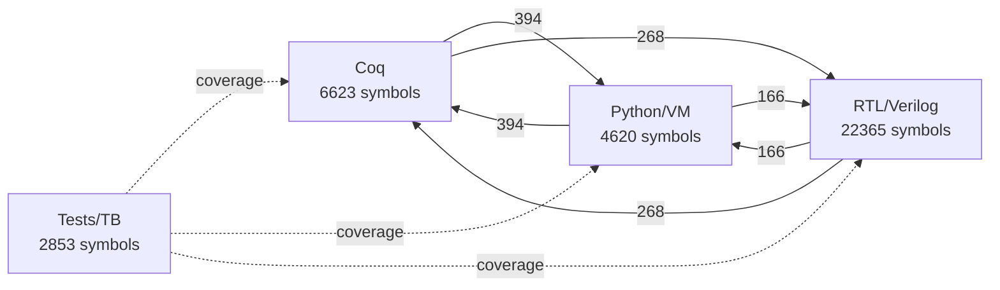
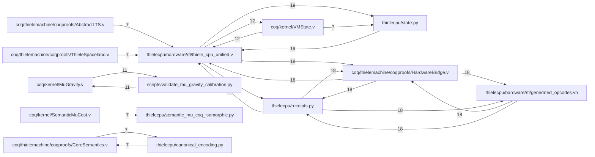

# Thiele Integration Atlas

Generated: 2026-02-19T07:56:59.860572+00:00

Single canonical atlas for cross-layer integration planning (Coq + VM/Python + RTL/Verilog + tests).

## Executive Summary

- Total symbols: **36461**
- Total edges: **58514**
- 3-layer triads: **72**
- Partial triads (2/3 layers): **75**
- Integrate candidates: **3**
- Safe removals (strict): **0**
- Inquisitor gate: **PASS**
- Proof accuracy: **100.00%**
- Test verification gate: **FAIL**
- Definition of Done: **NOT_COMPLETED**

Conservative policy: no Coq proof declarations are ever recommended for removal.
Important: Proof accuracy is Inquisitor proof-hygiene quality, not project completion percentage.

## Inquisitor Proof Gate

| Metric | Value |
|---|---:|
| Gate rating | PASS |
| Strict pass | True |
| Proof accuracy | 100.00% |
| Proof grade | A+ |
| Scanned Coq files | 305 |
| HIGH findings | 0 |
| MEDIUM findings | 0 |
| LOW findings | 0 |
| Inquisitor return code | 0 |

Top failing rule families from Inquisitor:

| Rule | Count |
|---|---:|
| *(none parsed)* | 0 |

## Kernel Organization Guidance

- Kernel Coq files: **121**, average connectivity **1%**
- Non-kernel Coq files: **183**, average connectivity **1%**
- Guidance: Kernel should remain the minimal canonical semantics layer; keep physics and domain files outside kernel and prove bridges into kernel invariants.

## Isomorphism Guidance Scorecard

| Metric | Value |
|---|---:|
| Isomorphism score (0-100) | 47.38 |
| Core+Bridge production ratio | 1% |
| Triad completion ratio | 49% |
| Directional coverage | 6/6 |
| Integrate-file pressure | 1% |
| Completion readiness (heuristic) | 33.93 |

## Test Verification Gate

| Metric | Value |
|---|---:|
| Gate rating | FAIL |
| Production symbol coverage | 3% |
| Production file coverage | 46% |
| Isolated test files | 0 |
| Covered prod symbols | 853/33608 |
| Covered prod files | 227/498 |

## Definition of Done (Unambiguous Completion Gate)

Overall status: **NOT_COMPLETED**

| Check | Actual | Target | Pass |
|---|---:|---:|---|
| isomorphism_score | 47.38 | >= 100.0 | False |
| triad_completion_ratio | 0.4898 | >= 0.7 | False |
| core_bridge_ratio | 0.0085 | >= 0.5 | False |
| test_prod_symbol_coverage_ratio | 0.0254 | >= 0.75 | False |
| test_prod_file_coverage_ratio | 0.4558 | >= 0.85 | False |
| isolated_test_files | 0.0 | <= 0.0 | True |
| kernel_proof_latex_coverage_ratio | 0.0364 | >= 0.6 | False |
| proof_files_with_readme_ratio | 0.0547 | >= 0.5 | False |
| coq_compile_pass | 1.0 | >= 1.0 | True |
| extraction_freshness_pass | 1.0 | >= 1.0 | True |
| rtl_synthesis_pass | 1.0 | >= 1.0 | True |
| inquisitor_strict_pass | 1.0 | == 1.0 | True |

Unmet checks:

- isomorphism_score: actual=47.38 target >= 100.0
- triad_completion_ratio: actual=0.4898 target >= 0.7
- core_bridge_ratio: actual=0.0085 target >= 0.5
- test_prod_symbol_coverage_ratio: actual=0.0254 target >= 0.75
- test_prod_file_coverage_ratio: actual=0.4558 target >= 0.85
- kernel_proof_latex_coverage_ratio: actual=0.0364 target >= 0.6
- proof_files_with_readme_ratio: actual=0.0547 target >= 0.5

## Toolchain Reality Gates

These gates verify **actual compilation, extraction, and synthesis** — not just
static graph analysis. All four must PASS for the isomorphism to be mechanically
checkable end-to-end.

| Gate | Ran | Pass | Detail |
|---|---|---|---|
| Coq compile (make -C coq, zero Admitted) | ✓ | **PASS** | 308/308 .vo, admits=0 |
| Extraction freshness (thiele_core.ml ≥ Extraction.v) | ✓ | **PASS** | — |
| RTL synthesis (Yosys lite, top=thiele_cpu, cells>0) | ✓ | **PASS** | cells=2 top=True |
| Co-simulation (iverilog/vvp testbench) | ✓ | **PASS** | rc=0 fatal=False |

## Thesis/Math LaTeX Coverage

| Metric | Value |
|---|---:|
| TeX files scanned | 19 |
| Kernel proof symbols mentioned in TeX | 38/1043 |
| Kernel proof LaTeX coverage ratio | 4% |
| Triad norms mentioned in TeX | 51/72 |
| Triad norm LaTeX coverage ratio | 71% |

Top missing kernel proof symbols in TeX (first 20):

| Symbol |
|---|
| Born_Rule_Unique_Fails_Without_More_Structure |
| Cone_Structure_Unique |
| Cone_Symmetry_Underdetermined |
| E_bit_independent_of_granularity |
| E_expand |
| E_nonneg |
| Entropy_From_Observation_Fails_Without_Finiteness |
| F_equals_module_count |
| F_nonneg |
| I_is_PSD |
| In_implies_graph_lookup |
| KernelNoGoForTOE_Decision |
| Kernel_Physics_Closure |
| Kernel_TOE_FinalOutcome |
| Lorentz_Not_Forced |
| MultiplicativeWeightFamily_Infinite |
| NoDup_incl_length |
| NoDup_map_inj |
| NoDup_remove_elem |
| Observational_Locality_Iff_Physics |

## Coq Proof Documentation Coverage (Low Priority)

| Metric | Value |
|---|---:|
| Proof files | 274 |
| Proof files with local README | 15/274 |
| Proof files with comment blocks | 271/274 |
| Proof files documented (README + comments) | 15/274 |

| Proof file | Proof count | Has comments | Has README | Status |
|---|---:|---|---|---|
| coq/physics_exploration/EmergentSchrodinger.v | 4 | True | True | documented |
| coq/physics_exploration/EmergentSpacetime.v | 3 | True | True | documented |
| coq/physics_exploration/HolographicGravity.v | 2 | True | True | documented |
| coq/physics_exploration/ParticleMasses.v | 2 | True | True | documented |
| coq/physics_exploration/PlanckDerivation.v | 7 | True | True | documented |
| coq/physics_exploration/PlanckEmergenceClean.v | 14 | True | True | documented |
| coq/quantum_derivation/BornRuleUnique.v | 2 | True | True | documented |
| coq/quantum_derivation/CollapseDetermination.v | 3 | True | True | documented |
| coq/quantum_derivation/ComplexNecessity.v | 13 | True | True | documented |
| coq/quantum_derivation/CompositePartitions.v | 5 | True | True | documented |
| coq/quantum_derivation/ObservationIrreversibility.v | 4 | True | True | documented |
| coq/quantum_derivation/ProjectionFromPartitions.v | 4 | True | True | documented |
| coq/quantum_derivation/SchrodingerFromPartitions.v | 3 | True | True | documented |
| coq/quantum_derivation/TensorNecessity.v | 5 | True | True | documented |
| coq/quantum_derivation/TwoDimensionalNecessity.v | 8 | True | True | documented |
| coq/bridge/BoxWorld_to_Kernel.v | 7 | True | False | needs_docs |
| coq/bridge/Causal_to_Kernel.v | 1 | True | False | needs_docs |
| coq/bridge/Entropy_to_Kernel.v | 1 | True | False | needs_docs |
| coq/bridge/FiniteQuantum_to_Kernel.v | 9 | True | False | needs_docs |
| coq/bridge/PythonMuLedgerBisimulation.v | 8 | True | False | needs_docs |
| coq/bridge/Randomness_to_Kernel.v | 1 | True | False | needs_docs |
| coq/bridge/Tomography_to_Kernel.v | 1 | False | False | needs_docs |
| coq/catnet/coqproofs/CatNet.v | 3 | True | False | needs_docs |
| coq/isomorphism/coqproofs/Universe.v | 3 | True | False | needs_docs |
| coq/kernel/AlgebraicCoherence.v | 17 | True | False | needs_docs |
| coq/kernel/ArrowOfTimeSynthesis.v | 15 | True | False | needs_docs |
| coq/kernel/BornRule.v | 10 | True | False | needs_docs |
| coq/kernel/BornRuleFromSymmetry.v | 4 | True | False | needs_docs |
| coq/kernel/BoxCHSH.v | 7 | True | False | needs_docs |
| coq/kernel/CHSH.v | 5 | True | False | needs_docs |
| coq/kernel/CHSHExtraction.v | 6 | True | False | needs_docs |
| coq/kernel/CausalSetAxioms.v | 11 | True | False | needs_docs |
| coq/kernel/Certification.v | 11 | True | False | needs_docs |
| coq/kernel/ClassicalBound.v | 2 | True | False | needs_docs |
| coq/kernel/Closure.v | 1 | True | False | needs_docs |
| coq/kernel/Composition.v | 5 | True | False | needs_docs |
| coq/kernel/ConeAlgebra.v | 14 | True | False | needs_docs |
| coq/kernel/ConeDerivation.v | 2 | True | False | needs_docs |
| coq/kernel/ConstantDerivationStrength.v | 14 | True | False | needs_docs |
| coq/kernel/ConstantUnification.v | 6 | True | False | needs_docs |
| coq/kernel/ConstructivePSD.v | 23 | True | False | needs_docs |
| coq/kernel/DerivedTime.v | 3 | True | False | needs_docs |
| coq/kernel/DiscreteGaussBonnet.v | 11 | True | False | needs_docs |
| coq/kernel/DiscreteTopology.v | 18 | True | False | needs_docs |
| coq/kernel/EinsteinEmergence.v | 7 | True | False | needs_docs |
| coq/kernel/EinsteinEquations4D.v | 38 | True | False | needs_docs |
| coq/kernel/EntropyImpossibility.v | 4 | True | False | needs_docs |
| coq/kernel/FalsifiablePrediction.v | 2 | True | False | needs_docs |
| coq/kernel/FiniteInformation.v | 17 | True | False | needs_docs |
| coq/kernel/FourDSimplicialComplex.v | 11 | True | False | needs_docs |
| coq/kernel/GeodesicCompleteness.v | 8 | True | False | needs_docs |
| coq/kernel/HardAssumptions.v | 2 | True | False | needs_docs |
| coq/kernel/HardMathFactsProven.v | 7 | True | False | needs_docs |
| coq/kernel/HardwareBisimulation.v | 11 | True | False | needs_docs |
| coq/kernel/InformationCausality.v | 13 | True | False | needs_docs |
| coq/kernel/InverseSquareLaw.v | 13 | True | False | needs_docs |
| coq/kernel/KernelBenchmarks.v | 5 | True | False | needs_docs |
| coq/kernel/KernelNoether.v | 12 | True | False | needs_docs |
| coq/kernel/KernelPhysics.v | 23 | True | False | needs_docs |
| coq/kernel/KernelTM.v | 1 | True | False | needs_docs |
| coq/kernel/L2Derivation.v | 10 | True | False | needs_docs |
| coq/kernel/LocalInfoLoss.v | 8 | True | False | needs_docs |
| coq/kernel/Locality.v | 14 | True | False | needs_docs |
| coq/kernel/LorentzNotForced.v | 3 | True | False | needs_docs |
| coq/kernel/LorentzSignature.v | 17 | True | False | needs_docs |
| coq/kernel/MasterSummary.v | 5 | True | False | needs_docs |
| coq/kernel/MetricFromMuCosts.v | 13 | True | False | needs_docs |
| coq/kernel/MinimalE.v | 2 | True | False | needs_docs |
| coq/kernel/MinorConstraints.v | 13 | True | False | needs_docs |
| coq/kernel/ModularObservation.v | 4 | True | False | needs_docs |
| coq/kernel/MuChaitin.v | 3 | True | False | needs_docs |
| coq/kernel/MuComplexity.v | 5 | True | False | needs_docs |
| coq/kernel/MuCostDerivation.v | 10 | True | False | needs_docs |
| coq/kernel/MuCostModel.v | 7 | True | False | needs_docs |
| coq/kernel/MuGeometry.v | 5 | True | False | needs_docs |
| coq/kernel/MuGravity.v | 108 | True | False | needs_docs |
| coq/kernel/MuGravity_BridgeTheorems.v | 1 | True | False | needs_docs |
| coq/kernel/MuGravity_Definitions.v | 1 | True | False | needs_docs |
| coq/kernel/MuGravity_Emergence.v | 1 | True | False | needs_docs |
| coq/kernel/MuInformation.v | 5 | True | False | needs_docs |
| coq/kernel/MuInitiality.v | 18 | True | False | needs_docs |
| coq/kernel/MuLedgerConservation.v | 24 | True | False | needs_docs |
| coq/kernel/MuNecessity.v | 4 | True | False | needs_docs |
| coq/kernel/MuNoFreeInsightQuantitative.v | 7 | True | False | needs_docs |
| coq/kernel/NPAMomentMatrix.v | 7 | True | False | needs_docs |
| coq/kernel/NPMuCostBound.v | 9 | True | False | needs_docs |
| coq/kernel/NoArbitrage.v | 5 | True | False | needs_docs |
| coq/kernel/NoCloning.v | 7 | True | False | needs_docs |
| coq/kernel/NoCloningFromMuMonotonicity.v | 4 | True | False | needs_docs |
| coq/kernel/NoFreeInsight.v | 3 | True | False | needs_docs |
| coq/kernel/NoGo.v | 11 | True | False | needs_docs |
| coq/kernel/NoGoSensitivity.v | 4 | True | False | needs_docs |
| coq/kernel/NonCircularityAudit.v | 15 | True | False | needs_docs |
| coq/kernel/ObserverDerivation.v | 7 | True | False | needs_docs |
| coq/kernel/OracleImpossibility.v | 7 | True | False | needs_docs |
| coq/kernel/PDISCOVERIntegration.v | 7 | True | False | needs_docs |
| coq/kernel/PNEWTopologyChange.v | 7 | True | False | needs_docs |
| coq/kernel/POVMBridge.v | 8 | True | False | needs_docs |
| coq/kernel/PartitionSeparation.v | 5 | True | False | needs_docs |
| coq/kernel/Persistence.v | 3 | True | False | needs_docs |
| coq/kernel/PhysicsClosure.v | 1 | True | False | needs_docs |
| coq/kernel/PoissonEquation.v | 9 | True | False | needs_docs |
| coq/kernel/ProbabilityImpossibility.v | 3 | True | False | needs_docs |
| coq/kernel/ProperSubsumption.v | 6 | True | False | needs_docs |
| coq/kernel/Purification.v | 7 | True | False | needs_docs |
| coq/kernel/PythonBisimulation.v | 5 | True | False | needs_docs |
| coq/kernel/QuantumBound.v | 8 | True | False | needs_docs |
| coq/kernel/QuantumEquivalence.v | 10 | True | False | needs_docs |
| coq/kernel/ReceiptCore.v | 1 | True | False | needs_docs |
| coq/kernel/ReceiptIntegrity.v | 17 | True | False | needs_docs |
| coq/kernel/RevelationRequirement.v | 5 | True | False | needs_docs |
| coq/kernel/SemanticComplexityIsomorphism.v | 12 | True | False | needs_docs |
| coq/kernel/SemanticMuCost.v | 2 | True | False | needs_docs |
| coq/kernel/SemidefiniteProgramming.v | 5 | True | False | needs_docs |
| coq/kernel/SimulationProof.v | 29 | True | False | needs_docs |
| coq/kernel/SpacetimeEmergence.v | 23 | True | False | needs_docs |
| coq/kernel/StateSpaceCounting.v | 7 | True | False | needs_docs |
| coq/kernel/StressEnergyDynamics.v | 5 | True | False | needs_docs |
| coq/kernel/Subsumption.v | 3 | True | False | needs_docs |
| coq/kernel/TOE.v | 1 | True | False | needs_docs |
| coq/kernel/TOEDecision.v | 4 | True | False | needs_docs |
| coq/kernel/ThreeLayerIsomorphism.v | 21 | True | False | needs_docs |
| coq/kernel/Tier1Proofs.v | 6 | True | False | needs_docs |
| coq/kernel/TopologyCurvatureBridge.v | 5 | True | False | needs_docs |
| coq/kernel/TsirelsonComputation.v | 1 | True | False | needs_docs |
| coq/kernel/TsirelsonDerivation.v | 5 | True | False | needs_docs |
| coq/kernel/TsirelsonFromAlgebra.v | 11 | True | False | needs_docs |
| coq/kernel/TsirelsonGeneral.v | 15 | True | False | needs_docs |
| coq/kernel/TsirelsonLowerBound.v | 2 | True | False | needs_docs |
| coq/kernel/TsirelsonUniqueness.v | 1 | True | False | needs_docs |
| coq/kernel/TsirelsonUpperBound.v | 19 | True | False | needs_docs |
| coq/kernel/Unitarity.v | 7 | True | False | needs_docs |
| coq/kernel/VMEncoding.v | 15 | True | False | needs_docs |
| coq/kernel/VMState.v | 32 | True | False | needs_docs |
| coq/kernel/ValidCorrelation.v | 1 | True | False | needs_docs |
| coq/kernel_toe/Closure.v | 1 | True | False | needs_docs |
| coq/kernel_toe/NoGo.v | 11 | True | False | needs_docs |
| coq/kernel_toe/NoGoSensitivity.v | 4 | True | False | needs_docs |
| coq/kernel_toe/Persistence.v | 3 | True | False | needs_docs |
| coq/kernel_toe/TOE.v | 1 | True | False | needs_docs |
| coq/modular_proofs/CornerstoneThiele.v | 5 | True | False | needs_docs |
| coq/modular_proofs/Encoding.v | 16 | True | False | needs_docs |
| coq/modular_proofs/EncodingBounds.v | 18 | True | False | needs_docs |
| coq/modular_proofs/Minsky.v | 2 | True | False | needs_docs |
| coq/modular_proofs/Simulation.v | 2 | True | False | needs_docs |
| coq/modular_proofs/TM_Basics.v | 10 | True | False | needs_docs |
| coq/modular_proofs/TM_to_Minsky.v | 12 | True | False | needs_docs |
| coq/modular_proofs/ThieleInstance.v | 12 | True | False | needs_docs |
| coq/modular_proofs/Thiele_Basics.v | 2 | True | False | needs_docs |
| coq/nofi/Instance_Kernel.v | 5 | True | False | needs_docs |
| coq/nofi/MuChaitinTheory_Theorem.v | 3 | True | False | needs_docs |
| coq/nofi/NoFreeInsight_Theorem.v | 1 | True | False | needs_docs |
| coq/physics/DiscreteModel.v | 15 | True | False | needs_docs |
| coq/physics/DissipativeModel.v | 5 | True | False | needs_docs |
| coq/physics/LandauerBridge.v | 10 | True | False | needs_docs |
| coq/physics/PreregSplit.v | 4 | True | False | needs_docs |
| coq/physics/TriangularLattice.v | 27 | True | False | needs_docs |
| coq/physics/WaveModel.v | 23 | True | False | needs_docs |
| coq/project_cerberus/coqproofs/Cerberus.v | 6 | True | False | needs_docs |
| coq/self_reference/SelfReference.v | 4 | True | False | needs_docs |
| coq/shor_primitives/Euclidean.v | 3 | True | False | needs_docs |
| coq/shor_primitives/Modular.v | 8 | True | False | needs_docs |
| coq/shor_primitives/PeriodFinding.v | 1 | True | False | needs_docs |
| coq/shor_primitives/PolylogConjecture.v | 1 | True | False | needs_docs |
| coq/spacetime/Spacetime.v | 7 | True | False | needs_docs |
| coq/spacetime_projection/SpacetimeProjection.v | 10 | True | False | needs_docs |
| coq/test_vscoq/coqproofs/test_vscoq.v | 1 | True | False | needs_docs |
| coq/tests/TestNecessity.v | 10 | True | False | needs_docs |
| coq/theory/ArchTheorem.v | 11 | True | False | needs_docs |
| coq/theory/Core.v | 2 | True | False | needs_docs |
| coq/theory/CostIsComplexity.v | 6 | True | False | needs_docs |
| coq/theory/EvolutionaryForge.v | 14 | True | False | needs_docs |
| coq/theory/Genesis.v | 3 | True | False | needs_docs |
| coq/theory/GeometricSignature.v | 11 | True | False | needs_docs |
| coq/theory/LogicToPhysics.v | 1 | True | False | needs_docs |
| coq/theory/NoFreeLunch.v | 2 | True | False | needs_docs |
| coq/theory/PhysRel.v | 4 | True | False | needs_docs |
| coq/theory/Representations.v | 7 | True | False | needs_docs |
| coq/theory/Separation.v | 6 | True | False | needs_docs |
| coq/theory/Universality.v | 13 | True | False | needs_docs |
| coq/theory/WitnessIsGenesis.v | 4 | True | False | needs_docs |
| coq/thermodynamic/LandauerDerived.v | 18 | True | False | needs_docs |
| coq/thermodynamic/ThermodynamicBridge.v | 16 | True | False | needs_docs |
| coq/thiele_manifold/PhysicsIsomorphism.v | 7 | True | False | needs_docs |
| coq/thiele_manifold/ThieleManifold.v | 12 | True | False | needs_docs |
| coq/thiele_manifold/ThieleManifoldBridge.v | 20 | True | False | needs_docs |
| coq/thielemachine/coqproofs/AbstractLTS.v | 22 | True | False | needs_docs |
| coq/thielemachine/coqproofs/AlgebraicLaws.v | 6 | True | False | needs_docs |
| coq/thielemachine/coqproofs/AmortizedAnalysis.v | 5 | True | False | needs_docs |
| coq/thielemachine/coqproofs/Axioms.v | 8 | True | False | needs_docs |
| coq/thielemachine/coqproofs/BellArtifacts.v | 8 | True | False | needs_docs |
| coq/thielemachine/coqproofs/BellCheck.v | 8 | True | False | needs_docs |
| coq/thielemachine/coqproofs/BellInequality.v | 210 | True | False | needs_docs |
| coq/thielemachine/coqproofs/BellReceiptLocalBound.v | 1 | True | False | needs_docs |
| coq/thielemachine/coqproofs/BellReceiptLocalGeneral.v | 14 | True | False | needs_docs |
| coq/thielemachine/coqproofs/BellReceiptSoundness.v | 6 | True | False | needs_docs |
| coq/thielemachine/coqproofs/BlindSighted.v | 2 | True | False | needs_docs |
| coq/thielemachine/coqproofs/CompositionPrimitive.v | 2 | True | False | needs_docs |
| coq/thielemachine/coqproofs/ComputationIsomorphism.v | 3 | True | False | needs_docs |
| coq/thielemachine/coqproofs/Confluence.v | 1 | True | False | needs_docs |
| coq/thielemachine/coqproofs/CoreSemantics.v | 25 | True | False | needs_docs |
| coq/thielemachine/coqproofs/DiscoveryProof.v | 26 | True | False | needs_docs |
| coq/thielemachine/coqproofs/DissipativeEmbedding.v | 9 | True | False | needs_docs |
| coq/thielemachine/coqproofs/EfficientDiscovery.v | 9 | True | False | needs_docs |
| coq/thielemachine/coqproofs/Embedding_TM.v | 4 | True | False | needs_docs |
| coq/thielemachine/coqproofs/EncodingBridge.v | 1 | False | False | needs_docs |
| coq/thielemachine/coqproofs/HardwareBridge.v | 2 | True | False | needs_docs |
| coq/thielemachine/coqproofs/HardwareVMHarness.v | 2 | True | False | needs_docs |
| coq/thielemachine/coqproofs/HyperThiele_Oracle.v | 1 | True | False | needs_docs |
| coq/thielemachine/coqproofs/Impossibility.v | 3 | True | False | needs_docs |
| coq/thielemachine/coqproofs/InfoTheory.v | 9 | True | False | needs_docs |
| coq/thielemachine/coqproofs/LogicIsomorphism.v | 2 | True | False | needs_docs |
| coq/thielemachine/coqproofs/MuAlignmentExample.v | 4 | True | False | needs_docs |
| coq/thielemachine/coqproofs/MuAlu.v | 3 | True | False | needs_docs |
| coq/thielemachine/coqproofs/NUSD.v | 2 | True | False | needs_docs |
| coq/thielemachine/coqproofs/Oracle.v | 40 | True | False | needs_docs |
| coq/thielemachine/coqproofs/OracleImpossibility.v | 1 | True | False | needs_docs |
| coq/thielemachine/coqproofs/PartitionDiscoveryIsomorphism.v | 4 | True | False | needs_docs |
| coq/thielemachine/coqproofs/PartitionLogic.v | 10 | True | False | needs_docs |
| coq/thielemachine/coqproofs/PhaseThree.v | 3 | False | False | needs_docs |
| coq/thielemachine/coqproofs/PhysicsEmbedding.v | 12 | True | False | needs_docs |
| coq/thielemachine/coqproofs/QHelpers.v | 4 | True | False | needs_docs |
| coq/thielemachine/coqproofs/QuantumAdmissibilityDeliverableB.v | 4 | True | False | needs_docs |
| coq/thielemachine/coqproofs/QuantumAdmissibilityTsirelson.v | 2 | True | False | needs_docs |
| coq/thielemachine/coqproofs/QuantumTheorems.v | 5 | True | False | needs_docs |
| coq/thielemachine/coqproofs/RepresentationTheorem.v | 4 | True | False | needs_docs |
| coq/thielemachine/coqproofs/SemanticBridge.v | 6 | True | False | needs_docs |
| coq/thielemachine/coqproofs/Separation.v | 5 | True | False | needs_docs |
| coq/thielemachine/coqproofs/Simulation.v | 5 | True | False | needs_docs |
| coq/thielemachine/coqproofs/SpacelandComplete.v | 19 | True | False | needs_docs |
| coq/thielemachine/coqproofs/SpacelandCore.v | 8 | True | False | needs_docs |
| coq/thielemachine/coqproofs/SpacelandProved.v | 8 | True | False | needs_docs |
| coq/thielemachine/coqproofs/SpecSound.v | 5 | True | False | needs_docs |
| coq/thielemachine/coqproofs/SpectralApproximation.v | 22 | True | False | needs_docs |
| coq/thielemachine/coqproofs/StructuredInstances.v | 5 | True | False | needs_docs |
| coq/thielemachine/coqproofs/Subsumption.v | 1 | True | False | needs_docs |
| coq/thielemachine/coqproofs/ThieleFoundations.v | 3 | True | False | needs_docs |
| coq/thielemachine/coqproofs/ThieleKernelCausality.v | 9 | True | False | needs_docs |
| coq/thielemachine/coqproofs/ThieleMachine.v | 15 | True | False | needs_docs |
| coq/thielemachine/coqproofs/ThieleMachineConcrete.v | 20 | True | False | needs_docs |
| coq/thielemachine/coqproofs/ThieleMachineSig.v | 4 | True | False | needs_docs |
| coq/thielemachine/coqproofs/ThieleProc.v | 19 | True | False | needs_docs |
| coq/thielemachine/coqproofs/ThieleProofCarryingReality.v | 2 | True | False | needs_docs |
| coq/thielemachine/coqproofs/ThieleSpaceland.v | 37 | True | False | needs_docs |
| coq/thielemachine/coqproofs/ThieleUnificationProtocol.v | 9 | True | False | needs_docs |
| coq/thielemachine/coqproofs/ThieleUnificationTensor.v | 8 | True | False | needs_docs |
| coq/thielemachine/coqproofs/TsirelsonBoundBridge.v | 1 | True | False | needs_docs |
| coq/thielemachine/coqproofs/UTMStaticCheck.v | 1 | True | False | needs_docs |
| coq/thielemachine/coqproofs/WaveCheck.v | 4 | True | False | needs_docs |
| coq/thielemachine/coqproofs/WaveEmbedding.v | 10 | True | False | needs_docs |
| coq/thielemachine/verification/Admissibility.v | 5 | True | False | needs_docs |
| coq/thielemachine/verification/BridgeDefinitions.v | 68 | True | False | needs_docs |
| coq/thielemachine/verification/BridgeProof.v | 5 | True | False | needs_docs |
| coq/thielemachine/verification/Deliverable_CHSHSeparation.v | 5 | True | False | needs_docs |
| coq/thielemachine/verification/Deliverable_MuEntropyNBits.v | 20 | True | False | needs_docs |
| coq/thielemachine/verification/Deliverable_MuEntropyOneBit.v | 4 | True | False | needs_docs |
| coq/thielemachine/verification/Deliverable_SignalingLowerBound.v | 1 | True | False | needs_docs |
| coq/thielemachine/verification/FullIsomorphism.v | 10 | True | False | needs_docs |
| coq/thielemachine/verification/ObservationInterface.v | 8 | True | False | needs_docs |
| coq/thielemachine/verification/PhysicsPillars.v | 14 | True | False | needs_docs |
| ... 14 more proof-doc rows omitted | | | | |

Top uncovered production files (first 20):

| Production file |
|---|
| coq/Extraction.v |
| coq/MinimalExtraction.v |
| coq/bridge/Randomness_to_Kernel.v |
| coq/kernel/AlgebraicCoherence.v |
| coq/kernel/ArrowOfTimeSynthesis.v |
| coq/kernel/AssumptionBundle.v |
| coq/kernel/BornRule.v |
| coq/kernel/BornRuleFromSymmetry.v |
| coq/kernel/CHSH.v |
| coq/kernel/CHSHExtraction.v |
| coq/kernel/CausalSetAxioms.v |
| coq/kernel/Certification.v |
| coq/kernel/ClassicalBound.v |
| coq/kernel/Closure.v |
| coq/kernel/Composition.v |
| coq/kernel/ConeAlgebra.v |
| coq/kernel/ConeDerivation.v |
| coq/kernel/ConstantDerivationStrength.v |
| coq/kernel/Definitions.v |
| coq/kernel/DerivedTime.v |

## Fragmented Correctness Diagnostics

- Proof gate PASS but test gate FAIL: verified statements are not yet sufficiently exercised against runtime surfaces.
- Proof hygiene is high while bridge ratio is low: risk of decorative proofs disconnected from implementation layers.
- Production symbol coverage by tests is below strict target; dynamic paths are under-verified.

## Top 10 Highest-Impact Closure Tasks

| Rank | Task | Type | Estimated score gain | Details |
|---:|---|---|---:|---|
| 1 | Add strict tests covering coq/Extraction.v | test_coverage_gap | 0.80 | No discovered test coverage edges to this production file |
| 2 | Add strict tests covering coq/MinimalExtraction.v | test_coverage_gap | 0.80 | No discovered test coverage edges to this production file |
| 3 | Add strict tests covering coq/bridge/Randomness_to_Kernel.v | test_coverage_gap | 0.80 | No discovered test coverage edges to this production file |
| 4 | Add strict tests covering coq/kernel/AlgebraicCoherence.v | test_coverage_gap | 0.80 | No discovered test coverage edges to this production file |
| 5 | Add strict tests covering coq/kernel/ArrowOfTimeSynthesis.v | test_coverage_gap | 0.80 | No discovered test coverage edges to this production file |
| 6 | Add strict tests covering coq/kernel/AssumptionBundle.v | test_coverage_gap | 0.80 | No discovered test coverage edges to this production file |
| 7 | Add strict tests covering coq/kernel/BornRule.v | test_coverage_gap | 0.80 | No discovered test coverage edges to this production file |
| 8 | Add strict tests covering coq/kernel/BornRuleFromSymmetry.v | test_coverage_gap | 0.80 | No discovered test coverage edges to this production file |
| 9 | Add strict tests covering coq/kernel/CHSH.v | test_coverage_gap | 0.80 | No discovered test coverage edges to this production file |
| 10 | Add strict tests covering coq/kernel/CHSHExtraction.v | test_coverage_gap | 0.80 | No discovered test coverage edges to this production file |

## Test File Verification Detail

| Test file | Layer | Symbols | Coverage edges | Covered prod files | Covered prod symbols | Status |
|---|---|---:|---:|---:|---:|---|
| thielecpu/hardware/testbench/partition_core_tb.v | rtl_tb | 25 | 1 | 1 | 1 | covered |
| tests/test_even_factor.py | test | 3 | 2 | 1 | 1 | covered |
| thielecpu/hardware/testbench/mu_alu_tb.v | rtl_tb | 11 | 2 | 2 | 2 | covered |
| thielecpu/hardware/testbench/thiele_cpu_engines_tb.v | rtl_tb | 51 | 2 | 2 | 2 | covered |
| thielecpu/hardware/testbench/thiele_cpu_genesis_compression_strict_tb.v | rtl_tb | 29 | 2 | 2 | 2 | covered |
| thielecpu/hardware/testbench/thiele_cpu_genesis_compression_tb.v | rtl_tb | 27 | 2 | 2 | 2 | covered |
| thielecpu/hardware/testbench/thiele_cpu_inverse_genesis_tb.v | rtl_tb | 27 | 2 | 2 | 2 | covered |
| thielecpu/hardware/testbench/thiele_cpu_tb.v | rtl_tb | 31 | 2 | 2 | 2 | covered |
| thielecpu/hardware/testbench/fuzz_harness_simple.v | rtl_tb | 26 | 3 | 3 | 3 | covered |
| tests/test_shor_demo.py | test | 8 | 9 | 3 | 4 | covered |
| tests/test_christoffel_flat_spacetime.py | test | 4 | 10 | 1 | 2 | covered |
| tests/test_emergent_geometry_proxies.py | test | 10 | 11 | 7 | 7 | covered |
| tests/test_rsa_scaling.py | test | 5 | 11 | 2 | 2 | covered |
| tests/test_coq_available.py | test | 4 | 12 | 9 | 9 | covered |
| tests/test_einstein_equation_empirical.py | test | 5 | 14 | 1 | 3 | covered |
| tests/test_metric_diagnosis.py | test | 2 | 14 | 12 | 13 | covered |
| tests/test_metric_position_dependent.py | test | 1 | 14 | 12 | 13 | covered |
| tests/test_einstein_nonvacuum_empirical.py | test | 2 | 15 | 12 | 14 | covered |
| tests/test_transition_logic.py | test | 8 | 16 | 4 | 7 | covered |
| tests/test_mu_gravity_physics_analysis.py | test | 7 | 18 | 5 | 6 | covered |
| tests/test_foundry_generated_surface.py | test | 6 | 19 | 9 | 12 | covered |
| tests/test_vm_cli_input_prompt.py | test | 5 | 21 | 12 | 14 | covered |
| tests/trs_conformance/test_vectors.py | test | 19 | 22 | 7 | 7 | covered |
| tests/test_certcheck.py | test | 6 | 24 | 3 | 6 | covered |
| tests/test_structure_period_finding.py | test | 10 | 24 | 8 | 9 | covered |
| tests/test_axiom_geometric_calibration.py | test | 8 | 27 | 17 | 22 | covered |
| tests/test_christoffel_corrected_metric.py | test | 4 | 27 | 18 | 21 | covered |
| tests/test_christoffel_v3_metric.py | test | 3 | 27 | 18 | 21 | covered |
| tests/test_phase3_bad_graph.py | test | 22 | 29 | 7 | 7 | covered |
| tests/test_mu_gravity_calibration_validator.py | test | 8 | 30 | 7 | 9 | covered |
| tests/test_mu_entropy_n_bits_certificate.py | test | 4 | 31 | 7 | 9 | covered |
| tests/test_gauss_bonnet_2d.py | test | 8 | 34 | 15 | 19 | covered |
| tests/test_mu_entropy_one_bit_certificate.py | test | 6 | 34 | 6 | 9 | covered |
| tests/test_rtl_mu_charging.py | test | 10 | 34 | 15 | 15 | covered |
| tests/test_chsh_manifold.py | test | 22 | 35 | 12 | 16 | covered |
| tests/test_actual_truth_simplified.py | test | 13 | 37 | 15 | 19 | covered |
| tests/test_partition_rsa_factorization.py | test | 8 | 38 | 16 | 17 | covered |
| tests/test_period_oracle.py | test | 10 | 38 | 15 | 16 | covered |
| tests/test_utm_program_validation.py | test | 12 | 39 | 8 | 9 | covered |
| tests/test_vm_cli_c_and_stdin.py | test | 6 | 39 | 16 | 18 | covered |
| tests/test_real_angles_from_metric.py | test | 10 | 44 | 19 | 26 | covered |
| tests/test_opcode_isomorphism.py | test | 11 | 45 | 14 | 15 | covered |
| tests/test_openfpga_flow.py | test | 14 | 47 | 19 | 23 | covered |
| tests/test_2d_mesh_creation.py | test | 6 | 48 | 14 | 20 | covered |
| tests/test_einstein_vacuum_empirical.py | test | 9 | 50 | 19 | 24 | covered |
| tests/test_fine_structure.py | test | 12 | 51 | 14 | 19 | covered |
| tests/test_phase4_null_hypothesis.py | test | 17 | 52 | 8 | 16 | covered |
| tests/test_opcode_alignment.py | test | 11 | 54 | 18 | 19 | covered |
| tests/test_discrete_topology.py | test | 12 | 58 | 15 | 21 | covered |
| tests/alignment/test_mu_alignment.py | test | 16 | 59 | 21 | 27 | covered |
| tests/test_c_rand_randomness_verifier.py | test | 13 | 59 | 5 | 10 | covered |
| scripts/test_16_instructions_tdd.py | test | 4 | 60 | 25 | 31 | covered |
| tests/test_c1_physics_divergence_verifier.py | test | 20 | 61 | 13 | 18 | covered |
| tests/test_c_causal_causal_verifier.py | test | 13 | 61 | 7 | 11 | covered |
| tests/test_c_entropy_entropy2_verifier.py | test | 13 | 61 | 7 | 11 | covered |
| tests/test_phase1_long_run.py | test | 20 | 64 | 13 | 20 | covered |
| tests/test_advantage_benchmarks.py | test | 39 | 65 | 5 | 5 | covered |
| tests/test_nofi_pyexec_nonforgeability.py | test | 6 | 65 | 30 | 37 | covered |
| tests/test_c_tomo_tomography_verifier.py | test | 13 | 67 | 8 | 12 | covered |
| tests/test_coq_bridge_coverage_links.py | test | 17 | 68 | 34 | 39 | covered |
| tests/test_three_layer_isomorphism_fuzz.py | test | 15 | 73 | 17 | 27 | covered |
| tests/test_nofi_semantic_structure_event.py | test | 8 | 77 | 34 | 44 | covered |
| tests/test_geometric_factorization_claim.py | test | 13 | 79 | 21 | 30 | covered |
| tests/test_mu_signaling_lower_bound.py | test | 7 | 86 | 21 | 30 | covered |
| tests/test_axiom_source_normalization.py | test | 13 | 88 | 22 | 30 | covered |
| tests/test_mu.py | test | 5 | 88 | 29 | 40 | covered |
| tests/test_equivalence_bundle.py | test | 18 | 89 | 38 | 39 | covered |
| tests/test_christoffel_empirical.py | test | 9 | 94 | 19 | 22 | covered |
| tests/test_full_stack_geometric_factorization.py | test | 16 | 102 | 26 | 33 | covered |
| tests/test_find_actual_truth.py | test | 15 | 103 | 24 | 35 | covered |
| tests/test_topology_curvature_bridge.py | test | 15 | 103 | 22 | 30 | covered |
| tests/test_dialogue_of_the_one.py | test | 20 | 107 | 22 | 30 | covered |
| tests/test_axiom_horizon_cycle.py | test | 14 | 111 | 21 | 28 | covered |
| tests/test_pnew_topology_change.py | test | 16 | 112 | 17 | 22 | covered |
| tests/test_quantitative_nofreeinsight.py | test | 25 | 114 | 5 | 10 | covered |
| tests/test_stress_energy_pnew.py | test | 21 | 120 | 35 | 46 | covered |
| tests/test_properties.py | test | 25 | 122 | 22 | 29 | covered |
| tests/test_observational_no_signaling.py | test | 8 | 127 | 20 | 30 | covered |
| tests/test_security_monitor.py | test | 13 | 129 | 29 | 37 | covered |
| tests/test_mu_gravity_axioms.py | test | 16 | 140 | 27 | 41 | covered |
| tests/test_connectivity_enforcement.py | test | 23 | 148 | 32 | 37 | covered |
| tests/trs_conformance/test_trs10.py | test | 36 | 158 | 20 | 28 | covered |
| tests/test_canonical_hash_golden.py | test | 30 | 165 | 10 | 19 | covered |
| tests/test_crypto_isomorphism.py | test | 21 | 169 | 30 | 50 | covered |
| scripts/test_three_layer_isomorphism.py | test | 17 | 174 | 39 | 56 | covered |
| tests/test_mu_profiler_universality.py | test | 39 | 174 | 16 | 24 | covered |
| tests/test_refinement.py | test | 23 | 176 | 28 | 40 | covered |
| tests/test_cross_platform_isomorphism.py | test | 28 | 197 | 29 | 53 | covered |
| tests/test_predicate_parser.py | test | 31 | 211 | 12 | 16 | covered |
| tests/test_rtl_synthesis_gate.py | test | 30 | 236 | 42 | 49 | covered |
| tests/test_rtl_compute_isomorphism.py | test | 19 | 247 | 60 | 88 | covered |
| tests/test_alpha_refinement.py | test | 16 | 260 | 39 | 74 | covered |
| tests/test_three_layer_isomorphism_semantic.py | test | 43 | 268 | 9 | 26 | covered |
| tests/test_verification_fuzz.py | test | 60 | 273 | 6 | 13 | covered |
| tests/test_random_program_fuzz.py | test | 50 | 274 | 65 | 86 | covered |
| tests/test_falsifiable_predictions.py | test | 39 | 284 | 27 | 40 | covered |
| tests/test_property_bisimulation.py | test | 39 | 291 | 60 | 88 | covered |
| tests/test_extraction_freshness.py | test | 25 | 294 | 45 | 55 | covered |
| tests/test_cross_layer_comprehensive.py | test | 55 | 301 | 37 | 69 | covered |
| tests/test_receipt_chain.py | test | 30 | 303 | 22 | 43 | covered |
| tests/test_thesis_verify.py | test | 39 | 333 | 13 | 37 | covered |
| tests/test_discovery_enhancements.py | test | 39 | 335 | 22 | 36 | covered |
| tests/test_mu_fixed.py | test | 42 | 347 | 11 | 42 | covered |
| tests/test_coq_compile_gate.py | test | 27 | 354 | 44 | 50 | covered |
| tests/test_isomorphism_violation_detection.py | test | 49 | 360 | 40 | 68 | covered |
| tests/test_bisimulation.py | test | 47 | 361 | 66 | 109 | covered |
| tests/test_partition_boundary.py | test | 18 | 366 | 24 | 38 | covered |
| tests/test_efficient_discovery.py | test | 39 | 368 | 38 | 68 | covered |
| tests/test_extracted_vm_runner.py | test | 22 | 457 | 59 | 74 | covered |
| tests/test_partition_isomorphism_minimal.py | test | 32 | 465 | 65 | 106 | covered |
| tests/test_accelerator_cosim.py | test | 56 | 480 | 39 | 66 | covered |
| tests/test_verilog_cosim.py | test | 72 | 501 | 50 | 67 | covered |
| tests/test_structural_verifier.py | test | 56 | 520 | 33 | 59 | covered |
| tests/test_isomorphism_vm_vs_coq.py | test | 36 | 535 | 54 | 73 | covered |
| tests/test_vm_encoding_validation.py | test | 16 | 543 | 26 | 43 | covered |
| tests/test_benchmark_suite.py | test | 56 | 625 | 40 | 70 | covered |
| tests/alignment/test_comprehensive_alignment.py | test | 53 | 636 | 49 | 58 | covered |
| tests/test_bianchi_enforcement.py | test | 47 | 703 | 50 | 81 | covered |
| tests/test_three_layer_isomorphism.py | test | 48 | 706 | 74 | 141 | covered |
| tests/test_isomorphism_vm_vs_verilog.py | test | 43 | 731 | 67 | 104 | covered |
| tests/test_fuzz_isomorphism.py | test | 35 | 754 | 66 | 111 | covered |
| tests/test_mu_costs.py | test | 53 | 837 | 33 | 69 | covered |
| tests/test_qm_divergent.py | test | 78 | 867 | 32 | 73 | covered |
| tests/test_bisimulation_complete.py | test | 80 | 1391 | 73 | 123 | covered |
| tests/test_rigorous_isomorphism.py | test | 72 | 1442 | 70 | 117 | covered |

## Run-to-Run Progress Delta

- History snapshots tracked: **68**
- Score delta vs previous run: **+0.24**
- Triad delta vs previous run: **+1**
- Partial-triad delta vs previous run: **-1**
- Integrate-file delta vs previous run: **+0**

## Guided Next Actions (Priority Queue)

- Integrate coq/theory/NoFreeLunch.v (coq) by resolving orphan/island symbols [2 orphan, 4 island; connectivity 0%]
- Integrate coq/tests/verify_zero_admits.v (coq) by resolving orphan/island symbols [4 orphan, 0 island; connectivity 0%]
- Integrate coq/test_vscoq/coqproofs/test_vscoq.v (coq) by resolving orphan/island symbols [3 orphan, 0 island; connectivity 0%]
- Close partial triad 'hash_state' by adding missing layer(s): rtl [present: coq,python]
- Close partial triad 'compile' by adding missing layer(s): rtl [present: coq,python]
- Close partial triad 'decode' by adding missing layer(s): rtl [present: coq,python]
- Close partial triad 'compute_geometric_signature' by adding missing layer(s): rtl [present: coq,python]
- Close partial triad 'encode' by adding missing layer(s): rtl [present: coq,python]
- Close partial triad 'entropy' by adding missing layer(s): rtl [present: coq,python]
- Close partial triad 'is_valid_partition' by adding missing layer(s): rtl [present: coq,python]
- Close partial triad 'isomorphism' by adding missing layer(s): rtl [present: coq,python]

## Coverage by Layer

| Layer | Files | Symbols |
|---|---:|---:|
| coq | 304 | 6623 |
| python | 186 | 4620 |
| rtl | 8 | 22365 |
| rtl_tb | 8 | 227 |
| test | 117 | 2626 |
| stale | 0 | 0 |

## Connectivity Legend

- **core**: connected to all three production layers
- **bridge**: connected to exactly two production layers
- **island**: connected only inside one layer
- **orphan**: no edges
- **duplicate**: same normalized symbol appears in multiple files of same layer
- **stale**: located under archive/disabled/exploratory/legacy markers
- **test_only**: symbol declared in test or testbench layer

## Symbol Classification

| Class | Count |
|---|---:|
| core | 151 |
| bridge | 134 |
| island | 5600 |
| orphan | 22982 |
| duplicate | 4741 |
| stale | 0 |
| test_only | 2853 |

## Edge Kinds

| Edge kind | Count |
|---|---:|
| py_ref | 22791 |
| coq_ref | 17312 |
| test_covers | 16727 |
| cross_name | 942 |
| cross_norm | 658 |
| cross_opcode | 56 |
| rtl_ref | 28 |

## Layer Interaction Diagram



## File-Level Connection Diagram (Top Links)



## Triad Topology Diagram

```mermaid
flowchart TB
  C["Coq"]
  P["Python"]
  R["RTL"]
  T1["step"]
  C --> T1
  T1 --> P
  T1 --> R
  T2["state"]
  C --> T2
  T2 --> P
  T2 --> R
  T3["receipt"]
  C --> T3
  T3 --> P
  T3 --> R
  T4["mu_cost"]
  C --> T4
  T4 --> P
  T4 --> R
  T5["hash"]
  C --> T5
  T5 --> P
  T5 --> R
  T6["instr"]
  C --> T6
  T6 --> P
  T6 --> R
  T7["tsirelson_bound"]
  C --> T7
  T7 --> P
  T7 --> R
  T8["num_modules"]
  C --> T8
  T8 --> P
  T8 --> R
  T9["instruction"]
  C --> T9
  T9 --> P
  T9 --> R
  T10["muledger"]
  C --> T10
  T10 --> P
  T10 --> R
  T11["region_size"]
  C --> T11
  T11 --> P
  T11 --> R
  T12["tau_mu"]
  C --> T12
  T12 --> P
  T12 --> R
  T13["energy"]
  C --> T13
  T13 --> P
  T13 --> R
  T14["mu_total"]
  C --> T14
  T14 --> P
  T14 --> R
  T15["q16_max"]
  C --> T15
  T15 --> P
  T15 --> R
  T16["chsh_value"]
  C --> T16
  T16 --> P
  T16 --> R
  T17["op_pnew"]
  C --> T17
  T17 --> P
  T17 --> R
  T18["opcode"]
  C --> T18
  T18 --> P
  T18 --> R
```



## Cross-Layer Matrix

| From \ To | coq | python | rtl |
|---|---:|---:|---:|
| coq | 0 | 394 | 268 |
| python | 394 | 0 | 166 |
| rtl | 268 | 166 | 0 |

## Confirmed 3-Layer Triads (Isomorphic Name Clusters)

| Normalized | Coq | Python/VM | RTL/Verilog | Multiplicity (C/P/R) |
|---|---|---|---|---|
| step | step | step | step | 16/3/1 |
| state | State | State | state | 15/1/3 |
| receipt | Receipt | Receipt | receipt | 11/1/1 |
| mu_cost | mu_cost | mu_cost | mu_cost | 8/1/2 |
| hash | Hash | hash | hash | 6/3/1 |
| instr | instr | Instr | instr | 6/1/2 |
| tsirelson_bound | tsirelson_bound | TSIRELSON_BOUND | TSIRELSON_BOUND | 5/3/1 |
| num_modules | NUM_MODULES | num_modules | num_modules | 1/3/4 |
| instruction | instruction | instruction | instruction | 4/1/2 |
| muledger | MuLedger | MuLedger | muledger | 3/3/1 |
| region_size | region_size | REGION_SIZE | REGION_SIZE | 3/2/2 |
| tau_mu | tau_mu | tau_mu | TAU_MU | 3/3/1 |
| energy | energy | _energy | energy | 2/3/1 |
| mu_total | mu_total | mu_total | mu_total | 4/1/1 |
| q16_max | Q16_MAX | Q16_MAX | Q16_MAX | 2/2/2 |
| chsh_value | chsh_value | chsh_value | chsh_value | 2/1/2 |
| op_pnew | OP_PNEW | _op_pnew | OP_PNEW | 1/2/2 |
| opcode | OPCODE | Opcode | opcode | 2/1/2 |
| problem | Problem | Problem | PROBLEM | 2/2/1 |
| q16_one | Q16_ONE | Q16_ONE | Q16_ONE | 2/1/2 |
| q16_shift | Q16_SHIFT | Q16_SHIFT | Q16_SHIFT | 2/1/2 |
| verify_receipt | verify_receipt | verify_receipt | verify_receipt | 2/2/1 |
| cert_addr | cert_addr | CERT_ADDR | cert_addr | 1/1/2 |
| check_lrat | check_lrat | check_lrat | CHECK_LRAT | 2/1/1 |
| chsh | chsh | chsh | CHSH | 2/1/1 |
| config | config | CONFIG | CONFIG | 2/1/1 |
| d_mu | d_mu | d_mu | D_MU | 2/1/1 |
| information_gain | information_gain | information_gain | INFORMATION_GAIN | 2/1/1 |
| mu_information | mu_information | mu_information | mu_information | 1/2/1 |
| opcode_chsh_trial | opcode_CHSH_TRIAL | OPCODE_CHSH_TRIAL | OPCODE_CHSH_TRIAL | 1/1/2 |
| opcode_emit | opcode_EMIT | OPCODE_EMIT | OPCODE_EMIT | 1/1/2 |
| opcode_halt | opcode_HALT | OPCODE_HALT | OPCODE_HALT | 1/1/2 |
| opcode_lassert | opcode_LASSERT | OPCODE_LASSERT | OPCODE_LASSERT | 1/1/2 |
| opcode_ljoin | opcode_LJOIN | OPCODE_LJOIN | OPCODE_LJOIN | 1/1/2 |
| opcode_mdlacc | opcode_MDLACC | OPCODE_MDLACC | OPCODE_MDLACC | 1/1/2 |
| opcode_oracle_halts | opcode_ORACLE_HALTS | OPCODE_ORACLE_HALTS | OPCODE_ORACLE_HALTS | 1/1/2 |
| opcode_pdiscover | opcode_PDISCOVER | OPCODE_PDISCOVER | OPCODE_PDISCOVER | 1/1/2 |
| opcode_pmerge | opcode_PMERGE | OPCODE_PMERGE | OPCODE_PMERGE | 1/1/2 |
| opcode_pnew | opcode_PNEW | OPCODE_PNEW | OPCODE_PNEW | 1/1/2 |
| opcode_psplit | opcode_PSPLIT | OPCODE_PSPLIT | OPCODE_PSPLIT | 1/1/2 |
| opcode_pyexec | opcode_PYEXEC | OPCODE_PYEXEC | OPCODE_PYEXEC | 1/1/2 |
| opcode_reveal | opcode_REVEAL | OPCODE_REVEAL | OPCODE_REVEAL | 1/1/2 |
| opcode_xfer | opcode_XFER | OPCODE_XFER | OPCODE_XFER | 1/1/2 |
| opcode_xor_add | opcode_XOR_ADD | OPCODE_XOR_ADD | OPCODE_XOR_ADD | 1/1/2 |
| opcode_xor_load | opcode_XOR_LOAD | OPCODE_XOR_LOAD | OPCODE_XOR_LOAD | 1/1/2 |
| opcode_xor_rank | opcode_XOR_RANK | OPCODE_XOR_RANK | OPCODE_XOR_RANK | 1/1/2 |
| opcode_xor_swap | opcode_XOR_SWAP | OPCODE_XOR_SWAP | OPCODE_XOR_SWAP | 1/1/2 |
| status | status | STATUS | status | 1/1/2 |
| total_mu_cost | total_mu_cost | total_mu_cost | TOTAL_MU_COST | 2/1/1 |
| trial | Trial | Trial | TRIAL | 2/1/1 |
| angle_defect_curvature | angle_defect_curvature | angle_defect_curvature | ANGLE_DEFECT_CURVATURE | 1/1/1 |
| compute_chsh | compute_chsh | compute_chsh | COMPUTE_CHSH | 1/1/1 |
| execute_instruction | execute_instruction | _execute_instruction | EXECUTE_INSTRUCTION | 1/1/1 |
| hash256 | hash256 | hash256 | hash256 | 1/1/1 |
| is_structured | is_structured | is_structured | is_structured | 1/1/1 |
| ledger_entries | ledger_entries | ledger_entries | LEDGER_ENTRIES | 1/1/1 |
| module_exists | module_exists | module_exists | module_exists | 1/1/1 |
| module_neighbors_complete | module_neighbors_complete | _module_neighbors_complete | MODULE_NEIGHBORS_COMPLETE | 1/1/1 |
| module_structural_mass | module_structural_mass | _module_structural_mass | MODULE_STRUCTURAL_MASS | 1/1/1 |
| modulus | modulus | MODULUS | MODULUS | 1/1/1 |
| mu_bits | mu_bits | mu_bits | mu_bits | 1/1/1 |
| mucost | MuCost | MuCost | MUCOST | 1/1/1 |
| next_id | next_id | next_id | next_id | 1/1/1 |
| partitions | partitions | PARTITIONS | partitions | 1/1/1 |
| pr_box | pr_box | PR_BOX | PR_BOX | 1/1/1 |
| primitive | Primitive | Primitive | PRIMITIVE | 1/1/1 |
| problemclass | ProblemClass | ProblemClass | PROBLEMCLASS | 1/1/1 |
| refine_partition | refine_partition | _refine_partition | REFINE_PARTITION | 1/1/1 |
| reversible | reversible | reversible | REVERSIBLE | 1/1/1 |
| symbol | Symbol | Symbol | SYMBOL | 1/1/1 |
| tsirelson | tsirelson | TSIRELSON | tsirelson | 1/1/1 |
| vm_apply | vm_apply | vm_apply | VM_APPLY | 1/1/1 |

## Partial Triads (Missing One Layer)

| Normalized | Present layers | Missing layer(s) | Weight |
|---|---|---|---:|
| hash_state | coq,python | rtl | 6 |
| compile | coq,python | rtl | 5 |
| decode | coq,python | rtl | 5 |
| compute_geometric_signature | coq,python | rtl | 4 |
| encode | coq,python | rtl | 4 |
| entropy | coq,python | rtl | 4 |
| is_valid_partition | coq,python | rtl | 4 |
| isomorphism | coq,python | rtl | 4 |
| log2_nat | coq,python | rtl | 4 |
| neighbors | coq,python | rtl | 4 |
| trivial_partition | coq,python | rtl | 4 |
| vmstate | coq,python | rtl | 4 |
| charge_discovery | coq,python | rtl | 3 |
| check_model | coq,python | rtl | 3 |
| classical_bound | coq,python | rtl | 3 |
| clause_satisfied | coq,python | rtl | 3 |
| count_operators | coq,python | rtl | 3 |
| degree_partition | coq,python | rtl | 3 |
| encode_instruction | coq,python | rtl | 3 |
| partitioncandidate | coq,python | rtl | 3 |
| q16_min | coq,python | rtl | 3 |
| add_entry | coq,python | rtl | 2 |
| arithexpr | coq,python | rtl | 2 |
| axiom_bitlength | coq,python | rtl | 2 |
| bounded_run | coq,python | rtl | 2 |
| classify | coq,python | rtl | 2 |
| constraint | coq,python | rtl | 2 |
| count_atoms | coq,python | rtl | 2 |
| count_vars | coq,python | rtl | 2 |
| count_vars_arith | coq,python | rtl | 2 |
| cryptoreceipt | coq,python | rtl | 2 |
| cryptostepwitness | coq,python | rtl | 2 |
| degree | coq,python | rtl | 2 |
| discover_partition | coq,python | rtl | 2 |
| edge | coq,python | rtl | 2 |
| encode_modules | coq,python | rtl | 2 |
| encode_partition | coq,python | rtl | 2 |
| encode_program | coq,python | rtl | 2 |
| encode_region | coq,python | rtl | 2 |
| encode_state | coq,python | rtl | 2 |
| expectation | coq,python | rtl | 2 |
| graph | coq,python | rtl | 2 |
| graph_lookup | coq,python | rtl | 2 |
| horizon_area | coq,python | rtl | 2 |
| info | coq,python | rtl | 2 |
| instruction_cost | coq,python | rtl | 2 |
| l_planck | coq,python | rtl | 2 |
| mask | coq,python | rtl | 2 |
| module_neighbors | coq,python | rtl | 2 |
| module_neighbors_adjacent | coq,python | rtl | 2 |
| mu_cost_density | coq,python | rtl | 2 |
| mu_laplacian | coq,python | rtl | 2 |
| mu_module_distance | coq,python | rtl | 2 |
| normalize_region | coq,python | rtl | 2 |
| parse_assignment | coq,python | rtl | 2 |
| partitiongraph | coq,python | rtl | 2 |
| problemtype | coq,python | rtl | 2 |
| run_program | coq,python | rtl | 2 |
| run_vm | coq,python | rtl | 2 |
| semantic_complexity_bits | coq,python | rtl | 2 |
| stepresult | coq,python | rtl | 2 |
| stress_energy | coq,python | rtl | 2 |
| sum_angles | coq,python | rtl | 2 |
| triangle_angle | coq,python | rtl | 2 |
| tsirelson_alice_outcome | coq,python | rtl | 2 |
| tsirelson_alice_setting | coq,python | rtl | 2 |
| tsirelson_bob_outcome | coq,python | rtl | 2 |
| tsirelson_bob_setting | coq,python | rtl | 2 |
| unit_conflict | coq,python | rtl | 2 |
| variation_of_information | coq,python | rtl | 2 |
| verify_crypto_receipt | coq,python | rtl | 2 |
| verify_hash_chain | coq,python | rtl | 2 |
| verify_rup_clause | coq,python | rtl | 2 |
| vmaxiom | coq,python | rtl | 2 |
| witnessstate | coq,python | rtl | 2 |

## Integration Backlog (Action = integrate)

| File | Layer | Symbols | Core | Bridge | Island | Orphan | Connectivity |
|---|---|---:|---:|---:|---:|---:|---:|
| coq/test_vscoq/coqproofs/test_vscoq.v | coq | 3 | 0 | 0 | 0 | 3 | 0% |
| coq/tests/verify_zero_admits.v | coq | 4 | 0 | 0 | 0 | 4 | 0% |
| coq/theory/NoFreeLunch.v | coq | 6 | 0 | 0 | 4 | 2 | 0% |

## Duplicate Collisions

| File | Layer | Duplicate symbols |
|---|---|---:|
| coq/Extraction.v | coq | 5 |
| coq/MinimalExtraction.v | coq | 5 |
| coq/bridge/BoxWorld_to_Kernel.v | coq | 11 |
| coq/bridge/Causal_to_Kernel.v | coq | 3 |
| coq/bridge/Entropy_to_Kernel.v | coq | 3 |
| coq/bridge/FiniteQuantum_to_Kernel.v | coq | 11 |
| coq/bridge/PythonMuLedgerBisimulation.v | coq | 5 |
| coq/bridge/Randomness_to_Kernel.v | coq | 2 |
| coq/bridge/Tomography_to_Kernel.v | coq | 3 |
| coq/isomorphism/coqproofs/Universe.v | coq | 3 |
| coq/kernel/AlgebraicCoherence.v | coq | 6 |
| coq/kernel/ArrowOfTimeSynthesis.v | coq | 5 |
| coq/kernel/AssumptionBundle.v | coq | 5 |
| coq/kernel/BornRule.v | coq | 4 |
| coq/kernel/BornRuleFromSymmetry.v | coq | 3 |
| coq/kernel/BoxCHSH.v | coq | 22 |
| coq/kernel/CHSHExtraction.v | coq | 4 |
| coq/kernel/CausalSetAxioms.v | coq | 3 |
| coq/kernel/ClassicalBound.v | coq | 2 |
| coq/kernel/Closure.v | coq | 8 |
| coq/kernel/Composition.v | coq | 5 |
| coq/kernel/ConeAlgebra.v | coq | 9 |
| coq/kernel/ConeDerivation.v | coq | 3 |
| coq/kernel/ConstantDerivationStrength.v | coq | 3 |
| coq/kernel/ConstantUnification.v | coq | 8 |
| coq/kernel/ConstructivePSD.v | coq | 3 |
| coq/kernel/Definitions.v | coq | 16 |
| coq/kernel/DerivedTime.v | coq | 3 |
| coq/kernel/DiscreteGaussBonnet.v | coq | 4 |
| coq/kernel/DiscreteTopology.v | coq | 6 |
| coq/kernel/EinsteinEmergence.v | coq | 7 |
| coq/kernel/EinsteinEquations4D.v | coq | 10 |
| coq/kernel/EntropyImpossibility.v | coq | 4 |
| coq/kernel/FalsifiablePrediction.v | coq | 7 |
| coq/kernel/FourDSimplicialComplex.v | coq | 3 |
| coq/kernel/GeodesicCompleteness.v | coq | 5 |
| coq/kernel/HardAssumptions.v | coq | 13 |
| coq/kernel/HardMathFactsProven.v | coq | 7 |
| coq/kernel/HardwareBisimulation.v | coq | 4 |
| coq/kernel/InformationCausality.v | coq | 2 |
| coq/kernel/InverseSquareLaw.v | coq | 5 |
| coq/kernel/Kernel.v | coq | 7 |
| coq/kernel/KernelBenchmarks.v | coq | 4 |
| coq/kernel/KernelNoether.v | coq | 3 |
| coq/kernel/KernelPhysics.v | coq | 19 |
| coq/kernel/KernelTM.v | coq | 3 |
| coq/kernel/KernelThiele.v | coq | 3 |
| coq/kernel/L2Derivation.v | coq | 4 |
| coq/kernel/LocalInfoLoss.v | coq | 9 |
| coq/kernel/LorentzNotForced.v | coq | 2 |
| coq/kernel/LorentzSignature.v | coq | 4 |
| coq/kernel/MasterSummary.v | coq | 3 |
| coq/kernel/MetricFromMuCosts.v | coq | 4 |
| coq/kernel/MinimalE.v | coq | 5 |
| coq/kernel/MinorConstraints.v | coq | 12 |
| coq/kernel/ModularObservation.v | coq | 5 |
| coq/kernel/MuChaitin.v | coq | 6 |
| coq/kernel/MuCostDerivation.v | coq | 3 |
| coq/kernel/MuCostModel.v | coq | 4 |
| coq/kernel/MuGeometry.v | coq | 4 |
| coq/kernel/MuGravity_BridgeTheorems.v | coq | 4 |
| coq/kernel/MuGravity_ConstructiveBridges.v | coq | 2 |
| coq/kernel/MuGravity_Definitions.v | coq | 2 |
| coq/kernel/MuGravity_Emergence.v | coq | 6 |
| coq/kernel/MuInformation.v | coq | 6 |
| coq/kernel/MuInitiality.v | coq | 9 |
| coq/kernel/MuNecessity.v | coq | 8 |
| coq/kernel/MuNoFreeInsightQuantitative.v | coq | 7 |
| coq/kernel/NPAMomentMatrix.v | coq | 1 |
| coq/kernel/NPMuCostBound.v | coq | 2 |
| coq/kernel/NoArbitrage.v | coq | 5 |
| coq/kernel/NoCloning.v | coq | 4 |
| coq/kernel/NoCloningFromMuMonotonicity.v | coq | 1 |
| coq/kernel/NoFreeInsight.v | coq | 14 |
| coq/kernel/NoGo.v | coq | 19 |
| coq/kernel/NoGoSensitivity.v | coq | 9 |
| coq/kernel/NonCircularityAudit.v | coq | 3 |
| coq/kernel/ObserverDerivation.v | coq | 3 |
| coq/kernel/PNEWTopologyChange.v | coq | 3 |
| coq/kernel/POVMBridge.v | coq | 2 |
| coq/kernel/PartitionSeparation.v | coq | 7 |
| coq/kernel/Persistence.v | coq | 22 |
| coq/kernel/PhysicsClosure.v | coq | 3 |
| coq/kernel/ProbabilityImpossibility.v | coq | 3 |
| coq/kernel/Purification.v | coq | 4 |
| coq/kernel/PythonBisimulation.v | coq | 3 |
| coq/kernel/QuantumBound.v | coq | 7 |
| coq/kernel/QuantumEquivalence.v | coq | 5 |
| coq/kernel/ReceiptCore.v | coq | 4 |
| coq/kernel/ReceiptIntegrity.v | coq | 4 |
| coq/kernel/RevelationRequirement.v | coq | 9 |
| coq/kernel/RiemannTensor4D.v | coq | 5 |
| coq/kernel/SemanticComplexityIsomorphism.v | coq | 3 |
| coq/kernel/SpacetimeEmergence.v | coq | 7 |
| coq/kernel/StressEnergyDynamics.v | coq | 7 |
| coq/kernel/Subsumption.v | coq | 2 |
| coq/kernel/TOE.v | coq | 3 |
| coq/kernel/TOEDecision.v | coq | 9 |
| coq/kernel/Test.v | coq | 1 |
| coq/kernel/ThreeLayerIsomorphism.v | coq | 6 |
| coq/kernel/Tier1Proofs.v | coq | 17 |
| coq/kernel/TopologyCurvatureBridge.v | coq | 5 |
| coq/kernel/TsirelsonDerivation.v | coq | 4 |
| coq/kernel/TsirelsonFromAlgebra.v | coq | 5 |
| coq/kernel/TsirelsonGeneral.v | coq | 6 |
| coq/kernel/TsirelsonLowerBound.v | coq | 2 |
| coq/kernel/TsirelsonUniqueness.v | coq | 6 |
| coq/kernel/TsirelsonUpperBound.v | coq | 6 |
| coq/kernel/Unitarity.v | coq | 5 |
| coq/kernel/VMEncoding.v | coq | 7 |
| coq/kernel/ValidCorrelation.v | coq | 6 |
| coq/kernel_toe/Closure.v | coq | 8 |
| coq/kernel_toe/Definitions.v | coq | 16 |
| coq/kernel_toe/NoGo.v | coq | 19 |
| coq/kernel_toe/NoGoSensitivity.v | coq | 9 |
| coq/kernel_toe/Persistence.v | coq | 22 |
| coq/kernel_toe/TOE.v | coq | 3 |
| coq/modular_proofs/Encoding.v | coq | 14 |
| coq/modular_proofs/EncodingBounds.v | coq | 8 |
| coq/modular_proofs/Minsky.v | coq | 8 |
| coq/modular_proofs/Simulation.v | coq | 2 |
| coq/modular_proofs/TM_Basics.v | coq | 9 |
| coq/modular_proofs/TM_to_Minsky.v | coq | 2 |
| coq/modular_proofs/ThieleInstance.v | coq | 4 |
| coq/modular_proofs/Thiele_Basics.v | coq | 2 |
| coq/nofi/Instance_Kernel.v | coq | 24 |
| coq/nofi/MuChaitinTheory_Interface.v | coq | 8 |
| coq/nofi/MuChaitinTheory_Theorem.v | coq | 6 |
| coq/nofi/NoFreeInsight_Interface.v | coq | 17 |
| coq/nofi/NoFreeInsight_Theorem.v | coq | 2 |
| coq/physics/DiscreteModel.v | coq | 9 |
| coq/physics/DissipativeModel.v | coq | 9 |
| coq/physics/LandauerBridge.v | coq | 7 |
| coq/physics/PreregSplit.v | coq | 1 |
| coq/physics/TriangularLattice.v | coq | 3 |
| coq/physics/WaveModel.v | coq | 7 |
| coq/physics_exploration/EmergentSchrodinger.v | coq | 1 |
| coq/physics_exploration/EmergentSpacetime.v | coq | 3 |
| coq/physics_exploration/ParticleMasses.v | coq | 1 |
| coq/physics_exploration/PlanckDerivation.v | coq | 8 |
| coq/physics_exploration/PlanckEmergenceClean.v | coq | 12 |
| coq/project_cerberus/coqproofs/Cerberus.v | coq | 9 |
| coq/quantum_derivation/BornRuleUnique.v | coq | 6 |
| coq/quantum_derivation/CollapseDetermination.v | coq | 7 |
| coq/quantum_derivation/ComplexNecessity.v | coq | 2 |
| coq/quantum_derivation/CompositePartitions.v | coq | 5 |
| coq/quantum_derivation/ObservationIrreversibility.v | coq | 5 |
| coq/quantum_derivation/ProjectionFromPartitions.v | coq | 3 |
| coq/quantum_derivation/SchrodingerFromPartitions.v | coq | 6 |
| coq/quantum_derivation/TensorNecessity.v | coq | 4 |
| coq/quantum_derivation/TwoDimensionalNecessity.v | coq | 3 |
| coq/self_reference/SelfReference.v | coq | 1 |
| coq/shor_primitives/Euclidean.v | coq | 4 |
| coq/shor_primitives/Modular.v | coq | 2 |
| coq/shor_primitives/PeriodFinding.v | coq | 7 |
| coq/shor_primitives/PolylogConjecture.v | coq | 5 |
| coq/spacetime/Spacetime.v | coq | 3 |
| coq/spacetime_projection/SpacetimeProjection.v | coq | 7 |
| coq/tests/TestNecessity.v | coq | 4 |
| coq/theory/Core.v | coq | 6 |
| coq/theory/Genesis.v | coq | 1 |
| coq/theory/LogicToPhysics.v | coq | 4 |
| coq/theory/PhysRel.v | coq | 2 |
| coq/theory/Representations.v | coq | 11 |
| coq/theory/Separation.v | coq | 3 |
| coq/theory/Universality.v | coq | 8 |
| coq/thermodynamic/LandauerDerived.v | coq | 9 |
| coq/thiele_manifold/PhysicalConstants.v | coq | 4 |
| coq/thiele_manifold/PhysicsIsomorphism.v | coq | 3 |
| coq/thiele_manifold/ThieleManifold.v | coq | 4 |
| coq/thiele_manifold/ThieleManifoldBridge.v | coq | 5 |
| coq/thielemachine/coqproofs/AbstractLTS.v | coq | 59 |
| coq/thielemachine/coqproofs/AlgebraicLaws.v | coq | 5 |
| coq/thielemachine/coqproofs/AmortizedAnalysis.v | coq | 7 |
| coq/thielemachine/coqproofs/Axioms.v | coq | 7 |
| coq/thielemachine/coqproofs/BellArtifacts.v | coq | 5 |
| coq/thielemachine/coqproofs/BellCheck.v | coq | 8 |
| coq/thielemachine/coqproofs/BellReceiptLocalBound.v | coq | 5 |
| coq/thielemachine/coqproofs/BellReceiptLocalGeneral.v | coq | 4 |
| coq/thielemachine/coqproofs/BellReceiptSemantics.v | coq | 3 |
| coq/thielemachine/coqproofs/BellReceiptSoundness.v | coq | 5 |
| coq/thielemachine/coqproofs/BlindSighted.v | coq | 9 |
| coq/thielemachine/coqproofs/CompositionPrimitive.v | coq | 2 |
| coq/thielemachine/coqproofs/ComputationIsomorphism.v | coq | 5 |
| coq/thielemachine/coqproofs/Confluence.v | coq | 3 |
| coq/thielemachine/coqproofs/DiscoveryProof.v | coq | 8 |
| coq/thielemachine/coqproofs/DissipativeEmbedding.v | coq | 4 |
| coq/thielemachine/coqproofs/Embedding_TM.v | coq | 3 |
| coq/thielemachine/coqproofs/EncodingBridge.v | coq | 2 |
| coq/thielemachine/coqproofs/GoldenVectors.v | coq | 3 |
| coq/thielemachine/coqproofs/HardwareVMHarness.v | coq | 3 |
| coq/thielemachine/coqproofs/HyperThiele.v | coq | 12 |
| coq/thielemachine/coqproofs/HyperThiele_Halting.v | coq | 1 |
| coq/thielemachine/coqproofs/Impossibility.v | coq | 6 |
| coq/thielemachine/coqproofs/InfoTheory.v | coq | 6 |
| coq/thielemachine/coqproofs/LawCheck.v | coq | 4 |
| coq/thielemachine/coqproofs/ListHelpers.v | coq | 4 |
| coq/thielemachine/coqproofs/LogicIsomorphism.v | coq | 2 |
| coq/thielemachine/coqproofs/MuAlignmentExample.v | coq | 1 |
| coq/thielemachine/coqproofs/NUSD.v | coq | 1 |
| ... 295 more duplicate rows omitted | | |

## Strict Safe-Removal Candidates

A file appears here only if ALL conditions hold:
1) path contains remove-safe markers (unused/deprecated/legacy/dead/tmp/disabled)
2) every symbol has zero incident edges
3) no Coq proof declarations involved

| File | Layer | Symbols | Reason |
|---|---|---:|---|
| *(none)* | | | strict filter found no safe removals |

## Archive/Legacy Files

| File | Symbols |
|---|---:|

## Highest Isolation Files

| File | Layer | Symbols | Orphan | Island | Connectivity |
|---|---|---:|---:|---:|---:|
| thielecpu/hardware/rtl/synth_lite_out.v | rtl | 21905 | 21870 | 0 | 0% |
| coq/thielemachine/coqproofs/BellInequality.v | coq | 308 | 47 | 240 | 1% |
| coq/kernel/MuGravity.v | coq | 181 | 3 | 153 | 7% |
| thielecpu/hardware/rtl/thiele_cpu_unified.v | rtl | 283 | 96 | 27 | 13% |
| thielecpu/vm.py | python | 224 | 13 | 100 | 2% |
| scripts/generate_full_mesh_audit.py | python | 121 | 2 | 83 | 2% |
| scripts/inquisitor.py | python | 98 | 1 | 81 | 0% |
| coq/kernel/VMState.v | coq | 107 | 5 | 66 | 11% |
| coq/thielemachine/verification/BridgeDefinitions.v | coq | 89 | 13 | 54 | 0% |
| coq/thielemachine/coqproofs/Oracle.v | coq | 62 | 0 | 59 | 0% |
| coq/kernel/VMEncoding.v | coq | 63 | 3 | 53 | 0% |
| thielecpu/dsl/executor.py | python | 80 | 1 | 54 | 1% |
| coq/kernel/EinsteinEquations4D.v | coq | 63 | 5 | 48 | 0% |
| coq/thielemachine/coqproofs/CoreSemantics.v | coq | 78 | 10 | 42 | 8% |
| scripts/demonstrate_structured_oracle.py | python | 69 | 3 | 48 | 1% |
| coq/thielemachine/coqproofs/ThieleMachineConcrete.v | coq | 58 | 6 | 44 | 2% |
| coq/kernel/DiscreteTopology.v | coq | 54 | 4 | 44 | 0% |
| thielecpu/dsl/ir.py | python | 70 | 0 | 47 | 1% |
| coq/kernel/ReceiptIntegrity.v | coq | 49 | 0 | 45 | 0% |
| coq/thielemachine/coqproofs/DiscoveryProof.v | coq | 53 | 4 | 41 | 0% |
| coq/modular_proofs/CornerstoneThiele.v | coq | 50 | 13 | 32 | 2% |
| scripts/rsa_partition_demo.py | python | 72 | 12 | 33 | 3% |
| coq/thielemachine/coqproofs/SpectralApproximation.v | coq | 46 | 10 | 34 | 0% |
| coq/kernel/ConstructivePSD.v | coq | 45 | 11 | 31 | 0% |
| thielecpu/receipts.py | python | 86 | 1 | 40 | 22% |
| coq/physics/TriangularLattice.v | coq | 43 | 0 | 40 | 0% |
| thielecpu/thesis_verify.py | python | 83 | 0 | 39 | 0% |
| demos/scripts/tsp_optimizer.py | python | 66 | 15 | 23 | 0% |
| coq/kernel/FourDSimplicialComplex.v | coq | 40 | 1 | 36 | 0% |
| coq/kernel/SimulationProof.v | coq | 44 | 8 | 29 | 4% |
| coq/kernel/CertCheck.v | coq | 46 | 2 | 35 | 6% |
| coq/thieleuniversal/coqproofs/UTM_CoreLemmas.v | coq | 49 | 16 | 20 | 0% |
| thielecpu/structural_verify.py | python | 58 | 0 | 36 | 0% |
| coq/physics/WaveModel.v | coq | 42 | 19 | 16 | 0% |
| coq/kernel/MuLedgerConservation.v | coq | 43 | 0 | 35 | 5% |

## Embedded Machine Snapshot

```json
{
  "generated_at": "2026-02-19T07:56:59.860572+00:00",
  "summary": {
    "symbols": 36461,
    "edges": 58514,
    "triads": 72,
    "partial_triads": 75,
    "classifications": {
      "duplicate": 4741,
      "island": 5600,
      "orphan": 22982,
      "bridge": 134,
      "core": 151,
      "test_only": 2853
    },
    "integrate_files": 3,
    "remove_safe_files": 0
  },
  "isomorphism_metrics": {
    "isomorphism_score": 47.38,
    "core_bridge_ratio": 0.0085,
    "triad_completion_ratio": 0.4898,
    "directional_coverage_ratio": 1.0,
    "integrate_file_ratio": 0.006,
    "prod_symbol_count": 33608,
    "core_bridge_count": 285,
    "triad_count": 72,
    "partial_triad_count": 75,
    "active_direction_count": 6,
    "direction_count": 6,
    "integrate_file_count": 3,
    "prod_file_count": 498
  },
  "trend_delta": {
    "has_previous": true,
    "score_delta": 0.24,
    "triad_delta": 1,
    "partial_triad_delta": -1,
    "integrate_file_delta": 0,
    "core_bridge_ratio_delta": 0.0
  },
  "proof_quality_metrics": {
    "proof_accuracy": 100.0,
    "proof_quality_grade": "A+",
    "gate_rating": "PASS",
    "high": 0,
    "medium": 0,
    "low": 0,
    "scanned_files": 305,
    "weighted_penalty": 0.0,
    "strict_pass": true
  },
  "test_verification_metrics": {
    "test_gate": "FAIL",
    "strict_pass": false,
    "test_file_count": 125,
    "isolated_test_file_count": 0,
    "prod_symbol_coverage_ratio": 0.0254,
    "prod_file_coverage_ratio": 0.4558,
    "covered_prod_symbol_count": 853,
    "prod_symbol_count": 33608,
    "covered_prod_file_count": 227,
    "prod_file_count": 498,
    "uncovered_prod_files_top": [
      "coq/Extraction.v",
      "coq/MinimalExtraction.v",
      "coq/bridge/Randomness_to_Kernel.v",
      "coq/kernel/AlgebraicCoherence.v",
      "coq/kernel/ArrowOfTimeSynthesis.v",
      "coq/kernel/AssumptionBundle.v",
      "coq/kernel/BornRule.v",
      "coq/kernel/BornRuleFromSymmetry.v",
      "coq/kernel/CHSH.v",
      "coq/kernel/CHSHExtraction.v",
      "coq/kernel/CausalSetAxioms.v",
      "coq/kernel/Certification.v",
      "coq/kernel/ClassicalBound.v",
      "coq/kernel/Closure.v",
      "coq/kernel/Composition.v",
      "coq/kernel/ConeAlgebra.v",
      "coq/kernel/ConeDerivation.v",
      "coq/kernel/ConstantDerivationStrength.v",
      "coq/kernel/Definitions.v",
      "coq/kernel/DerivedTime.v",
      "coq/kernel/EinsteinEmergence.v",
      "coq/kernel/EntropyImpossibility.v",
      "coq/kernel/FourDSimplicialComplex.v",
      "coq/kernel/GeodesicCompleteness.v",
      "coq/kernel/HardAssumptions.v",
      "coq/kernel/HardMathFactsProven.v",
      "coq/kernel/HardwareBisimulation.v",
      "coq/kernel/InformationCausality.v",
      "coq/kernel/InverseSquareLaw.v",
      "coq/kernel/KernelBenchmarks.v"
    ]
  },
  "priority_plan": [
    {
      "type": "test_coverage_gap",
      "priority": 2,
      "task": "Add strict tests covering coq/Extraction.v",
      "details": "No discovered test coverage edges to this production file",
      "estimated_score_gain": 0.8
    },
    {
      "type": "test_coverage_gap",
      "priority": 2,
      "task": "Add strict tests covering coq/MinimalExtraction.v",
      "details": "No discovered test coverage edges to this production file",
      "estimated_score_gain": 0.8
    },
    {
      "type": "test_coverage_gap",
      "priority": 2,
      "task": "Add strict tests covering coq/bridge/Randomness_to_Kernel.v",
      "details": "No discovered test coverage edges to this production file",
      "estimated_score_gain": 0.8
    },
    {
      "type": "test_coverage_gap",
      "priority": 2,
      "task": "Add strict tests covering coq/kernel/AlgebraicCoherence.v",
      "details": "No discovered test coverage edges to this production file",
      "estimated_score_gain": 0.8
    },
    {
      "type": "test_coverage_gap",
      "priority": 2,
      "task": "Add strict tests covering coq/kernel/ArrowOfTimeSynthesis.v",
      "details": "No discovered test coverage edges to this production file",
      "estimated_score_gain": 0.8
    },
    {
      "type": "test_coverage_gap",
      "priority": 2,
      "task": "Add strict tests covering coq/kernel/AssumptionBundle.v",
      "details": "No discovered test coverage edges to this production file",
      "estimated_score_gain": 0.8
    },
    {
      "type": "test_coverage_gap",
      "priority": 2,
      "task": "Add strict tests covering coq/kernel/BornRule.v",
      "details": "No discovered test coverage edges to this production file",
      "estimated_score_gain": 0.8
    },
    {
      "type": "test_coverage_gap",
      "priority": 2,
      "task": "Add strict tests covering coq/kernel/BornRuleFromSymmetry.v",
      "details": "No discovered test coverage edges to this production file",
      "estimated_score_gain": 0.8
    },
    {
      "type": "test_coverage_gap",
      "priority": 2,
      "task": "Add strict tests covering coq/kernel/CHSH.v",
      "details": "No discovered test coverage edges to this production file",
      "estimated_score_gain": 0.8
    },
    {
      "type": "test_coverage_gap",
      "priority": 2,
      "task": "Add strict tests covering coq/kernel/CHSHExtraction.v",
      "details": "No discovered test coverage edges to this production file",
      "estimated_score_gain": 0.8
    }
  ],
  "fragmented_correctness_flags": [
    "Proof gate PASS but test gate FAIL: verified statements are not yet sufficiently exercised against runtime surfaces.",
    "Proof hygiene is high while bridge ratio is low: risk of decorative proofs disconnected from implementation layers.",
    "Production symbol coverage by tests is below strict target; dynamic paths are under-verified."
  ],
  "latex_coverage_metrics": {
    "tex_file_count": 19,
    "kernel_proof_symbol_count": 1043,
    "kernel_proof_symbol_mentioned_count": 38,
    "kernel_proof_latex_coverage_ratio": 0.0364,
    "kernel_proof_missing_top": [
      "Born_Rule_Unique_Fails_Without_More_Structure",
      "Cone_Structure_Unique",
      "Cone_Symmetry_Underdetermined",
      "E_bit_independent_of_granularity",
      "E_expand",
      "E_nonneg",
      "Entropy_From_Observation_Fails_Without_Finiteness",
      "F_equals_module_count",
      "F_nonneg",
      "I_is_PSD",
      "In_implies_graph_lookup",
      "KernelNoGoForTOE_Decision",
      "Kernel_Physics_Closure",
      "Kernel_TOE_FinalOutcome",
      "Lorentz_Not_Forced",
      "MultiplicativeWeightFamily_Infinite",
      "NoDup_incl_length",
      "NoDup_map_inj",
      "NoDup_remove_elem",
      "Observational_Locality_Iff_Physics",
      "Observer_Minimality",
      "PSD5_convex",
      "PSD5_off_diagonal_bound",
      "PSD_cauchy_schwarz",
      "PSD_diagonal_nonneg",
      "PSD_off_diagonal_bound",
      "PSD_perfect_corr_implies_equal_rows",
      "Physics_Closure",
      "Potential_from_MinCost",
      "Qabs_4_triangle",
      "Qabs_bound",
      "Qabs_triangle_4",
      "Qgt_minus_pos",
      "Qopp_0_le",
      "Rabs_le_inv",
      "Rabs_sq_le",
      "S_box_correlators",
      "Time_Is_Not_Fundamental",
      "Uniform_Strategy_Dies",
      "V_nonneg"
    ],
    "triad_norm_count": 72,
    "triad_norm_mentioned_count": 51,
    "triad_norm_latex_coverage_ratio": 0.7083
  },
  "proof_documentation_metrics": {
    "proof_file_count": 274,
    "proof_files_with_readme_count": 15,
    "proof_files_with_comment_blocks_count": 271,
    "proof_files_documented_count": 15,
    "proof_files_with_readme_ratio": 0.0547,
    "proof_files_with_comment_ratio": 0.9891,
    "proof_files_documented_ratio": 0.0547,
    "missing_readme_proof_files_top": [
      "coq/bridge/BoxWorld_to_Kernel.v",
      "coq/bridge/Causal_to_Kernel.v",
      "coq/bridge/Entropy_to_Kernel.v",
      "coq/bridge/FiniteQuantum_to_Kernel.v",
      "coq/bridge/PythonMuLedgerBisimulation.v",
      "coq/bridge/Randomness_to_Kernel.v",
      "coq/bridge/Tomography_to_Kernel.v",
      "coq/catnet/coqproofs/CatNet.v",
      "coq/isomorphism/coqproofs/Universe.v",
      "coq/kernel/AlgebraicCoherence.v",
      "coq/kernel/ArrowOfTimeSynthesis.v",
      "coq/kernel/BornRule.v",
      "coq/kernel/BornRuleFromSymmetry.v",
      "coq/kernel/BoxCHSH.v",
      "coq/kernel/CHSH.v",
      "coq/kernel/CHSHExtraction.v",
      "coq/kernel/CausalSetAxioms.v",
      "coq/kernel/Certification.v",
      "coq/kernel/ClassicalBound.v",
      "coq/kernel/Closure.v",
      "coq/kernel/Composition.v",
      "coq/kernel/ConeAlgebra.v",
      "coq/kernel/ConeDerivation.v",
      "coq/kernel/ConstantDerivationStrength.v",
      "coq/kernel/ConstantUnification.v",
      "coq/kernel/ConstructivePSD.v",
      "coq/kernel/DerivedTime.v",
      "coq/kernel/DiscreteGaussBonnet.v",
      "coq/kernel/DiscreteTopology.v",
      "coq/kernel/EinsteinEmergence.v",
      "coq/kernel/EinsteinEquations4D.v",
      "coq/kernel/EntropyImpossibility.v",
      "coq/kernel/FalsifiablePrediction.v",
      "coq/kernel/FiniteInformation.v",
      "coq/kernel/FourDSimplicialComplex.v",
      "coq/kernel/GeodesicCompleteness.v",
      "coq/kernel/HardAssumptions.v",
      "coq/kernel/HardMathFactsProven.v",
      "coq/kernel/HardwareBisimulation.v",
      "coq/kernel/InformationCausality.v"
    ]
  },
  "definition_of_done": {
    "status": "NOT_COMPLETED",
    "completed": false,
    "checks": [
      {
        "name": "isomorphism_score",
        "actual": 47.38,
        "comparator": ">=",
        "threshold": 100.0,
        "passed": false
      },
      {
        "name": "triad_completion_ratio",
        "actual": 0.4898,
        "comparator": ">=",
        "threshold": 0.7,
        "passed": false
      },
      {
        "name": "core_bridge_ratio",
        "actual": 0.0085,
        "comparator": ">=",
        "threshold": 0.5,
        "passed": false
      },
      {
        "name": "test_prod_symbol_coverage_ratio",
        "actual": 0.0254,
        "comparator": ">=",
        "threshold": 0.75,
        "passed": false
      },
      {
        "name": "test_prod_file_coverage_ratio",
        "actual": 0.4558,
        "comparator": ">=",
        "threshold": 0.85,
        "passed": false
      },
      {
        "name": "isolated_test_files",
        "actual": 0.0,
        "comparator": "<=",
        "threshold": 0.0,
        "passed": true
      },
      {
        "name": "kernel_proof_latex_coverage_ratio",
        "actual": 0.0364,
        "comparator": ">=",
        "threshold": 0.6,
        "passed": false
      },
      {
        "name": "proof_files_with_readme_ratio",
        "actual": 0.0547,
        "comparator": ">=",
        "threshold": 0.5,
        "passed": false
      },
      {
        "name": "coq_compile_pass",
        "actual": 1.0,
        "comparator": ">=",
        "threshold": 1.0,
        "passed": true
      },
      {
        "name": "extraction_freshness_pass",
        "actual": 1.0,
        "comparator": ">=",
        "threshold": 1.0,
        "passed": true
      },
      {
        "name": "rtl_synthesis_pass",
        "actual": 1.0,
        "comparator": ">=",
        "threshold": 1.0,
        "passed": true
      },
      {
        "name": "inquisitor_strict_pass",
        "actual": 1.0,
        "comparator": "==",
        "threshold": 1.0,
        "passed": true
      }
    ],
    "unmet_check_count": 7,
    "unmet_checks": [
      {
        "name": "isomorphism_score",
        "actual": 47.38,
        "comparator": ">=",
        "threshold": 100.0,
        "passed": false
      },
      {
        "name": "triad_completion_ratio",
        "actual": 0.4898,
        "comparator": ">=",
        "threshold": 0.7,
        "passed": false
      },
      {
        "name": "core_bridge_ratio",
        "actual": 0.0085,
        "comparator": ">=",
        "threshold": 0.5,
        "passed": false
      },
      {
        "name": "test_prod_symbol_coverage_ratio",
        "actual": 0.0254,
        "comparator": ">=",
        "threshold": 0.75,
        "passed": false
      },
      {
        "name": "test_prod_file_coverage_ratio",
        "actual": 0.4558,
        "comparator": ">=",
        "threshold": 0.85,
        "passed": false
      },
      {
        "name": "kernel_proof_latex_coverage_ratio",
        "actual": 0.0364,
        "comparator": ">=",
        "threshold": 0.6,
        "passed": false
      },
      {
        "name": "proof_files_with_readme_ratio",
        "actual": 0.0547,
        "comparator": ">=",
        "threshold": 0.5,
        "passed": false
      }
    ]
  },
  "toolchain_gates": {
    "coq_compile": {
      "ran": true,
      "pass": true,
      "returncode": 0,
      "stderr_tail": "",
      "total_v_files": 308,
      "total_vo_files": 308,
      "compile_ratio": 1.0,
      "admitted_count": 0
    },
    "extraction_freshness": {
      "ran": true,
      "pass": true,
      "files": {
        "Extraction.v": {
          "exists": true,
          "nonempty": true,
          "symbols_ok": true,
          "missing_symbols": [],
          "fresh": true,
          "pass": true
        },
        "MinimalExtraction.v": {
          "exists": true,
          "nonempty": true,
          "symbols_ok": true,
          "missing_symbols": [],
          "fresh": true,
          "pass": true
        }
      }
    },
    "rtl_synthesis": {
      "ran": true,
      "pass": true,
      "mode": "full_synthesis",
      "returncode": 0,
      "cell_count": 2,
      "top_module_present": true,
      "modules_found": [
        "energy_calc",
        "tsirelson_checker",
        "hash256",
        "clz8",
        "mu_core",
        "receipt_integrity_checker",
        "mu_alu",
        "thiele_cpu"
      ],
      "stderr_tail": ""
    },
    "cosim": {
      "ran": true,
      "pass": true,
      "returncode": 0,
      "has_fail_marker": false,
      "stdout_tail": "0,\n    0,\n    0,\n    0,\n    0,\n    0,\n    0,\n    0,\n    0,\n    0,\n    0,\n    0,\n    0,\n    0,\n    0,\n    0,\n    0,\n    0,\n    0,\n    0,\n    0,\n    0,\n    0,\n    0,\n    0,\n    0,\n    0,\n    0,\n    0,\n    0,\n    0,\n    0,\n    0,\n    0\n  ],\n  \"modules\": [\n    {\"id\": -1, \"region\": []}\n  ]\n}\n/workspaces/The-Thiele-Machine/thielecpu/hardware/testbench/thiele_cpu_tb.v:297: $finish called at 345000 (1ps)\n"
    }
  },
  "inquisitor": {
    "status": "PASS",
    "returncode": 0,
    "report_path": "INQUISITOR_REPORT.md"
  },
  "cross_layer_matrix": {
    "coq->python": 394,
    "coq->rtl": 268,
    "python->coq": 394,
    "python->rtl": 166,
    "rtl->coq": 268,
    "rtl->python": 166
  },
  "top_cross_file_links": [
    {
      "src": "thielecpu/hardware/rtl/thiele_cpu_unified.v",
      "dst": "thielecpu/receipts.py",
      "weight": 40
    },
    {
      "src": "thielecpu/receipts.py",
      "dst": "thielecpu/hardware/rtl/thiele_cpu_unified.v",
      "weight": 40
    },
    {
      "src": "thielecpu/hardware/rtl/thiele_cpu_unified.v",
      "dst": "thielecpu/state.py",
      "weight": 19
    },
    {
      "src": "thielecpu/state.py",
      "dst": "thielecpu/hardware/rtl/thiele_cpu_unified.v",
      "weight": 19
    },
    {
      "src": "coq/thielemachine/coqproofs/HardwareBridge.v",
      "dst": "thielecpu/hardware/rtl/generated_opcodes.vh",
      "weight": 18
    },
    {
      "src": "coq/thielemachine/coqproofs/HardwareBridge.v",
      "dst": "thielecpu/hardware/rtl/thiele_cpu_unified.v",
      "weight": 18
    },
    {
      "src": "coq/thielemachine/coqproofs/HardwareBridge.v",
      "dst": "thielecpu/receipts.py",
      "weight": 18
    },
    {
      "src": "thielecpu/hardware/rtl/generated_opcodes.vh",
      "dst": "coq/thielemachine/coqproofs/HardwareBridge.v",
      "weight": 18
    },
    {
      "src": "thielecpu/hardware/rtl/generated_opcodes.vh",
      "dst": "thielecpu/receipts.py",
      "weight": 18
    },
    {
      "src": "thielecpu/hardware/rtl/thiele_cpu_unified.v",
      "dst": "coq/thielemachine/coqproofs/HardwareBridge.v",
      "weight": 18
    },
    {
      "src": "thielecpu/receipts.py",
      "dst": "coq/thielemachine/coqproofs/HardwareBridge.v",
      "weight": 18
    },
    {
      "src": "thielecpu/receipts.py",
      "dst": "thielecpu/hardware/rtl/generated_opcodes.vh",
      "weight": 18
    },
    {
      "src": "coq/kernel/VMState.v",
      "dst": "thielecpu/hardware/rtl/thiele_cpu_unified.v",
      "weight": 12
    },
    {
      "src": "thielecpu/hardware/rtl/thiele_cpu_unified.v",
      "dst": "coq/kernel/VMState.v",
      "weight": 12
    },
    {
      "src": "coq/kernel/MuGravity.v",
      "dst": "scripts/validate_mu_gravity_calibration.py",
      "weight": 11
    },
    {
      "src": "scripts/validate_mu_gravity_calibration.py",
      "dst": "coq/kernel/MuGravity.v",
      "weight": 11
    },
    {
      "src": "coq/kernel/SemanticMuCost.v",
      "dst": "thielecpu/semantic_mu_coq_isomorphic.py",
      "weight": 7
    },
    {
      "src": "coq/kernel/VMState.v",
      "dst": "thielecpu/state.py",
      "weight": 7
    },
    {
      "src": "coq/thielemachine/coqproofs/AbstractLTS.v",
      "dst": "thielecpu/hardware/rtl/thiele_cpu_unified.v",
      "weight": 7
    },
    {
      "src": "coq/thielemachine/coqproofs/CoreSemantics.v",
      "dst": "thielecpu/canonical_encoding.py",
      "weight": 7
    },
    {
      "src": "coq/thielemachine/coqproofs/ThieleSpaceland.v",
      "dst": "thielecpu/hardware/rtl/thiele_cpu_unified.v",
      "weight": 7
    },
    {
      "src": "thielecpu/canonical_encoding.py",
      "dst": "coq/thielemachine/coqproofs/CoreSemantics.v",
      "weight": 7
    },
    {
      "src": "thielecpu/hardware/rtl/thiele_cpu_unified.v",
      "dst": "coq/thielemachine/coqproofs/AbstractLTS.v",
      "weight": 7
    },
    {
      "src": "thielecpu/hardware/rtl/thiele_cpu_unified.v",
      "dst": "coq/thielemachine/coqproofs/ThieleSpaceland.v",
      "weight": 7
    },
    {
      "src": "thielecpu/semantic_mu_coq_isomorphic.py",
      "dst": "coq/kernel/SemanticMuCost.v",
      "weight": 7
    },
    {
      "src": "thielecpu/state.py",
      "dst": "coq/kernel/VMState.v",
      "weight": 7
    },
    {
      "src": "coq/thielemachine/coqproofs/SpacelandCore.v",
      "dst": "thielecpu/hardware/rtl/thiele_cpu_unified.v",
      "weight": 6
    },
    {
      "src": "thielecpu/hardware/rtl/thiele_cpu_unified.v",
      "dst": "coq/thielemachine/coqproofs/SpacelandCore.v",
      "weight": 6
    },
    {
      "src": "thielecpu/hardware/rtl/thiele_cpu_unified.v",
      "dst": "thielecpu/mu_fixed.py",
      "weight": 6
    },
    {
      "src": "thielecpu/mu_fixed.py",
      "dst": "thielecpu/hardware/rtl/thiele_cpu_unified.v",
      "weight": 6
    },
    {
      "src": "coq/kernel/CertCheck.v",
      "dst": "thielecpu/certcheck.py",
      "weight": 5
    },
    {
      "src": "coq/thielemachine/coqproofs/MuAlu.v",
      "dst": "thielecpu/mu_fixed.py",
      "weight": 5
    },
    {
      "src": "coq/thielemachine/coqproofs/ThieleMachine.v",
      "dst": "thielecpu/hardware/rtl/thiele_cpu_unified.v",
      "weight": 5
    },
    {
      "src": "coq/thielemachine/coqproofs/ThieleMachineSig.v",
      "dst": "thielecpu/hardware/rtl/thiele_cpu_unified.v",
      "weight": 5
    },
    {
      "src": "experiments/mu_audited_bell_test.py",
      "dst": "thielecpu/hardware/rtl/thiele_cpu_unified.v",
      "weight": 5
    },
    {
      "src": "thielecpu/certcheck.py",
      "dst": "coq/kernel/CertCheck.v",
      "weight": 5
    },
    {
      "src": "thielecpu/hardware/rtl/thiele_cpu_unified.v",
      "dst": "coq/thielemachine/coqproofs/ThieleMachine.v",
      "weight": 5
    },
    {
      "src": "thielecpu/hardware/rtl/thiele_cpu_unified.v",
      "dst": "coq/thielemachine/coqproofs/ThieleMachineSig.v",
      "weight": 5
    },
    {
      "src": "thielecpu/hardware/rtl/thiele_cpu_unified.v",
      "dst": "experiments/mu_audited_bell_test.py",
      "weight": 5
    },
    {
      "src": "thielecpu/mu_fixed.py",
      "dst": "coq/thielemachine/coqproofs/MuAlu.v",
      "weight": 5
    },
    {
      "src": "coq/thielemachine/coqproofs/BellInequality.v",
      "dst": "scripts/generate_tsirelson_receipts.py",
      "weight": 4
    },
    {
      "src": "coq/thielemachine/coqproofs/CoreSemantics.v",
      "dst": "thielecpu/hardware/rtl/thiele_cpu_unified.v",
      "weight": 4
    },
    {
      "src": "coq/thielemachine/coqproofs/EfficientDiscovery.v",
      "dst": "thielecpu/discovery.py",
      "weight": 4
    },
    {
      "src": "coq/thielemachine/coqproofs/MuAlu.v",
      "dst": "thielecpu/hardware/rtl/thiele_cpu_unified.v",
      "weight": 4
    },
    {
      "src": "coq/thielemachine/coqproofs/SpacelandCore.v",
      "dst": "experiments/phi_vs_mu_correlation.py",
      "weight": 4
    },
    {
      "src": "coq/thielemachine/coqproofs/SpacelandCore.v",
      "dst": "thielecpu/hardware/rtl/synth_lite_out.v",
      "weight": 4
    },
    {
      "src": "coq/thielemachine/coqproofs/SpacelandCore.v",
      "dst": "thielecpu/state.py",
      "weight": 4
    },
    {
      "src": "coq/thielemachine/coqproofs/Spaceland_Simple.v",
      "dst": "thielecpu/hardware/rtl/thiele_cpu_unified.v",
      "weight": 4
    },
    {
      "src": "coq/thielemachine/coqproofs/ThieleSpaceland.v",
      "dst": "thielecpu/crypto.py",
      "weight": 4
    },
    {
      "src": "experiments/phi_vs_mu_correlation.py",
      "dst": "coq/thielemachine/coqproofs/SpacelandCore.v",
      "weight": 4
    }
  ]
}
```

## Companion Outputs

Atlas run also writes machine-readable analysis and diagram sources under `artifacts/atlas/`.

| Exported path |
|---|
| artifacts/atlas/atlas_definition_of_done.json |
| artifacts/atlas/atlas_edges.csv |
| artifacts/atlas/atlas_file_metrics.csv |
| artifacts/atlas/atlas_inquisitor_summary.json |
| artifacts/atlas/atlas_latex_coverage.json |
| artifacts/atlas/atlas_partial_triads.csv |
| artifacts/atlas/atlas_priority_plan.json |
| artifacts/atlas/atlas_proof_documentation.csv |
| artifacts/atlas/atlas_summary.json |
| artifacts/atlas/atlas_symbols.csv |
| artifacts/atlas/atlas_test_verification.csv |
| artifacts/atlas/atlas_triads.csv |
| artifacts/atlas/file_action_breakdown.mmd |
| artifacts/atlas/layer_flow.mmd |
| artifacts/atlas/python_rtl_focus.mmd |
| artifacts/atlas/symbol_class_breakdown.mmd |
| artifacts/atlas/top_file_links.mmd |
| artifacts/atlas/triad_topology.mmd |

Rendered image files:

| Image path |
|---|
| artifacts/atlas/cross_layer_matrix.png |
| artifacts/atlas/file_action_breakdown.png |
| artifacts/atlas/layer_symbol_counts.png |
| artifacts/atlas/symbol_class_breakdown.png |

## Notes

- This atlas is intentionally integration-biased and conservative on removals.
- Use triads + top file links as the primary map for cross-layer completion work.
- Keep Coq-only or proof-heavy files in the pipeline unless independently deprecated.
