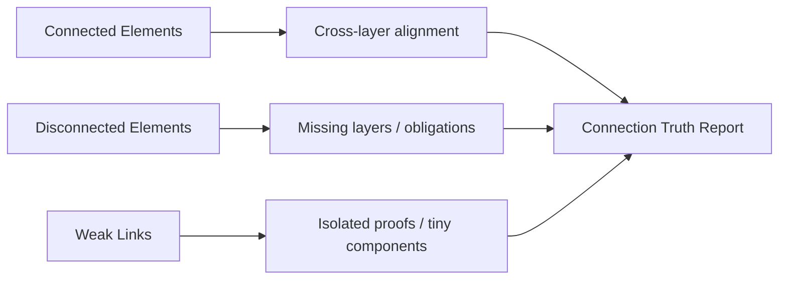

# Isomorphism Connection Audit

Generated: 2026-02-19T01:17:07.069167+00:00

## Summary

- Connected elements: **7**
- Disconnected items: **5**
- Weak links: **2**
- Confidence: **guarded**

## Disconnected (Actionable)

- `fullwirespec_discharge` [formalize]: missing=['coq(instantiation)'] → Add machine-checked FullWireSpec instantiation/proof for concrete implementation model, or keep runtime lockstep as evidence and track this as an explicit theorem gap.
- `semantic_unmapped::coq` [reintegrate]: missing=['coq', 'matrix-coverage'] → Promote critical nearby files into declared layer set or explicitly archive them.
- `semantic_unmapped::python` [reintegrate]: missing=['python', 'matrix-coverage'] → Promote critical nearby files into declared layer set or explicitly archive them.
- `semantic_unmapped::rtl` [reintegrate]: missing=['rtl', 'matrix-coverage'] → Promote critical nearby files into declared layer set or explicitly archive them.
- `semantic_unmapped::tests` [reintegrate]: missing=['tests', 'matrix-coverage'] → Promote critical nearby files into declared layer set or explicitly archive them.

## Weak Links

- `proof-isolated-declarations` [reintegrate]: count=619 → Review declarations for dead-end proofs or unhooked lemmas; reintegrate or archive.
- `formal-obligation-open` [formalize]: count=1 → Discharge non-Coq FullWireSpec in Coq to remove runtime-only closure dependence.

## Coverage Scope

- `coq`: declared=6, discovered=308, coverage=0.0195, semantic_unmapped=261
- `python`: declared=4, discovered=124, coverage=0.0323, semantic_unmapped=107
- `rtl`: declared=2, discovered=15, coverage=0.1333, semantic_unmapped=13
- `tests`: declared=5, discovered=111, coverage=0.045, semantic_unmapped=98

## Outside Main Body

- `archive/SPECULATIVE_PHYSICS_MAPPING.md` markers=['archive']
- `archive/coq_with_axioms/TsirelsonBoundProof.v` markers=['archive']
- `archive/kernel_exploratory/MinorConstraints.v` markers=['archive']
- `archive/kernel_exploratory/MuInformationTheoreticBounds.v` markers=['archive']
- `archive/kernel_exploratory/QuantumBoundComplete.v` markers=['archive']
- `archive/kernel_exploratory/TsirelsonBoundComplete.v` markers=['archive']
- `archive/kernel_exploratory/TsirelsonBoundDirect.v` markers=['archive']
- `archive/kernel_exploratory/TsirelsonBoundProof2.v` markers=['archive']
- `archive/kernel_exploratory/TsirelsonBoundTDD.v` markers=['archive']
- `archive/kernel_exploratory/TsirelsonBoundVerification.v` markers=['archive']
- `archive/scripts_unused/challenge.py` markers=['archive']
- `archive/scripts_unused/convert_variable_to_axiom.py` markers=['archive']
- `archive/scripts_unused/di_randomness_conflict_chart.py` markers=['archive']
- `archive/scripts_unused/recover_neural_prng.py` markers=['archive']
- `archive/tests_disabled/disabled/test_cross_impl.py` markers=['archive', 'disabled']
- `archive/tests_disabled/disabled/test_demo_cli_end_to_end.py` markers=['archive', 'disabled']
- `archive/tests_disabled/disabled/test_di_randomness_conflict_artifact.py` markers=['archive', 'disabled']
- `archive/tests_disabled/disabled/test_drat_normalization.py` markers=['archive', 'disabled']
- `archive/tests_disabled/disabled/test_fuzz_receipts.py` markers=['archive', 'disabled']
- `archive/tests_disabled/disabled/test_isomorphism_complete.py` markers=['archive', 'disabled']
- `archive/tests_disabled/disabled/test_lrat_normalization_demo.py` markers=['archive', 'disabled']
- `archive/tests_disabled/disabled/test_maxwell_thiele_ratchet.py` markers=['archive', 'disabled']
- `archive/tests_disabled/disabled/test_medium_cnf_sanity.py` markers=['archive', 'disabled']
- `archive/tests_disabled/disabled/test_prereg_a_per_series_metrics.py` markers=['archive', 'disabled']
- `archive/tests_disabled/disabled/test_prereg_a_schema_and_filtering.py` markers=['archive', 'disabled']
- `archive/tests_disabled/disabled/test_prereg_a_smoke.py` markers=['archive', 'disabled']
- `archive/tests_disabled/disabled/test_prereg_c_catalog_smoke.py` markers=['archive', 'disabled']
- `archive/tests_disabled/disabled/test_schema.py` markers=['archive', 'disabled']
- `archive/tests_disabled/disabled/test_showcase_programs.py` markers=['archive', 'disabled']
- `archive/tests_disabled/disabled/test_structural_heat_experiment.py` markers=['archive', 'disabled']

## Iterated/Similar Groups

- `.md:readme` count=4 sample=['coq/README.md', 'coq/physics_exploration/README.md', 'coq/quantum_derivation/README.md', 'scripts/README.md']
- `.py:test_three_layer_isomorphism` count=2 sample=['scripts/test_three_layer_isomorphism.py', 'tests/test_three_layer_isomorphism.py']
- `.v:closure` count=2 sample=['coq/kernel/Closure.v', 'coq/kernel_toe/Closure.v']
- `.v:definitions` count=2 sample=['coq/kernel/Definitions.v', 'coq/kernel_toe/Definitions.v']
- `.v:minorconstraints` count=2 sample=['archive/kernel_exploratory/MinorConstraints.v', 'coq/kernel/MinorConstraints.v']
- `.v:nogo` count=2 sample=['coq/kernel/NoGo.v', 'coq/kernel_toe/NoGo.v']
- `.v:nogosensitivity` count=2 sample=['coq/kernel/NoGoSensitivity.v', 'coq/kernel_toe/NoGoSensitivity.v']
- `.v:oracleimpossibility` count=2 sample=['coq/kernel/OracleImpossibility.v', 'coq/thielemachine/coqproofs/OracleImpossibility.v']
- `.v:persistence` count=2 sample=['coq/kernel/Persistence.v', 'coq/kernel_toe/Persistence.v']
- `.v:simulation` count=2 sample=['coq/modular_proofs/Simulation.v', 'coq/thielemachine/coqproofs/Simulation.v']

## Stale/Superfluous Candidates

- `archive/SPECULATIVE_PHYSICS_MAPPING.md` → Path marker indicates likely stale/externalized component.
- `archive/coq_with_axioms/TsirelsonBoundProof.v` → Path marker indicates likely stale/externalized component.
- `archive/kernel_exploratory/MinorConstraints.v` → Path marker indicates likely stale/externalized component.
- `archive/kernel_exploratory/MuInformationTheoreticBounds.v` → Path marker indicates likely stale/externalized component.
- `archive/kernel_exploratory/QuantumBoundComplete.v` → Path marker indicates likely stale/externalized component.
- `archive/kernel_exploratory/TsirelsonBoundComplete.v` → Path marker indicates likely stale/externalized component.
- `archive/kernel_exploratory/TsirelsonBoundDirect.v` → Path marker indicates likely stale/externalized component.
- `archive/kernel_exploratory/TsirelsonBoundProof2.v` → Path marker indicates likely stale/externalized component.
- `archive/kernel_exploratory/TsirelsonBoundTDD.v` → Path marker indicates likely stale/externalized component.
- `archive/kernel_exploratory/TsirelsonBoundVerification.v` → Path marker indicates likely stale/externalized component.
- `archive/scripts_unused/challenge.py` → Path marker indicates likely stale/externalized component.
- `archive/scripts_unused/convert_variable_to_axiom.py` → Path marker indicates likely stale/externalized component.
- `archive/scripts_unused/di_randomness_conflict_chart.py` → Path marker indicates likely stale/externalized component.
- `archive/scripts_unused/recover_neural_prng.py` → Path marker indicates likely stale/externalized component.
- `archive/tests_disabled/disabled/test_cross_impl.py` → Path marker indicates likely stale/externalized component.
- `archive/tests_disabled/disabled/test_demo_cli_end_to_end.py` → Path marker indicates likely stale/externalized component.
- `archive/tests_disabled/disabled/test_di_randomness_conflict_artifact.py` → Path marker indicates likely stale/externalized component.
- `archive/tests_disabled/disabled/test_drat_normalization.py` → Path marker indicates likely stale/externalized component.
- `archive/tests_disabled/disabled/test_fuzz_receipts.py` → Path marker indicates likely stale/externalized component.
- `archive/tests_disabled/disabled/test_isomorphism_complete.py` → Path marker indicates likely stale/externalized component.
- `archive/tests_disabled/disabled/test_lrat_normalization_demo.py` → Path marker indicates likely stale/externalized component.
- `archive/tests_disabled/disabled/test_maxwell_thiele_ratchet.py` → Path marker indicates likely stale/externalized component.
- `archive/tests_disabled/disabled/test_medium_cnf_sanity.py` → Path marker indicates likely stale/externalized component.
- `archive/tests_disabled/disabled/test_prereg_a_per_series_metrics.py` → Path marker indicates likely stale/externalized component.
- `archive/tests_disabled/disabled/test_prereg_a_schema_and_filtering.py` → Path marker indicates likely stale/externalized component.
- `archive/tests_disabled/disabled/test_prereg_a_smoke.py` → Path marker indicates likely stale/externalized component.
- `archive/tests_disabled/disabled/test_prereg_c_catalog_smoke.py` → Path marker indicates likely stale/externalized component.
- `archive/tests_disabled/disabled/test_schema.py` → Path marker indicates likely stale/externalized component.
- `archive/tests_disabled/disabled/test_showcase_programs.py` → Path marker indicates likely stale/externalized component.
- `archive/tests_disabled/disabled/test_structural_heat_experiment.py` → Path marker indicates likely stale/externalized component.

## Visualization

