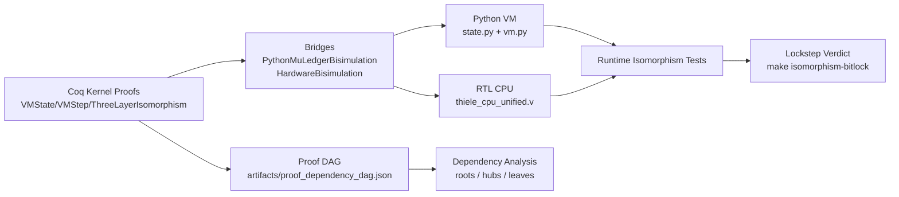
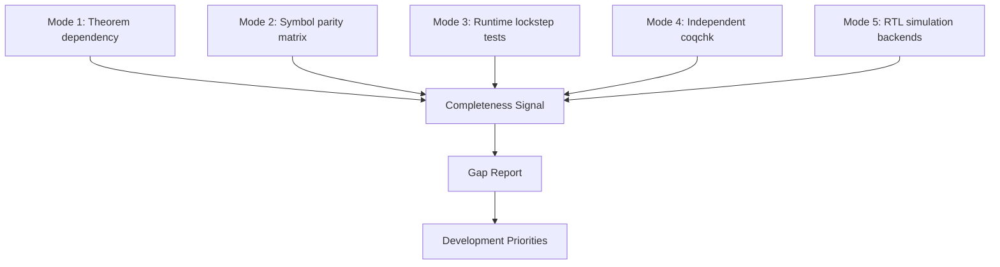

# Isomorphism Visual + Programmatic Audit

Generated: 2026-02-19T01:17:07.068050+00:00

## Scope

- This report connects proof structure, implementation surfaces, and runtime verification artifacts.
- It is designed to answer: "what does all-the-same mean" and "what is missing".

## Chart A — Proof to Implementation Stack



## Chart B — Analysis Modes Composition



## Programmatic Artifacts

- `artifacts/isomorphism_implementation_matrix.json`
- `artifacts/isomorphism_gap_report.json`
- `artifacts/isomorphism_development_backlog.json`
- `artifacts/isomorphism_connection_audit.json`
- `artifacts/proof_dependency_dag.json`
- `artifacts/isomorphism_validation.json`
- `artifacts/charts/isomorphism_stack.mmd`
- `artifacts/charts/analysis_modes.mmd`
- `artifacts/charts/isomorphism_finish_order.mmd`
- `artifacts/charts/connection_truth_map.mmd`

## Chart C — Finish-Order Roadmap

```mermaid
flowchart TD
    R0[Current Baseline
proof-undeniable + isomorphism-bitlock PASS]
    R1[P0: Coq FullWireSpec discharge
(concrete non-Coq instantiation)]
    R2[P1: Lockstep corpus expansion
(edge/corner/fuzz traces)]
    R3[P1: Receipt end-to-end closure
(proof + runtime anti-forgery)]
    R4[P2: Dual-simulator parity
(iverilog + verilator)]
    R5[Release Readiness
mathematical + visual + runtime closure]

    R0 --> R1 --> R2 --> R5
    R1 --> R3 --> R5
    R2 --> R4 --> R5

```

## What "All the Same" Means (Operational Definition)

A change is "all the same" only if all of the following hold together:

1. **Semantic equivalence**: Coq step semantics and implementation steps preserve the same observables (μ, pc, state projections).
2. **Structural equivalence**: Partition graph/module behavior aligns (PNEW/PSPLIT/PMERGE invariants).
3. **Accounting equivalence**: μ-cost updates and μ-tensor/Bianchi invariants align across layers.
4. **Encoding equivalence**: Opcode/field encoding and decoding match.
5. **Behavioral equivalence**: Runtime lockstep tests pass on representative and adversarial traces.

## Surface Matrix Summary

- Aligned surfaces: **7/7**
- Coq files: **308**
- Theorem-like declarations: **2564**
- Explicit axioms/parameters/hypotheses: **24**
- Admits: **0**
- Isomorphism-related test files: **23**

## Repo Coverage Scope

- Layer coverage ratios come from discovered files vs declared matrix files.
- This report now explicitly identifies semantic files outside the declared main body and tags nearby anchors for reintegration.
- `repo_surface_coverage` is embedded in `artifacts/isomorphism_implementation_matrix.json`.

## Explicit Formal Obligation Status

- `fws_step_correct` discharge for non-Coq concrete specs: **False**
- Declared `*_full_wire_spec` defs: **coq_full_wire_spec**

## Gap Reading Guide

Use `artifacts/isomorphism_gap_report.json`:
- Each gap item names an element and missing layer(s).
- Missing layer means either implementation symbol absence or missing validation surface.
- Prioritize gaps that affect μ-accounting, partition semantics, and lockstep tests first.

## Connection Truth Guide

Use `artifacts/isomorphism_connection_audit.json`:
- `connected`: elements presently aligned across all declared layers.
- `disconnected`: concrete missing links with action tags (`formalize`/`reintegrate`/`move_or_archive`).
- `weak_links`: non-failing but unstable connections (isolated proofs, tiny proof islands, open formal obligations).
